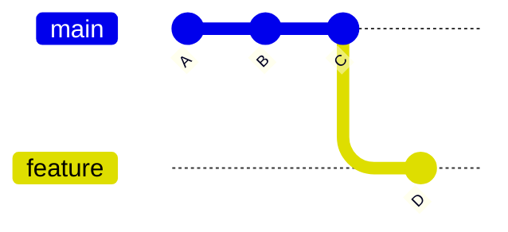

# 🌿 What Is a Branch?

---

## 🎯 Why This Matters

Branching is one of the most important features in Git.

Without branches:
- all work happens on one line
- high risk of breaking code
- difficult collaboration

With branches:
- you can work safely
- isolate features and fixes
- collaborate without conflicts

---

## ✅ Definition

A branch in Git is:

> a movable pointer to a commit

---

## 🧠 Mental Model

Git history is a chain of commits:

```text
A --- B --- C
````

If `main` points to `C`:

```text
A --- B --- C   (main)
```

Now create a new branch:

```text
A --- B --- C   (main, feature)
```

Both branches point to the same commit.

Now commit on `feature`:

```text
A --- B --- C   (main)
           \
            D   (feature)
```

👉 Only `feature` moved forward

---

## 📊 Visual (Mermaid Graph)



---

## 🏗 Internal Architecture

Branches are stored in:

```bash
.git/refs/heads/
```

Example:

```text
.git/
└── refs/
    └── heads/
        ├── main
        └── feature
```

Each file contains:

```text
<commit-hash>
```

Example:

```text
a1b2c3d4e5...
```

👉 This means:

Branch = name → commit pointer

---

## 🔬 What Happens Internally

When you create a branch:

```bash
git branch feature
```

Git does:

1. Creates file:

   ```
   .git/refs/heads/feature
   ```

2. Writes current commit hash into it

That’s it.

No files are copied. No project duplication happens.

---

## ⚡ Why Branches Are Fast

Because Git:

* does NOT copy the repository
* only creates a pointer (reference)

This makes branch creation:

* instant
* lightweight
* scalable

---

## 🧩 Use Cases

### 1. Feature Development

Create branch per feature:

```bash
git branch feature-login
```

---

### 2. Bug Fix

```bash
git branch bugfix-navbar
```

---

### 3. Experimentation

```bash
git branch test-new-idea
```

---

### 4. Team Collaboration

Each developer works on their own branch

---

### 5. Release Preparation

```bash
git branch release-v1.0
```

---

## 🛠 Command Variants

### List branches

```bash
git branch
```

---

### Show branch with latest commit

```bash
git branch -v
```

---

### Show all branches (including remote)

```bash
git branch -a
```

---

### Show current branch

```bash
git branch --show-current
```

---

## 🧪 Practical Example

```bash
git init
echo "Hello" > app.txt
git add .
git commit -m "Initial commit"

git branch feature
git branch
```

Output:

```text
* main
  feature
```

---

## ⚠️ Common Mistakes

### ❌ Mistake 1: Thinking branch = copy

👉 It is NOT a copy, just a pointer

---

### ❌ Mistake 2: Confusing branch with folder

👉 Branches are not directories

---

### ❌ Mistake 3: Not checking current branch

👉 Always verify:

```bash
git branch
```

---

### ❌ Mistake 4: Mixing local vs remote branches

* local → your machine
* remote → server (GitHub)

---

## 🧠 Interview-Level Explanation

If asked:

**Q: What is a branch in Git?**

Answer:

> A branch in Git is a lightweight movable pointer to a commit.
> It allows parallel development by letting multiple lines of work exist independently.
> Internally, branches are stored as references inside `.git/refs/heads/`, each pointing to a commit hash.

---

## 🧠 Memory Trick

> Branch = Label pointing to latest commit

---

## ✅ Quick Recap

* Branch is a pointer, not a copy
* Stored in `.git/refs/heads/`
* Moves forward when new commits are made
* Enables parallel development

---

## Check Yourself

1. Is a branch a full copy of the project?
2. Where are branches stored internally?
3. What moves when a new commit is made?
4. Why is branching fast in Git?

---

## ➡️ Next Step

Go to: `02-create-branch.md`
