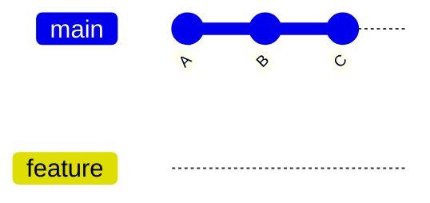

# 🌱 Create a Branch

---

## 🎯 Why This Matters

Creating branches is the foundation of safe development in Git.

Instead of working directly on `main`, you create branches to:

- build features
- fix bugs
- experiment safely
- prepare releases

---

## ✅ Basic Command

```bash
git branch feature
````

👉 This creates a new branch named `feature`

⚠️ Important:

> It does NOT switch to the branch

---

## 🧠 Mental Model

Before creating a branch:

```text
A --- B --- C   (main)
```

After:

```text
A --- B --- C   (main, feature)
```

👉 Both branches point to the same commit

---

## 📊 Visual (Mermaid)



---

## 🏗 Internal Architecture

When you run:

```bash
git branch feature
```

Git creates a file:

```bash
.git/refs/heads/feature
```

Inside it:

```text
<commit-hash>
```

Example:

```text
a1b2c3d4e5f6...
```

👉 This means:

feature → commit C

---

## 🔬 Internal Flow

Steps Git performs:

1. Reads current commit from HEAD
2. Creates new reference file
3. Stores commit hash in it

No files are copied.

---

## ⚡ Key Insight

> Branch creation is instant because Git only creates a pointer

---

## 🛠 Command Variants

### 1. Create branch (basic)

```bash
git branch feature
```

---

### 2. Create from specific commit

```bash
git branch feature <commit-hash>
```

Use when starting from older history.

---

### 3. Create from another branch

```bash
git branch feature main
```

---

### 4. Create + switch (recommended)

```bash
git switch -c feature
```

OR

```bash
git checkout -b feature
```

---

### 5. Verify branches

```bash
git branch
```

---

## 🧩 Real Use Cases

### 🔹 Feature Development

```bash
git branch feature-login
```

---

### 🔹 Bug Fix

```bash
git branch bugfix-header
```

---

### 🔹 Hotfix

```bash
git branch hotfix-payment
```

---

### 🔹 Backup Before Risky Change

```bash
git branch backup-before-refactor
```

---

### 🔹 Work From Old Commit

```bash
git branch test-old abc1234
```

---

## 🧪 Example Walkthrough

```bash
git init
echo "Hello" > file.txt
git add .
git commit -m "Initial commit"

git branch feature
git branch
```

Output:

```text
* main
  feature
```

---

## ⚠️ Important Difference

| Command               | Behavior           |
| --------------------- | ------------------ |
| git branch feature    | creates only       |
| git switch feature    | switches           |
| git switch -c feature | creates + switches |

---

## ⚠️ Common Mistakes

### ❌ Forgetting to switch

You created branch but still on main

Fix:

```bash
git switch feature
```

---

### ❌ Creating branch from wrong location

Always check:

```bash
git branch
git log --oneline
```

---

### ❌ Bad naming

Avoid:

```text
test1
abc
branch2
```

Use:

```text
feature-login
bugfix-navbar
hotfix-payment
```

---

## 🧠 Best Practices

* create branch from correct base
* use clear names
* keep branches focused
* verify before committing

---

## 🧠 Interview-Level Explanation

**Q: What happens when you create a branch in Git?**

Answer:

> When you create a branch, Git creates a new reference inside `.git/refs/heads/` that points to the current commit.
> No files are copied. It is just a pointer to a commit, which is why branch creation is very fast.

---

## 🧠 Memory Trick

> git branch = create pointer
> git switch = move pointer

---

## ✅ Quick Recap

* `git branch name` creates a branch
* does NOT switch automatically
* stored inside `.git/refs/heads/`
* points to current commit

---

## Check Yourself

1. Does `git branch feature` switch branches?
2. Where is the branch stored internally?
3. Why is branch creation fast?
4. How do you create + switch in one command?

---

## ➡️ Next Step

Go to: `03-switch-branch.md`

```
```


## 🧠 What Happens Internally

* new pointer created
* points to current commit

---

## 📸 Visual


---

## ⚠️ Important

This does NOT switch branch.

---

## ➡️ Next

👉 `03-switch-branch.md`
