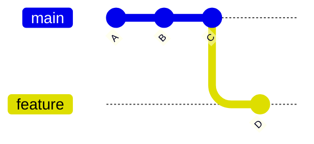

# 🔄 Switch Branch

---

## 🎯 Why This Matters

Creating a branch is not enough.

To actually **work on that branch**, you must switch to it.

Switching branches changes:

- where new commits go
- what files you see in your project
- what version of the project you are working on

---

## ✅ Main Command

```bash
git switch feature
````

👉 This moves you from your current branch to `feature`

---

## 🧠 Mental Model

Think of Git like multiple timelines.

Each branch = a timeline

Switching branches = moving between timelines

---

## 📊 Example

Before switching:

```text id="8v3f6y"
A --- B --- C   (main)
           \
            D   (feature)
HEAD → main
```

After:

```text id="7pnv9e"
A --- B --- C   (main)
           \
            D   (feature)
                  ↑
                 HEAD
```

👉 HEAD moved to `feature`

---

## 📊 Visual (Mermaid)



---

## 🏗 Internal Architecture

### 1. HEAD File

Stored at:

```bash id="8dphc5"
.git/HEAD
```

Before switching:

```text id="w53m3c"
ref: refs/heads/main
```

After switching:

```text id="5ymc1h"
ref: refs/heads/feature
```

👉 HEAD always points to current branch

---

### 2. Working Directory

Git updates your actual files:

* replaces files with selected branch version
* removes files not present in that branch

---

### 3. Index (Staging Area)

Stored at:

```bash id="7l4y9y"
.git/index
```

Git updates index to match target branch

---

## 🔬 What Happens Internally

When you run:

```bash id="k8eqe3"
git switch feature
```

Git performs:

1. Update HEAD pointer
2. Read target commit
3. Update index
4. Update working directory

---

## ⚡ Key Insight

> Switching branches = changing HEAD + reloading project state

---

## 🛠 Command Variants

### 1. Modern way (recommended)

```bash id="x3hr9o"
git switch feature
```

---

### 2. Old command (still used)

```bash id="h1lq4r"
git checkout feature
```

---

### 3. Create + switch

```bash id="k6vd5f"
git switch -c feature
```

---

### 4. Switch to previous branch

```bash id="z0r2f6"
git switch -
```

---

### 5. Switch to specific commit (detached HEAD)

```bash id="j8u3lc"
git switch --detach <commit-hash>
```

---

## 🧩 Real Use Cases

### 🔹 Work on a feature

```bash id="b0sk7n"
git switch feature-login
```

---

### 🔹 Return to main

```bash id="bqfd4x"
git switch main
```

---

### 🔹 Quickly jump between branches

```bash id="vk7b6y"
git switch -
```

---

### 🔹 Debug older version

```bash id="3e3b2x"
git switch --detach abc123
```

---

## ⚠️ Common Errors & Fixes

---

### ❌ Error: Uncommitted changes

```bash id="y3c2k7"
error: Your local changes would be overwritten
```

#### ✔ Fix 1: Commit changes

```bash id="h1l92p"
git add .
git commit -m "save work"
git switch feature
```

#### ✔ Fix 2: Stash changes

```bash id="b91xzn"
git stash
git switch feature
git stash pop
```

---

### ❌ Error: Branch does not exist

```bash id="v6n1ro"
git switch feature
```

Fix:

```bash id="0e2t1y"
git branch
```

---

## ⚠️ Detached HEAD (Important)

If you run:

```bash id="vnh2ya"
git switch --detach <commit>
```

HEAD points directly to commit:

```text id="6p3o2l"
A --- B --- C
           ↑
         HEAD
```

👉 You are NOT on a branch

---

### ✔ Fix Detached HEAD

```bash id="b7h6zx"
git switch -c new-branch
```

---

## ⚠️ Common Mistakes

### ❌ Switching without checking current branch

Always verify:

```bash id="9k3q9p"
git branch
```

---

### ❌ Losing changes

Switching without commit/stash may cause conflicts

---

### ❌ Confusing checkout vs switch

* checkout = old, multi-purpose
* switch = clear and safe

---

## 🧠 Best Practices

* commit or stash before switching
* use `git switch` instead of checkout
* use meaningful branch names
* check branch before switching

---

## 🧠 Interview-Level Explanation

**Q: What happens when you switch branches in Git?**

Answer:

> When switching branches, Git updates the HEAD reference to point to the target branch, updates the index (staging area), and modifies the working directory to match the commit that the branch points to.

---

## 🧠 Memory Trick

> switch = move HEAD + reload files

---

## ✅ Quick Recap

* `git switch` moves between branches
* HEAD updates to new branch
* working directory changes
* index updates
* supports detached HEAD mode

---

## Check Yourself

1. What does HEAD represent?
2. What happens to files when switching branches?
3. How do you fix uncommitted changes issue?
4. What is detached HEAD?

---

## ➡️ Next Step

Go to: `04-rename-branch.md`

