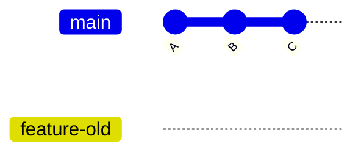

````md id="n8q4z2"
# ✏️ Rename Branch

---

## 🎯 Why This Matters

Clear branch names are critical for:

- readability
- team collaboration
- maintainability
- CI/CD workflows

Renaming helps when:

- you made a typo
- naming conventions changed
- branch purpose evolved
- preparing for merge or release

---

## ✅ Main Commands

### Rename current branch
```bash
git branch -m new-name
````

### Rename a specific branch

```bash
git branch -m old-name new-name
```

---

## 🧠 Mental Model

Renaming a branch means:

> changing the label (reference name), NOT the commit history

---

## 📊 Example

Before:

```text id="p1a9cd"
A --- B --- C   (feature-old)
```

After rename:

```text id="m8v2yq"
A --- B --- C   (feature-new)
```

👉 The commits are unchanged
👉 Only the branch name changed

---

## 📊 Visual (Mermaid)



(rename → feature-new)

---

## 🏗 Internal Architecture

Branches are stored in:

```bash id="y6h2cj"
.git/refs/heads/
```

Before rename:

```text id="u3b5va"
.git/refs/heads/feature-old
```

After rename:

```text id="f7r8sn"
.git/refs/heads/feature-new
```

👉 Git renames the reference file

---

## 🔬 Additional Internal Changes

### 1. HEAD (if current branch)

If you rename the current branch:

```text id="v4x2ld"
.git/HEAD
```

remains:

```text id="j1n7aq"
ref: refs/heads/feature-new
```

---

### 2. Reflog Update

Git also updates:

```bash id="t3k8bd"
.git/logs/refs/heads/
```

to maintain history tracking.

---

## ⚡ Key Insight

> Rename = change reference name, not commit history

---

## 🛠 Command Variants

### Rename current branch

```bash id="a5t9po"
git branch -m new-name
```

---

### Rename another branch

```bash id="d8k1rv"
git branch -m old-name new-name
```

---

### Rename + push to remote (after rename)

```bash id="r4b3xq"
git push origin -u new-name
```

---

### Delete old remote branch

```bash id="q1p7zu"
git push origin --delete old-name
```

---

## 🌐 Remote Branch Case (Important)

If branch is already pushed:

### Steps:

```bash id="z8f4hk"
git branch -m old-name new-name
git push origin -u new-name
git push origin --delete old-name
```

---

## 🧩 Real Use Cases

### 🔹 Fix typo

```bash id="c2v8lo"
git branch -m featre-login feature-login
```

---

### 🔹 Improve naming

```bash id="k5j9np"
git branch -m test1 feature-auth
```

---

### 🔹 Standardize naming convention

```bash id="g3m7dx"
git branch -m login dev-login
```

---

### 🔹 Before merging

Rename unclear branch before PR

---

## ⚠️ Common Mistakes

---

### ❌ Forgetting remote rename

Renaming locally does NOT update remote

---

### ❌ Renaming shared branch without coordination

May break team workflows

---

### ❌ Using unclear names

Avoid:

```text id="n4x1qs"
test
abc
branch1
```

Prefer:

```text id="z6k2rt"
feature-login
bugfix-header
hotfix-payment
```

---

## 🧠 Best Practices

* follow naming conventions
* rename before pushing if possible
* keep names meaningful
* coordinate with team if shared branch

---

## 🧠 Interview-Level Explanation

**Q: What happens internally when a branch is renamed?**

Answer:

> Git renames the reference file inside `.git/refs/heads/`.
> If the branch is currently checked out, the HEAD reference continues to point to the renamed branch.
> Git may also update reflog entries to maintain history tracking.

---

## 🧠 Memory Trick

> rename = change label, not history

---

## ✅ Quick Recap

* branch rename does NOT change commits
* stored in `.git/refs/heads/`
* HEAD updates automatically if needed
* remote rename requires manual steps

---

## Check Yourself

1. Does renaming a branch change commits?
2. Where are branch names stored internally?
3. What extra step is needed for remote branches?
4. Why should branch names be meaningful?

---

## ➡️ Next Step

Go to: `05-delete-branch.md`
