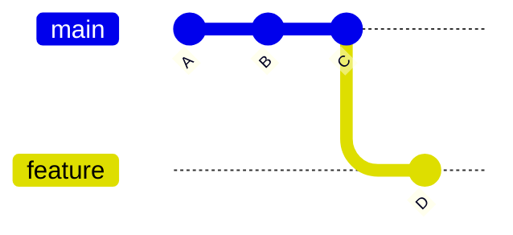

# 🗑 Delete a Branch

---

## 🎯 Why This Matters

Branches are temporary by design.

After a feature is complete or merged, the branch should be deleted to:

- keep repository clean
- avoid confusion
- reduce clutter
- prevent accidental usage of old branches

---

## ✅ Main Commands

### Safe delete (recommended)
```bash
git branch -d feature
````

### Force delete

```bash
git branch -D feature
```

---

## 🧠 Mental Model

Deleting a branch means:

> removing the pointer (reference), NOT deleting commits immediately

---

## 📊 Example

Before deletion:

```text
A --- B --- C   (main)
           \
            D   (feature)
```

After deleting `feature`:

```text
A --- B --- C   (main)
           \
            D   (dangling commit)
```

👉 Commit `D` still exists (temporarily)

---

## 📊 Visual (Mermaid)



(delete feature → pointer removed)

---

## 🏗 Internal Architecture

Branches are stored in:

```bash
.git/refs/heads/
```

Deleting a branch removes:

```text
.git/refs/heads/feature
```

---

## 🔬 What Happens Internally

When you run:

```bash
git branch -d feature
```

Git:

1. checks if branch is merged
2. removes reference file
3. keeps commits (temporarily)

---

## ⚡ Key Insight

> Deleting a branch removes only the reference, not the data immediately

---

## 🛠 Command Variants

### Safe delete

```bash
git branch -d feature
```

---

### Force delete

```bash
git branch -D feature
```

---

### Delete remote branch

```bash
git push origin --delete feature
```

---

### List branches before deleting

```bash
git branch
```

---

## 🧩 Real Use Cases

### 🔹 After merging feature

```bash
git branch -d feature-login
```

---

### 🔹 Clean old branches

```bash
git branch -d old-feature
```

---

### 🔹 Remove broken branch

```bash
git branch -D broken-branch
```

---

### 🔹 Delete remote branch

```bash
git push origin --delete feature-login
```

---

## ⚠️ Safe vs Force Delete

| Command | Behavior                          |
| ------- | --------------------------------- |
| -d      | prevents deleting unmerged branch |
| -D      | deletes anyway (dangerous)        |

---

## ⚠️ Common Mistakes

### ❌ Deleting unmerged work

Use `-d` to stay safe

---

### ❌ Forgetting remote delete

Local delete does NOT remove remote branch

---

### ❌ Deleting wrong branch

Always check:

```bash
git branch
```

---

## 🧠 Best Practices

* use `-d` whenever possible
* delete branches after merge
* clean up regularly
* verify before deleting

---

## 🧠 Interview-Level Explanation

**Q: What happens when you delete a branch in Git?**

Answer:

> Deleting a branch removes the reference from `.git/refs/heads/`, but the commits are not immediately deleted. They remain in the repository until garbage collection removes unreachable commits.

---

## 🧠 Memory Trick

> delete branch = remove pointer, not commits

---

## ✅ Quick Recap

* `-d` = safe delete
* `-D` = force delete
* removes reference only
* commits may still exist temporarily

---

## Check Yourself

1. Does deleting a branch delete commits immediately?
2. What is the difference between `-d` and `-D`?
3. Where are branches stored internally?
4. How do you delete a remote branch?

---

## ➡️ Next Step

Go to: `06-feature-branch-workflow.md`
