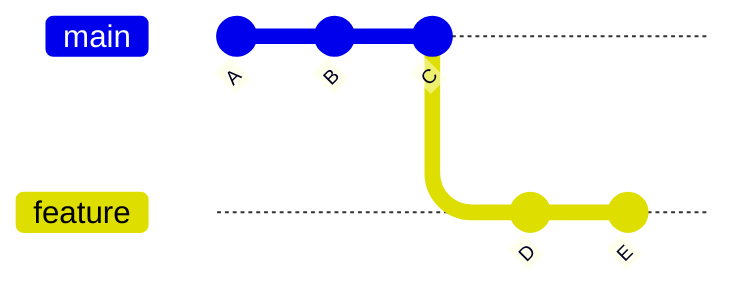

# 🚀 Feature Branch Workflow

---

## 🎯 Why This Matters

This is the **most commonly used Git workflow** in real-world projects.

It allows:

- safe feature development
- parallel work
- clean main branch
- easier code reviews

---

## 🧠 Core Idea

> Every feature gets its own branch

---

## 📊 Visual (ASCII)

```text
main:    A --- B --- C
                 \
feature:          D --- E
````

---

## 📊 Visual (Mermaid)



---

## 🧪 Step-by-Step Workflow

### 1. Start from main

```bash
git switch main
git pull
```

---

### 2. Create feature branch

```bash
git switch -c feature-login
```

---

### 3. Work and commit

```bash
git add .
git commit -m "Add login UI"
```

---

### 4. Push branch

```bash
git push -u origin feature-login
```

---

### 5. Merge later (via PR or locally)

---

## 🏗 Internal Architecture

### Branch Pointer

```bash
.git/refs/heads/feature-login
```

points to latest commit

---

### HEAD

```bash
.git/HEAD
```

points to:

```text
ref: refs/heads/feature-login
```

---

### Commit Graph

Each commit links to parent:

```text
C → D → E
```

---

## 🔬 What Happens Internally

1. branch created → pointer created
2. commits → new objects in `.git/objects/`
3. HEAD moves → active branch changes
4. history diverges

---

## 🧩 Real Use Cases

### 🔹 Add new feature

```bash
git switch -c feature-payment
```

---

### 🔹 Build UI separately

```bash
git switch -c feature-dashboard
```

---

### 🔹 Work in team

Each developer uses separate branch

---

### 🔹 Parallel development

Multiple features built simultaneously

---

## 🛠 Command Variants

### Create + switch

```bash
git switch -c feature
```

---

### Push branch

```bash
git push -u origin feature
```

---

### Check branches

```bash
git branch
```

---

### Switch back

```bash
git switch main
```

---

## ⚠️ Common Mistakes

### ❌ Working directly on main

Always use feature branches

---

### ❌ Not pulling latest main

Can cause conflicts later

---

### ❌ Large commits

Keep commits small and meaningful

---

### ❌ Not deleting branch after merge

Leads to clutter

---

## 🧠 Best Practices

* one branch per feature
* meaningful branch names
* commit frequently
* pull latest main before starting
* delete branch after merge

---

## 🧠 Interview-Level Explanation

**Q: What is the feature branch workflow?**

Answer:

> The feature branch workflow involves creating a separate branch for each feature, developing changes in isolation, and then merging back into the main branch. This ensures that the main branch remains stable while allowing parallel development.

---

## 🧠 Memory Trick

> Feature = separate branch → safe development

---

## ✅ Quick Recap

* create branch per feature
* work independently
* merge later
* keep main stable

---

## Check Yourself

1. Why use feature branches?
2. What happens to main during feature work?
3. When should you create a branch?
4. Why delete branches after merge?

---

## ➡️ Next Step

Go to: `07-main-vs-dev.md`