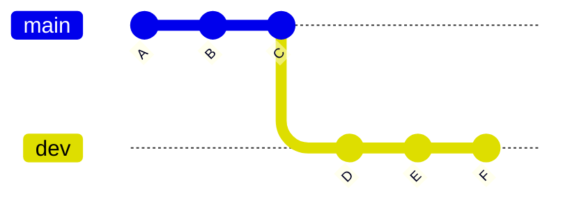

````md id="m4z8xn"
# 🧭 main vs dev Branch Strategy

---

## 🎯 Why This Matters

In real-world projects, teams rarely work directly on `main`.

Instead, they introduce a **development branch (`dev`)** to:

- protect stable code
- manage ongoing work
- reduce risk
- organize releases

---

## 🧠 Core Idea

- `main` → production-ready, stable code  
- `dev` → active development branch  

---

## 📊 Basic Structure

```text
main:   A --- B --- C   (stable)
                   \
dev:                D --- E --- F   (development)
````

👉 `main` stays clean
👉 `dev` keeps evolving

---

## 📊 Visual (Mermaid)



---

## 🏗 Internal Architecture

Branches are stored in:

```bash id="y3nt1r"
.git/refs/heads/
```

Example:

```text id="nt4p6k"
main → commit-hash-C
dev  → commit-hash-F
```

---

### HEAD Reference

```bash id="1h2h7c"
.git/HEAD
```

Points to current branch:

```text id="fc8tnz"
ref: refs/heads/dev
```

---

## 🔬 What Happens Internally

When working with `dev`:

1. commits are added to dev branch
2. main remains unchanged
3. commit graph diverges
4. later merged into main

---

## 🧪 Typical Workflow

### 1. Create dev branch

```bash id="hzg53y"
git switch -c dev
```

---

### 2. Work on dev

```bash id="k1lh0z"
git add .
git commit -m "New feature"
```

---

### 3. Merge into main

```bash id="6zzx4p"
git switch main
git merge dev
```

---

## 🧩 Real-World Use Cases

### 🔹 Team Development

* developers push to `dev`
* `main` is updated only after testing

---

### 🔹 CI/CD Pipelines

* `dev` → staging environment
* `main` → production deployment

---

### 🔹 Release Preparation

* stabilize `dev`
* merge to `main`
* tag release

---

### 🔹 Multiple Developers

```text id="n1d9l8"
main
  \
   dev
    ├── feature-login
    ├── feature-dashboard
    └── bugfix-header
```

---

## 🛠 Command Variants

### Create dev branch

```bash id="c0vfxm"
git branch dev
git switch dev
```

OR

```bash id="m2eqru"
git switch -c dev
```

---

### Switch between branches

```bash id="5cprpn"
git switch main
git switch dev
```

---

### Merge dev into main

```bash id="drnxoz"
git switch main
git merge dev
```

---

### Push dev branch

```bash id="j3e8sz"
git push -u origin dev
```

---

## ⚠️ Common Mistakes

---

### ❌ Working directly on main

👉 Risky — can break production

---

### ❌ Not syncing dev with main

```bash id="r9dbxt"
git pull
```

---

### ❌ Long-lived dev branch

👉 Causes huge merge conflicts

---

### ❌ Mixing features in dev

👉 Use feature branches inside dev

---

## 🧠 Best Practices

* use `main` only for stable code
* use `dev` for integration
* create feature branches from `dev`
* merge regularly
* test before merging to main

---

## 🔁 Extended Workflow (Best Practice)

```text id="d7gn7k"
main
  \
   dev
     \
      feature-x
```

Flow:

1. feature branch → dev
2. dev → main

---

## 🧠 Interview-Level Explanation

**Q: What is the difference between main and dev branches?**

Answer:

> The main branch represents stable, production-ready code, while the dev branch is used for integrating ongoing development work. Developers typically create feature branches from dev, merge them into dev, and once stable, dev is merged into main.

---

## 🧠 Memory Trick

> main = stable
> dev = development

---

## ✅ Quick Recap

* main = production-ready
* dev = active development
* dev receives frequent changes
* main receives tested changes

---

## Check Yourself

1. Why should you avoid working directly on main?
2. What is the role of dev branch?
3. Where should feature branches originate?
4. When should dev be merged into main?

---

## ➡️ Next Step

Go to: `08-hotfix-branch.md`
