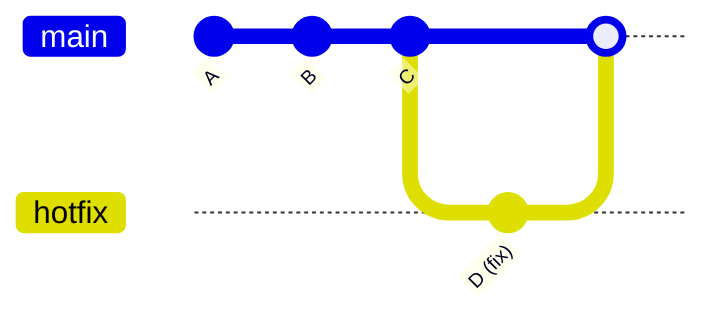

# 🚑 Hotfix Branch

---

## 🎯 Why This Matters

In real-world systems, production bugs can happen at any time.

When a critical issue appears in production, you cannot wait for ongoing development (`dev`).

You need a **fast, isolated fix**.

That is where a **hotfix branch** is used.

---

## 🧠 Core Idea

> Hotfix branch = create from main → fix → merge back quickly

---

## 📊 Basic Flow

```text
main:   A --- B --- C
                     \
hotfix:               D (fix)
````

After merging:

```text
main:   A --- B --- C --- D
```

---

## 📊 Visual (Mermaid)



---

## 🧪 Step-by-Step Workflow

### 1. Start from main

```bash
git switch main
git pull
```

---

### 2. Create hotfix branch

```bash
git switch -c hotfix-critical-bug
```

---

### 3. Fix issue and commit

```bash
git add .
git commit -m "Fix critical production bug"
```

---

### 4. Merge into main

```bash
git switch main
git merge hotfix-critical-bug
```

---

### 5. (Important) Merge into dev

```bash
git switch dev
git merge hotfix-critical-bug
```

---

### 6. Delete branch

```bash
git branch -d hotfix-critical-bug
```

---

## 🏗 Internal Architecture

### Branch Reference

```bash
.git/refs/heads/hotfix-critical-bug
```

Points to latest commit (fix)

---

### HEAD

```bash
.git/HEAD
```

Moves:

```text
main → hotfix → main
```

---

### Commit Graph

```text
C → D
```

D = fix commit

---

## 🔬 What Happens Internally

1. New branch created from `main`
2. Fix commit added
3. Merge creates new commit (if needed)
4. Both `main` and `dev` updated

---

## 🧩 Real Use Cases

### 🔹 Production bug fix

Fix login crash immediately

---

### 🔹 Security patch

Fix vulnerability without waiting for release

---

### 🔹 Payment failure

Fix urgent business-critical issue

---

### 🔹 API downtime

Patch server issue quickly

---

## 🛠 Command Variants

### Create hotfix branch

```bash
git switch -c hotfix-issue
```

---

### Push hotfix

```bash
git push -u origin hotfix-issue
```

---

### Merge into main

```bash
git merge hotfix-issue
```

---

### Merge into dev

```bash
git switch dev
git merge hotfix-issue
```

---

### Delete branch

```bash
git branch -d hotfix-issue
```

---

## ⚠️ Common Mistakes

---

### ❌ Creating hotfix from dev

👉 Always start from main

---

### ❌ Forgetting to merge into dev

👉 Leads to missing fixes later

---

### ❌ Delaying hotfix

👉 Hotfix should be fast and minimal

---

### ❌ Mixing features with fix

👉 Keep hotfix focused

---

## 🧠 Best Practices

* keep hotfix small and focused
* always branch from main
* merge into both main and dev
* delete after completion
* test before merging

---

## 🧠 Interview-Level Explanation

**Q: What is a hotfix branch in Git?**

Answer:

> A hotfix branch is created from the main branch to fix critical production issues quickly. After applying the fix, it is merged back into both main and development branches to keep them consistent.

---

## 🧠 Memory Trick

> Hotfix = urgent fix from main

---

## ✅ Quick Recap

* created from main
* used for urgent fixes
* merged into main + dev
* deleted after use

---

## Check Yourself

1. Why should hotfix branch start from main?
2. Where should it be merged after fix?
3. Why keep hotfix small?
4. What happens if you skip merging into dev?

---

## ➡️ Next Step

Go to: `practice-lab.md`
