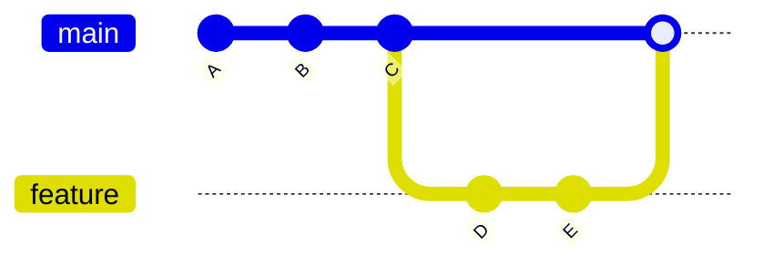

# 🔀 What Is Merge?

---

## 🎯 Why This Matters

Branches allow parallel development.

But at some point, you need to **combine those changes back together**.

That process is called **merging**.

---

## ✅ Definition

A merge in Git is:

> the process of combining changes from one branch into another

---

## 🧠 Mental Model

Think of branches as separate timelines.

Merging = combining those timelines into one.

---

## 📊 Example Before Merge

```text
main:     A --- B --- C
                       \
feature:                D --- E
````

---

## 📊 After Merge

```text id="v8pl6r"
main:     A --- B --- C -------- M
                       \      /
feature:                D --- E
```

👉 `M` = merge commit

---

## 📊 Visual (Mermaid)



---

## 🧠 Core Idea

> Merge brings changes from one branch into another branch

---

## 🛠 Basic Command

```bash
git switch main
git merge feature
```

👉 Merges `feature` into `main`

---

## 🏗 Internal Architecture

---

### 1. Commit Graph

Git history is a **Directed Acyclic Graph (DAG)**

Each commit points to its parent(s)

---

### 2. Normal Commit

```text id="g1t9np"
Commit C → parent B
```

---

### 3. Merge Commit

```text id="h7ql2y"
Merge Commit M → parent C (main)
               → parent E (feature)
```

👉 Merge commit has **2 parents**

---

### 4. Merge Base (Important)

Git finds the **common ancestor**:

```text id="kz3z92"
Common ancestor = C
```

This is called the **merge base**

---

## 🔬 What Happens Internally

When you run:

```bash id="h8j4ye"
git merge feature
```

Git performs:

---

### Step 1: Find Common Ancestor

```text id="a9y5d1"
C = merge base
```

---

### Step 2: Compare Changes

Git compares:

* C → main changes
* C → feature changes

---

### Step 3: Apply Changes

* combines both changes
* detects conflicts if needed

---

### Step 4: Create Merge Commit

If needed:

```text id="e2k7lv"
M (new commit)
```

---

### Step 5: Move Branch Pointer

```text id="h5x4rt"
main → M
```

---

## ⚡ Key Insight

> Merge is based on comparing differences from a common ancestor

---

## 🧩 Types of Merge (Overview)

You will learn in next files:

### 🔹 Fast-Forward Merge

* no merge commit
* simple pointer move

---

### 🔹 Three-Way Merge

* creates merge commit
* combines histories

---

### 🔹 Merge Conflict

* happens when same code changed
* requires manual resolution

---

## 🧩 Real Use Cases

### 🔹 Feature Completion

```bash id="u2jw09"
git merge feature-login
```

---

### 🔹 Team Integration

Combine work from multiple developers

---

### 🔹 Release Workflow

Merge `dev` into `main`

---

### 🔹 Hotfix

Merge urgent fix into multiple branches

---

## 🛠 Command Variants

### Basic merge

```bash id="p5y4sm"
git merge feature
```

---

### Force merge commit

```bash id="c4x9qz"
git merge --no-ff feature
```

---

### Abort merge

```bash id="j2d7ka"
git merge --abort
```

---

## ⚠️ Common Mistakes

---

### ❌ Merging wrong branch

Always check:

```bash id="b8p1yc"
git branch
```

---

### ❌ Not updating main

```bash id="f5k2lx"
git pull
```

---

### ❌ Ignoring conflicts

Must resolve manually

---

### ❌ Large feature branches

Leads to complex merges

---

## 🧠 Best Practices

* merge frequently
* keep branches small
* test before merging
* review changes before merge

---

## 🧠 Interview-Level Explanation

**Q: What is merge in Git?**

Answer:

> Merge in Git is the process of combining changes from one branch into another. Internally, Git finds a common ancestor (merge base), compares differences from both branches, and creates a merge commit with two parent commits if needed.

---

## 🧠 Memory Trick

> Merge = combine timelines using common ancestor

---

## ✅ Quick Recap

* merge combines branches
* uses common ancestor
* may create merge commit
* updates branch pointer

---

## Check Yourself

1. What is a merge base?
2. Why does merge commit have 2 parents?
3. When is merge commit created?
4. What happens during merge internally?

---

## ➡️ Next Step

Go to: `02-fast-forward-merge.md`

