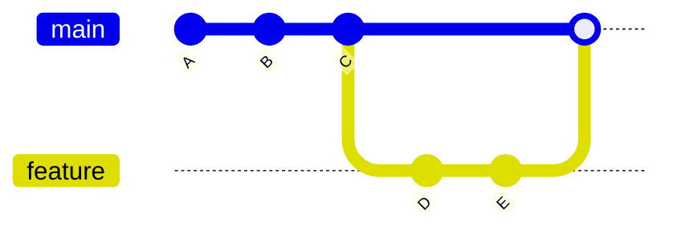

# ⚡ Fast-Forward Merge

---

## 🎯 Why This Matters

Fast-forward merge is the **simplest and cleanest type of merge** in Git.

It happens when:

> there is no divergence between branches

Understanding this helps you:

- keep history clean
- understand when merge commit is NOT created
- predict Git behavior

---

## ✅ Definition

A fast-forward merge is:

> a merge where Git simply moves the branch pointer forward

No new commit is created.

---

## 🧠 Mental Model

If `main` has NOT changed since `feature` was created:

Git does NOT need to combine histories.

It just moves the pointer.

---

## 📊 Before Merge

```text
main:     A --- B --- C
                       \
feature:                D --- E
````

---

## 📊 After Fast-Forward Merge

```text id="ff1"
main:     A --- B --- C --- D --- E
feature:                      ↑
```

👉 `main` moved forward
👉 no merge commit

---

## 📊 Key Observation

* No branching structure remains
* Linear history is preserved

---

## 📊 Visual (Mermaid)



---

## 🏗 Internal Architecture

---

### Before Merge

```text id="ff3"
main → C
feature → E
```

---

### After Merge

```text id="ff4"
main → E
feature → E
```

---

### What Changed?

Only this:

```text id="ff5"
main pointer moved from C → E
```

---

### What Did NOT Change?

* no new commit created
* no merge commit
* no parent linking

---

## 🔬 What Happens Internally

When you run:

```bash id="ff6"
git merge feature
```

Git checks:

---

### Step 1: Is fast-forward possible?

Condition:

```text id="ff7"
main is behind feature
(no new commits on main)
```

---

### Step 2: Move pointer

```text id="ff8"
main → feature's commit
```

---

### Step 3: Update working directory

* files updated to latest state
* index updated

---

## ⚡ Key Insight

> Fast-forward merge = pointer movement only

---

## 🧩 When Fast-Forward Happens

✔ Happens when:

* main has no new commits
* feature is ahead
* no divergence

---

## ❌ When It Does NOT Happen

```text
main:     A --- B --- C --- X
                       \
feature:                D --- E
```

👉 Now Git must do **three-way merge**

---

## 🛠 Command Variants

---

### Default merge

```bash id="ff9"
git merge feature
```

Git automatically fast-forwards if possible

---

### Force merge commit (disable fast-forward)

```bash id="ff10"
git merge --no-ff feature
```

👉 creates merge commit even if not needed

---

### Only allow fast-forward

```bash id="ff11"
git merge --ff-only feature
```

👉 fails if fast-forward not possible

---

## 🧩 Real Use Cases

---

### 🔹 Small feature branches

```bash id="ff12"
git merge feature-login
```

---

### 🔹 Solo development

* simple linear history
* no need for merge commits

---

### 🔹 Clean history projects

* preferred in minimal workflows

---

## ⚠️ Common Mistakes

---

### ❌ Not understanding why no merge commit created

👉 Fast-forward skips merge commit

---

### ❌ Losing branch context

After merge:

* branch structure disappears
* history becomes linear

---

### ❌ Expecting graph visualization

👉 Fast-forward removes branching structure

---

## 🧠 Best Practices

* use fast-forward for small changes
* use `--no-ff` for important features
* understand when history matters

---

## 🧠 Interview-Level Explanation

**Q: What is fast-forward merge?**

Answer:

> A fast-forward merge occurs when the current branch has no new commits, and Git simply moves the branch pointer forward to the target branch’s latest commit without creating a merge commit.

---

## 🧠 Memory Trick

> Fast-forward = move pointer, no merge commit

---

## ✅ Quick Recap

* no merge commit created
* pointer moves forward
* happens when no divergence
* keeps history linear

---

## 📊 Comparison

| Feature      | Fast-Forward |
| ------------ | ------------ |
| Merge commit | ❌ No         |
| History      | Linear       |
| Speed        | Fast         |
| Complexity   | Low          |

---

## Check Yourself

1. When does fast-forward merge happen?
2. Does it create a merge commit?
3. What moves during fast-forward?
4. How to prevent fast-forward?

---

## ➡️ Next Step

Go to: `03-three-way-merge.md`

