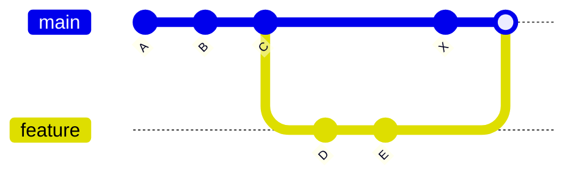

# 🔀 Three-Way Merge (Core Git Behavior)

---

## 🎯 Why This Matters

Three-way merge is the **most important merge type in Git**.

It happens when:

> both branches have diverged (both have new commits)

This is the **real-world merge scenario** you will face most of the time.

---

## ✅ Definition

A three-way merge is:

> a merge that uses a common ancestor (merge base) to combine changes from two branches

It creates a **new merge commit**.

---

## 🧠 Mental Model

Git compares **three versions**:

1. common ancestor (base)
2. current branch (main)
3. target branch (feature)

👉 That’s why it's called **three-way**

---

## 📊 Before Merge

```text
main:     A --- B --- C --- X
                       \
feature:                D --- E
````

---

## 📊 Merge Base

```text id="tw1"
Common ancestor = C
```

---

## 📊 After Merge

```text id="tw2"
main:     A --- B --- C --- X -------- M
                       \            /
feature:                D --- E ----
```

👉 `M` = merge commit
👉 has 2 parents

---

## 📊 Visual (Mermaid)



---

## 🏗 Internal Architecture

---

### 1. Merge Base (Important)

Git finds the **common ancestor**:

```text id="tw4"
merge-base(main, feature) = C
```

---

### 2. Commit Structure

Merge commit:

```text id="tw5"
M → parent1: X (main)
M → parent2: E (feature)
```

---

### 3. Storage

Stored in:

```bash id="tw6"
.git/objects/
```

---

### 4. HEAD Movement

Before:

```text id="tw7"
HEAD → main → X
```

After:

```text id="tw8"
HEAD → main → M
```

---

## 🔬 What Happens Internally

When you run:

```bash id="tw9"
git merge feature
```

Git performs:

---

### Step 1: Find merge base

```text id="tw10"
C = common ancestor
```

---

### Step 2: Compare changes

Git compares:

```text id="tw11"
C → X  (main changes)
C → E  (feature changes)
```

---

### Step 3: Combine changes

* applies both changes
* detects overlaps

---

### Step 4: Resolve conflicts (if any)

If same lines changed:

👉 conflict occurs

---

### Step 5: Create merge commit

```text id="tw12"
M (new commit)
```

---

## ⚡ Key Insight

> Three-way merge compares differences from a common ancestor

---

## 📊 Why It's Needed

Fast-forward is not possible because:

```text id="tw13"
main has X
feature has D, E
```

👉 histories diverged

---

## 🧩 Real Use Cases

---

### 🔹 Feature branch updated while main also changed

Very common in teams

---

### 🔹 Parallel development

Multiple developers committing simultaneously

---

### 🔹 Long-running feature branches

Need merging after main evolves

---

## 🛠 Command Variants

---

### Basic merge

```bash id="tw14"
git merge feature
```

---

### No fast-forward (force merge commit)

```bash id="tw15"
git merge --no-ff feature
```

---

### Abort merge

```bash id="tw16"
git merge --abort
```

---

## ⚠️ Conflict Scenario Example

```text id="tw17"
main:     C --- X (changed line 5)
feature:  C --- E (changed same line 5)
```

👉 conflict occurs

---

## ⚠️ Common Mistakes

---

### ❌ Not understanding merge base

👉 leads to confusion in conflicts

---

### ❌ Large divergence

👉 harder merges

---

### ❌ Ignoring conflicts

👉 breaks code

---

### ❌ Merging outdated branches

Always:

```bash id="tw18"
git pull
```

---

## 🧠 Best Practices

* merge frequently
* keep branches small
* resolve conflicts carefully
* test after merge
* review changes before merging

---

## 🧠 Interview-Level Explanation

**Q: What is a three-way merge?**

Answer:

> A three-way merge is a merge strategy in Git where Git uses a common ancestor (merge base) to compare changes from two branches. It creates a new merge commit with two parents representing both histories.

---

## 🧠 Memory Trick

> Three-way = base + two branches

---

## ✅ Quick Recap

* used when branches diverge
* finds common ancestor
* compares 3 versions
* creates merge commit
* may cause conflicts

---

## 📊 Comparison

| Feature      | Three-Way Merge  |
| ------------ | ---------------- |
| Merge commit | ✔ Yes            |
| Parents      | 2                |
| Complexity   | Medium           |
| Used when    | branches diverge |

---

## Check Yourself

1. What is merge base?
2. Why are 3 versions compared?
3. When is three-way merge used?
4. Why does merge commit have 2 parents?

---

## ➡️ Next Step

Go to: `04-merge-conflicts.md`

