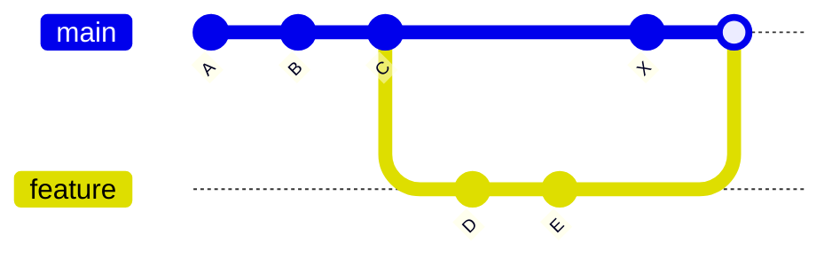
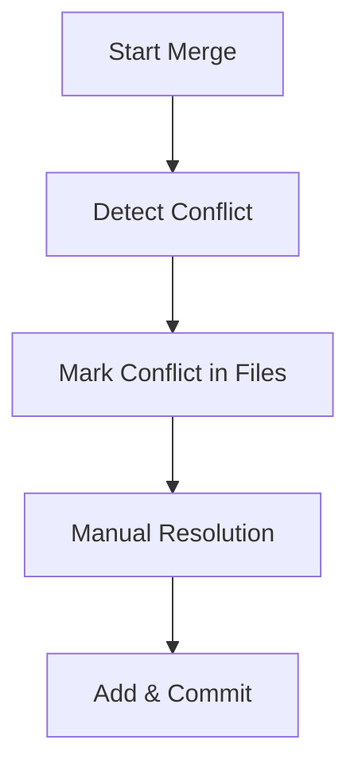

# ⚠️ Merge Conflicts

---

## 🎯 Why This Matters

Merge conflicts are one of the most common challenges in Git.

They happen when:

> Git cannot automatically combine changes from two branches

Understanding conflicts deeply helps you:

- avoid breaking code
- resolve issues confidently
- collaborate effectively in teams

---

## ✅ Definition

A merge conflict occurs when:

> the same part of a file is modified differently in two branches

---

## 🧠 Mental Model

Git tries to merge automatically.

But when it sees:

- same file
- same location
- different changes

👉 it stops and asks YOU to decide

---

## 📊 Example (Before Conflict)

```text
main:     A --- B --- C --- X
                       \
feature:                D --- E
````

---

## 📊 Conflict Situation

Suppose both changed the same line:

```text
File: app.txt

main version:
Hello World

feature version:
Hello Git
```

---

## 📊 Visual Conflict Representation

```text
<<<<<<< HEAD
Hello World
=======
Hello Git
>>>>>>> feature
```

---

## 📊 Visual (ASCII Graph)

```text
A --- B --- C --- X   (main)
           \
            D --- E   (feature)

Both changed same code → conflict
```

---

## 📊 Visual (Mermaid)



---

## 🏗 Internal Architecture

---

### Conflict Markers

Git inserts markers inside files:

```text
<<<<<<< HEAD
(main branch code)
=======
(feature branch code)
>>>>>>> feature
```

---

### HEAD Meaning

```text
HEAD = current branch (main)
```

---

### Merge State Files

During conflict, Git creates:

```bash
.git/MERGE_HEAD
.git/MERGE_MSG
```

---

### Index State

Git index stores:

* base version
* current version
* incoming version

---

## 🔬 What Happens Internally

When you run:

```bash
git merge feature
```

Git:

---

### Step 1: Finds merge base

```text
C = common ancestor
```

---

### Step 2: Compares changes

```text
C → main
C → feature
```

---

### Step 3: Detects overlap

Same line changed → conflict

---

### Step 4: Stops merge

* marks conflict
* waits for manual resolution

---

## ⚡ Key Insight

> Git only fails when it cannot decide safely

---

## 🧩 Types of Conflicts

---

### 1. Same Line Conflict

```text
Line 5 changed in both branches
```

---

### 2. File Deletion Conflict

```text
main deletes file
feature modifies it
```

---

### 3. Rename Conflict

```text
same file renamed differently
```

---

### 4. Binary File Conflict

Git cannot merge binary files

---

## 🧩 Real Use Cases

---

### 🔹 Two developers edit same function

---

### 🔹 One changes logic, other changes UI

---

### 🔹 Refactoring + feature development

---

### 🔹 Hotfix vs ongoing feature

---

## 🛠 Commands During Conflict

---

### Check status

```bash
git status
```

---

### See conflicted files

```bash
git diff
```

---

### Abort merge

```bash
git merge --abort
```

---

## 📊 Conflict Flow

```text
Start Merge
   ↓
Detect Conflict
   ↓
Mark Files
   ↓
Developer Resolves
   ↓
Commit Merge
```

---

## 📊 Visual (Flow Diagram)



---

## ⚠️ Common Mistakes

---

### ❌ Deleting conflict markers incorrectly

Must remove ALL markers:

```text
<<<<<<<
=======
>>>>>>>
```

---

### ❌ Guessing instead of understanding

Always read both versions

---

### ❌ Ignoring conflict

Merge won't complete until resolved

---

### ❌ Not testing after merge

Critical step

---

## 🧠 Best Practices

* keep branches small
* merge frequently
* communicate in teams
* resolve conflicts carefully
* test after resolving

---

## 🧠 Interview-Level Explanation

**Q: What is a merge conflict in Git?**

Answer:

> A merge conflict occurs when Git cannot automatically merge changes from two branches because the same part of a file was modified differently. Git marks the conflict and requires manual resolution.

---

## 🧠 Memory Trick

> Conflict = Git needs human decision

---

## ✅ Quick Recap

* happens when same code is changed
* Git inserts conflict markers
* requires manual resolution
* merge pauses until fixed

---

## Check Yourself

1. When does a merge conflict occur?
2. What do conflict markers mean?
3. How does Git handle conflicts internally?
4. What must you do after resolving conflict?

---

## ➡️ Next Step

Go to: `05-resolving-conflicts.md`
