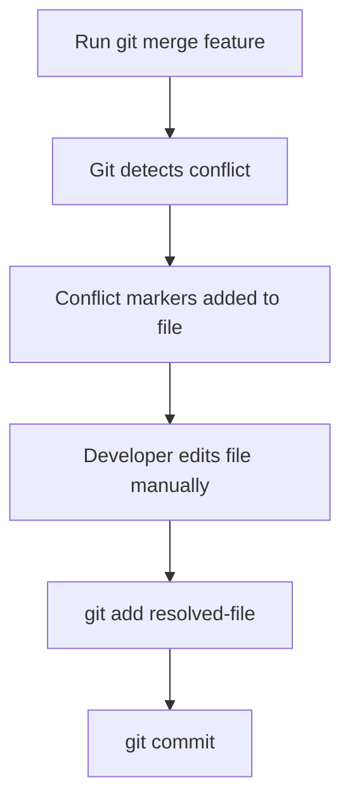
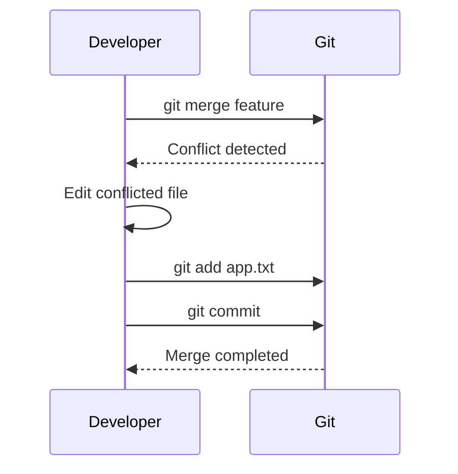

# 🛠 Resolving Merge Conflicts (Step by Step)

---

## 🎯 Why This Matters

Understanding what a merge conflict is is only the first step.

The real skill is:

> resolving conflicts safely and correctly

If you can resolve conflicts calmly, you become much more confident with Git.

---

## ✅ Goal

By the end of this file, you will know how to:

- identify conflicted files
- read conflict markers
- choose the correct code
- finish the merge
- abort if needed
- use helpful Git commands during resolution

---

## 🧠 Mental Model

A merge conflict means:

> Git has paused and is asking you to choose the final version

Git does **not** know your project logic.  
You do.

---

## 📊 Conflict Resolution Flow

```text
Start merge
   ↓
Git finds conflict
   ↓
Git marks file
   ↓
You edit file manually
   ↓
You stage resolved file
   ↓
You complete merge commit
````

---

## 📊 Visual (Mermaid)



---

## 🧪 Step-by-Step Example

Suppose you have this history:

```text
main:     A --- B --- C --- X
                       \
feature:                D --- E
```

Both branches changed the same line in `app.txt`.

---

## 📄 File Before Conflict

### On `main`

```text
Welcome to Dashboard
```

### On `feature`

```text
Welcome to User Dashboard
```

---

## ⚠️ After Running Merge

Command:

```bash
git switch main
git merge feature
```

Git cannot merge automatically, so it writes conflict markers into the file:

```text
<<<<<<< HEAD
Welcome to Dashboard
=======
Welcome to User Dashboard
>>>>>>> feature
```

---

## 🧩 What the Markers Mean

```text
<<<<<<< HEAD
```

This is the version from your **current branch**

```text
=======
```

Separator between both versions

```text
>>>>>>> feature
```

This is the version from the **incoming branch**

---

## 📊 Visual Breakdown

```text
<<<<<<< HEAD
(main branch version)
=======
(feature branch version)
>>>>>>> feature
```

---

## ✅ Step 1: Check Git Status

Run:

```bash
git status
```

Example output:

```text
On branch main
You have unmerged paths.
  (fix conflicts and run "git commit")

Unmerged paths:
  both modified:   app.txt
```

This tells you which files need resolution.

---

## ✅ Step 2: Open the Conflicted File

Open `app.txt` in your editor.

You will see conflict markers.

Example:

```text
<<<<<<< HEAD
Welcome to Dashboard
=======
Welcome to User Dashboard
>>>>>>> feature
```

---

## ✅ Step 3: Decide Final Content

Now you choose what the final file should contain.

### Option A: Keep current branch version

```text
Welcome to Dashboard
```

### Option B: Keep incoming branch version

```text
Welcome to User Dashboard
```

### Option C: Combine both meaningfully

```text
Welcome to the User Dashboard
```

Usually, **Option C** is best if both changes matter.

---

## ✅ Step 4: Remove Conflict Markers

Your resolved file should contain only the final desired content.

Example final file:

```text
Welcome to the User Dashboard
```

⚠️ Make sure these are completely removed:

```text
<<<<<<<
=======
>>>>>>>
```

---

## ✅ Step 5: Mark File as Resolved

After editing, stage the file:

```bash
git add app.txt
```

This tells Git:

> conflict has been resolved for this file

---

## ✅ Step 6: Complete the Merge

Now commit the merge:

```bash
git commit
```

Git usually opens a default merge commit message.

You can keep it, or edit it.

Example:

```text
Merge branch 'feature'
```

---

## ✅ Step 7: Verify History

Run:

```bash
git log --oneline --graph --decorate --all
```

You should now see the merge commit in history.

---

## 📊 Full Resolution Workflow

```text
1. git merge feature
2. git status
3. open conflicted file
4. remove markers + fix code
5. git add file
6. git commit
```

---

## 📊 Visual (ASCII Example)

Before resolution:

```text
<<<<<<< HEAD
color = blue
=======
color = red
>>>>>>> feature
```

After resolution:

```text
color = purple
```

---

## 📊 Visual (Mermaid)



---

## 🛠 Useful Commands During Conflict Resolution

### Check status

```bash
git status
```

### See conflict details

```bash
git diff
```

### Stage resolved file

```bash
git add app.txt
```

### Complete merge

```bash
git commit
```

### Abort merge

```bash
git merge --abort
```

---

## ❌ If You Want to Cancel the Merge

If you are confused or want to stop:

```bash
git merge --abort
```

This returns the repository to the state before merge started.

Use this when:

* conflict is too large
* wrong branch was merged
* you want to retry later

---

## 🧩 Real-World Resolution Scenarios

### 1. Same Line Changed

Most common case

### 2. One Developer Refactors, Another Adds Logic

Need careful manual combination

### 3. File Deleted in One Branch, Modified in Another

Must decide whether file stays or goes

### 4. Large Team Merge

Often many files conflict at once

---

## ⚠️ Common Mistakes

### ❌ Leaving conflict markers in file

Always remove:

```text
<<<<<<<
=======
>>>>>>>
```

---

### ❌ Choosing wrong version without understanding

Read both sides carefully

---

### ❌ Forgetting `git add`

Git will not know file is resolved

---

### ❌ Forgetting to test after merge

Resolution may compile but still be logically wrong

---

### ❌ Resolving too quickly in big files

Take time to understand context

---

## 🧠 Best Practices

* resolve conflicts as soon as possible
* keep feature branches short-lived
* pull and merge frequently
* communicate with teammates when needed
* run tests after resolution
* review final merged file carefully

---

## 🧪 Mini Practice Example

Create a test repo:

```bash
mkdir conflict-lab
cd conflict-lab
git init
echo "Hello" > app.txt
git add .
git commit -m "Initial commit"
```

Create feature branch:

```bash
git switch -c feature
echo "Welcome to User Dashboard" > app.txt
git commit -am "Update greeting in feature"
```

Go back to main:

```bash
git switch main
echo "Welcome to Dashboard" > app.txt
git commit -am "Update greeting in main"
```

Now merge:

```bash
git merge feature
```

Resolve conflict manually, then:

```bash
git add app.txt
git commit
```

---

## 🧠 Interview-Level Explanation

**Q: How do you resolve a merge conflict in Git?**

Answer:

> First, identify conflicted files using `git status`. Then open the file and examine Git’s conflict markers. Choose the correct final code, remove the markers, stage the resolved file with `git add`, and complete the merge using `git commit`. If needed, the merge can be canceled with `git merge --abort`.

---

## 🧠 Memory Trick

> Conflict → edit → add → commit

---

## ✅ Quick Recap

* Git pauses on conflict
* conflict markers show both versions
* you must manually decide final content
* remove markers
* `git add` marks resolved
* `git commit` completes merge

---

## Check Yourself

1. What do `<<<<<<<`, `=======`, and `>>>>>>>` mean?
2. What command shows conflicted files?
3. What command marks a file as resolved?
4. How do you cancel a merge in progress?
5. Why should you test after resolving conflicts?

---

## ➡️ Next Step

Go to: `06-merge-strategies.md`
