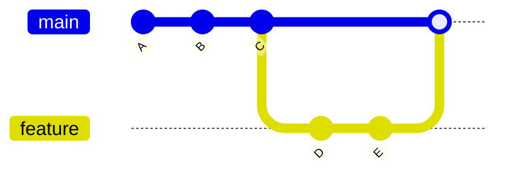

# 🔀 Merging (Combining Branches)

---

## 🎯 Goal of This Section

By the end of this module, you will:

- understand how Git combines branches
- know different types of merges
- resolve merge conflicts confidently
- understand merge internals (commit graph + parents)
- use merge in real-world workflows

---

## 🧠 Core Idea

> Merging = combining changes from one branch into another

---

## 📊 Basic Example

You have two branches:

```text
main:     A --- B --- C
                       \
feature:                D --- E
````

When you merge `feature` into `main`, Git combines histories.

---

## 📊 After Merge

```text id="w0r2gx"
main:     A --- B --- C -------- M
                       \      /
feature:                D --- E
```

👉 `M` = merge commit

---

## 📊 Visual (Mermaid)



---

## 🧠 Types of Merge

You will learn:

### 1. Fast-Forward Merge

* no new commit
* branch moves forward

### 2. Three-Way Merge

* creates merge commit
* combines two histories

### 3. Merge Conflicts

* happens when same code is changed
* requires manual resolution

---

## 🏗 Internal Architecture

### Merge Commit Structure

A normal commit has:

```text
1 parent
```

A merge commit has:

```text id="k2h7pl"
2 parents
```

Example:

```text id="x3jp0p"
M → C (main)
M → E (feature)
```

---

### Where Data is Stored

```bash
.git/objects/
```

Stores:

* commit objects
* tree objects
* blob objects

---

### HEAD Movement

Before merge:

```text id="5a8u6q"
HEAD → main → C
```

After merge:

```text id="f1l4ys"
HEAD → main → M
```

---

## 🔬 What Happens Internally During Merge

When you run:

```bash
git merge feature
```

Git:

1. finds common ancestor
2. compares changes from both branches
3. applies changes
4. creates new commit (if needed)
5. updates branch pointer

---

## 🧩 Real-World Use Cases

### 🔹 Feature Integration

Merge completed feature into main

---

### 🔹 Team Collaboration

Combine work from multiple developers

---

### 🔹 Release Preparation

Merge dev into main for release

---

### 🔹 Hotfix Integration

Merge urgent fix into both main and dev

---

## 🛠 Common Commands

```bash id="t8o7zv"
git merge feature
git merge --no-ff feature
git merge --abort
```

---

## ⚠️ Common Mistakes

---

### ❌ Merging wrong branch

Always verify:

```bash id="8p0w6t"
git branch
```

---

### ❌ Ignoring conflicts

Must resolve properly

---

### ❌ Not pulling latest changes

Always update before merge

---

### ❌ Large feature branches

Leads to complex conflicts

---

## 🧠 Best Practices

* keep branches small
* merge frequently
* test before merging
* understand conflicts before resolving
* use meaningful commit messages

---

## 🧠 Interview-Level Explanation

**Q: What is a merge in Git?**

Answer:

> A merge in Git combines changes from one branch into another. Internally, Git creates a merge commit with two parent commits, representing the histories of both branches. Git uses a three-way merge algorithm to combine changes.

---

## 🧠 Memory Trick

> Merge = combine timelines

---

## 📚 Topics in This Module

1. What is merge
2. Fast-forward merge
3. Three-way merge
4. Merge conflicts
5. Resolving conflicts
6. Merge strategies

---

## 🧪 Practice Lab

👉 `practice-lab.md`

---

## 🚀 Next Step

👉 Start with: `01-what-is-merge.md`
