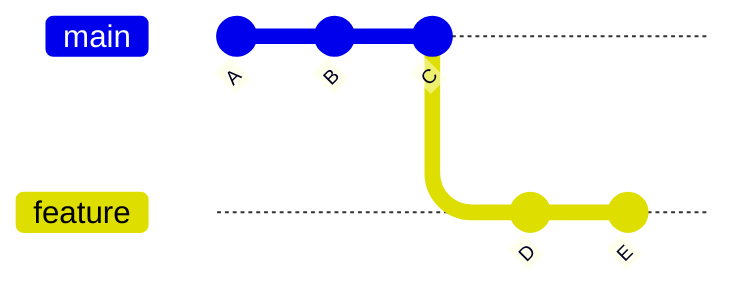

# 🔁 What Is Rebase?

---

## 🎯 Why This Matters

Rebasing is used to:

- keep Git history clean
- avoid unnecessary merge commits
- make commit history easier to read

---

## ✅ Definition

Rebase is:

> moving a branch to a new base and replaying its commits

---

## 🧠 Mental Model

Instead of combining histories like merge:

👉 rebase **rebuilds history**

---

## 📊 Before Rebase

```text
main:     A --- B --- C
                       \
feature:                D --- E
````

---

## 📊 After Rebase

```text id="reb102"
main:     A --- B --- C --- D' --- E'
```

---

## 📊 Key Difference

* D, E → replaced by D’, E’
* new commit hashes created

---

## 📊 Visual (Mermaid)



(Rebase → commits replayed on top of C)

---

## 🏗 Internal Architecture

---

### 1. Merge Base

Git finds:

```text id="reb104"
common ancestor = C
```

---

### 2. Commit Extraction

Git extracts:

```text id="reb105"
D, E
```

---

### 3. Reset Branch

```text id="reb106"
feature → C
```

---

### 4. Replay Commits

```text id="reb107"
D → D'
E → E'
```

---

## 🔬 What Happens Internally

Command:

```bash id="reb108"
git rebase main
```

Steps:

1. find merge base
2. save commits as patches
3. move branch pointer
4. apply commits one by one

---

## ⚡ Key Insight

> Rebase rewrites history by creating new commits

---

## 🧩 Merge vs Rebase (Quick)

---

### Merge

```text id="reb109"
creates merge commit
```

---

### Rebase

```text id="reb110"
creates linear history
```

---

## 🧩 Real Use Cases

---

### 🔹 Update feature branch

```bash id="reb111"
git rebase main
```

---

### 🔹 Clean commit history

Before PR

---

### 🔹 Avoid merge clutter

Cleaner logs

---

## 🛠 Command Variants

---

### Basic rebase

```bash id="reb112"
git rebase main
```

---

### Interactive rebase

```bash id="reb113"
git rebase -i HEAD~3
```

---

### Continue after conflict

```bash id="reb114"
git rebase --continue
```

---

### Abort rebase

```bash id="reb115"
git rebase --abort
```

---

## ⚠️ Common Mistakes

---

### ❌ Rebasing shared branch

👉 breaks team history

---

### ❌ Ignoring conflicts

Must resolve manually

---

### ❌ Not testing after rebase

Replayed commits may break code

---

### ❌ Confusing merge and rebase

---

## 🧠 Best Practices

* rebase local branches only
* use before PR
* resolve conflicts carefully
* verify history after rebase

---

## 🧠 Interview-Level Explanation

**Q: What happens during a rebase?**

Answer:

> During rebase, Git identifies the common ancestor, temporarily removes commits from the current branch, resets the branch to the new base, and reapplies those commits one by one, creating new commit hashes.

---

## 🧠 Memory Trick

> Rebase = replay commits

---

## ✅ Quick Recap

* moves branch to new base
* rewrites commits
* creates linear history
* safer for local work

---

## Check Yourself

1. What happens to commits during rebase?
2. Why do commit hashes change?
3. When should you avoid rebasing?
4. What is the difference from merge?

---

## ➡️ Next Step

Go to: `02-merge-vs-rebase.md`
