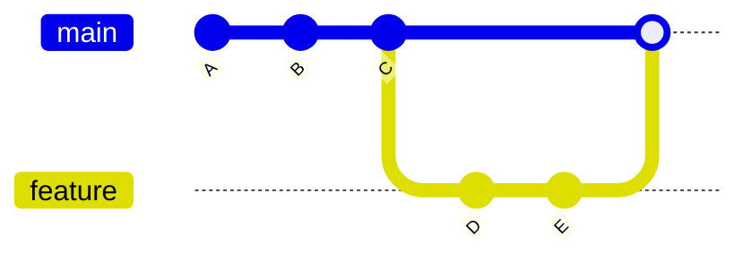
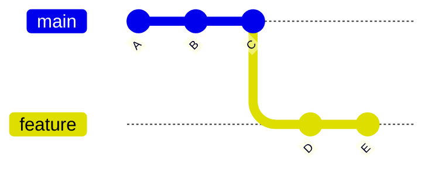

Perfect — here are **both files**, fully **clean, copy-paste-ready `.md`**, with:

* deep concepts
* internal architecture
* command variants
* real use cases
* strong visuals (ASCII + Mermaid)
* interview-level clarity

---

# 📄 `04-Rebasing/02-merge-vs-rebase.md`

````md id="reb201"
# ⚔️ Merge vs Rebase

---

## 🎯 Why This Matters

Merge and Rebase both:

> combine work from different branches

But they do it in **very different ways**

Understanding this is critical for:

- clean history
- team collaboration
- avoiding confusion
- interview questions

---

## 🧠 Core Difference

| Merge | Rebase |
|------|--------|
| Combines history | Rewrites history |
| Keeps original commits | Creates new commits |
| Creates merge commit | No merge commit |
| Non-destructive | Rewrites commit hashes |

---

## 📊 Example Setup

```text
main:     A --- B --- C
                       \
feature:                D --- E
````

---

## 🔀 Merge Result

```text id="mvr1"
main:     A --- B --- C -------- M
                       \      /
feature:                D ---- E
```

👉 Merge commit `M` created
👉 History preserved

---

## 🔁 Rebase Result

```text id="mvr2"
main:     A --- B --- C --- D' --- E'
```

👉 Commits replayed
👉 Linear history

---

## 📊 Visual (Mermaid)

---

### Merge



---

### Rebase



(Rebase → D', E' on top of C)

---

## 🏗 Internal Architecture

---

### Merge Internals

* creates new commit `M`
* commit has **2 parents**
* preserves graph structure

---

### Rebase Internals

* finds merge base
* extracts commits
* replays commits
* creates new commit hashes

---

## 🔬 What Happens Internally

---

### Merge

```bash id="mvr5"
git merge feature
```

Git:

1. finds common ancestor
2. combines changes
3. creates merge commit

---

### Rebase

```bash id="mvr6"
git rebase main
```

Git:

1. finds common ancestor
2. removes commits
3. reapplies commits
4. rewrites history

---

## 🧩 Real Use Cases

---

### 🔹 Use Merge When

* working in teams
* preserving history matters
* merging shared branches
* handling production code

---

### 🔹 Use Rebase When

* cleaning local commits
* preparing PR
* keeping history linear
* working solo or on private branch

---

## ⚠️ Golden Rule

> Never rebase shared/public branches

---

## ⚠️ Common Mistakes

---

### ❌ Rebasing shared branch

👉 breaks other developers’ history

---

### ❌ Using merge everywhere

👉 creates messy history

---

### ❌ Confusing results

👉 merge = graph
👉 rebase = line

---

## 🧠 Best Practices

* use rebase locally
* use merge for team integration
* rebase before PR
* merge into main

---

## 📊 Comparison Table

| Feature         | Merge | Rebase  |
| --------------- | ----- | ------- |
| History         | Graph | Linear  |
| Merge commit    | ✔ Yes | ❌ No    |
| Commit hashes   | Same  | Changed |
| Safe for shared | ✔ Yes | ❌ No    |

---

## 🧠 Interview-Level Explanation

**Q: Difference between merge and rebase?**

Answer:

> Merge combines branches by creating a merge commit and preserving history, while rebase rewrites commit history by replaying commits on a new base, resulting in a linear history.

---

## 🧠 Memory Trick

> Merge = combine
> Rebase = rewrite

---

## ✅ Quick Recap

* merge keeps history
* rebase rewrites history
* use rebase locally
* use merge for teams

---

## Check Yourself

1. Which creates merge commit?
2. Which rewrites history?
3. When should you avoid rebase?
4. Why does rebase change commit hashes?

---

## ➡️ Next Step

Go to: `03-interactive-rebase.md`
