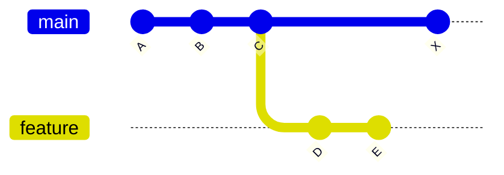
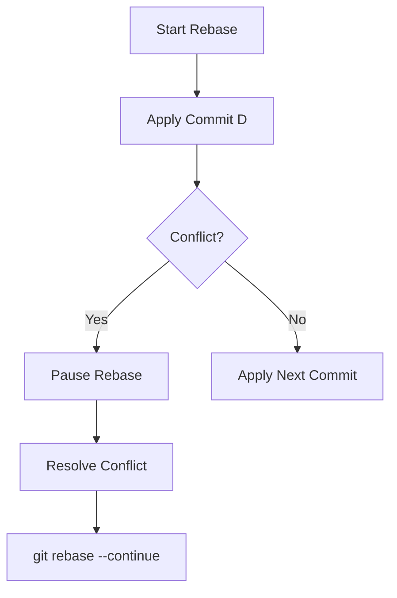

# ⚠️ Rebase Conflicts (When Replaying Goes Wrong)

---

## 🎯 Why This Matters

Rebase conflicts are similar to merge conflicts, but:

> they happen while Git is replaying commits one-by-one

Understanding this is essential because:

- rebase rewrites history
- conflicts can happen multiple times
- mistakes can lose work if handled poorly

---

## ✅ Definition

A rebase conflict occurs when:

> Git cannot apply a commit cleanly while replaying it onto a new base

---

## 🧠 Mental Model

During rebase:

```text
Take commit D → apply on new base
Take commit E → apply on new base
````

If Git fails during any step → conflict

---

## 📊 Before Rebase

```text
main:     A --- B --- C --- X
                       \
feature:                D --- E
```

---

## 📊 During Rebase

```text
Step 1: move feature to main
Step 2: replay D
Step 3: replay E
```

---

## 📊 Conflict Happens

```text
main:     A --- B --- C --- X
                               \
feature:                        D'  (conflict here)
```

---

## 📊 Visual (Mermaid)



(Rebase → replay D → conflict)

---

## 🏗 Internal Architecture

---

### During Rebase

Git creates temporary state:

```bash
.git/rebase-apply/
```

---

### Files Created

```bash
.git/REBASE_HEAD
.git/MERGE_MSG
```

---

### Index Holds 3 Versions

* base version
* current version
* incoming commit version

---

## 🔬 What Happens Internally

When you run:

```bash
git rebase main
```

Git:

1. finds merge base
2. extracts commits (D, E)
3. resets branch to main
4. applies commit D → conflict
5. stops and waits

---

## ⚡ Key Insight

> Rebase conflict = failed patch application

---

## 📊 Conflict Example

```text
<<<<<<< HEAD
Hello World
=======
Hello Git
>>>>>>> commit-D
```

---

## 📊 Visual Flow



---

## 🛠 Step-by-Step Fix

---

### Step 1: Check status

```bash
git status
```

---

### Step 2: Open conflicted file

---

### Step 3: Resolve manually

Remove markers:

```text
<<<<<<<
=======
>>>>>>>
```

---

### Step 4: Mark resolved

```bash
git add file.txt
```

---

### Step 5: Continue rebase

```bash
git rebase --continue
```

---

### Step 6: Repeat if more conflicts

---

## ❌ Abort Rebase

```bash
git rebase --abort
```

Returns to original state

---

## 📊 Visual (Before vs After)

---

### Before Conflict

```text
C → D → E
```

---

### After Rebase

```text
C → X → D' → E'
```

---

## 🧩 Real Use Cases

---

### 🔹 Updating feature branch

---

### 🔹 Long-running branch rebasing

---

### 🔹 Cleaning history before PR

---

## ⚠️ Common Mistakes

---

### ❌ Panicking on multiple conflicts

👉 normal in rebase

---

### ❌ Forgetting `--continue`

---

### ❌ Editing wrong section

---

### ❌ Losing changes

👉 due to incorrect resolution

---

## 🧠 Best Practices

* resolve carefully, commit by commit
* test after rebase
* keep branches small
* rebase frequently

---

## 🧠 Interview-Level Explanation

**Q: What is a rebase conflict?**

Answer:

> A rebase conflict occurs when Git fails to apply a commit during rebase because of conflicting changes. The developer must manually resolve the conflict and continue the rebase process.

---

## 🧠 Memory Trick

> Rebase conflict = replay failed

---

## ✅ Quick Recap

* happens during commit replay
* occurs commit-by-commit
* resolved manually
* continue with `--continue`

---

## Check Yourself

1. When do rebase conflicts occur?
2. How is it different from merge conflict?
3. What command continues rebase?
4. How to cancel rebase?

---

## ➡️ Next Step

Go to: `practice-lab.md`
