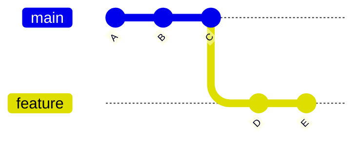

# 🔁 Rebasing (Rewriting History Cleanly)

---

## 🎯 Goal of This Section

By the end of this module, you will:

- understand what rebasing really means
- know how rebasing differs from merging
- use rebase to keep history clean
- avoid common rebase mistakes
- safely use rebase in real-world workflows

---

## 🧠 Core Idea

> Rebase = move your commits to a new base

---

## 📊 Basic Example

Before rebase:

```text
main:     A --- B --- C
                       \
feature:                D --- E
````

After rebase:

```text id="reb02"
main:     A --- B --- C --- D' --- E'
```

👉 commits are **replayed on top of main**
👉 history becomes **linear**

---

## 📊 Visual (Mermaid)



(Rebase → D', E' move on top of C)

---

## 🔀 Merge vs Rebase

---

### Merge

```text id="reb04"
A --- B --- C -------- M
           \        /
            D ---- E
```

* preserves history
* creates merge commit

---

### Rebase

```text id="reb05"
A --- B --- C --- D' --- E'
```

* rewrites history
* no merge commit

---

## 🏗 Internal Architecture

Rebase works by:

1. finding common ancestor
2. extracting commits
3. replaying commits on new base
4. creating new commit hashes

---

## 🔬 What Happens Internally

When you run:

```bash id="reb06"
git rebase main
```

Git:

1. finds merge base
2. saves commits (patches)
3. resets branch to main
4. reapplies commits one by one

---

## 🧩 Real-World Use Cases

* keeping history clean
* preparing PRs
* updating feature branch
* avoiding unnecessary merge commits

---

## 🛠 Common Commands

```bash id="reb07"
git rebase main
git rebase -i HEAD~3
git rebase --abort
git rebase --continue
```

---

## ⚠️ Important Warning

> Never rebase public/shared branches

Because:

* it rewrites history
* breaks other developers’ work

---

## 🧠 Best Practices

* use rebase for local branches
* use merge for shared branches
* rebase before creating PR
* test after rebase

---

## 🧠 Interview-Level Explanation

**Q: What is rebasing in Git?**

Answer:

> Rebasing is the process of moving or replaying commits from one branch onto another base commit, creating a linear history by rewriting commit hashes.

---

## 🧠 Memory Trick

> Rebase = replay commits on new base

---

## 📚 Topics in This Module

1. What is rebase
2. Merge vs rebase
3. Interactive rebase
4. Rebase conflicts
5. Safe rebasing practices

---

## 🧪 Practice Lab

👉 `practice-lab.md`

---

## 🚀 Next Step

👉 Start with: `01-what-is-rebase.md`
