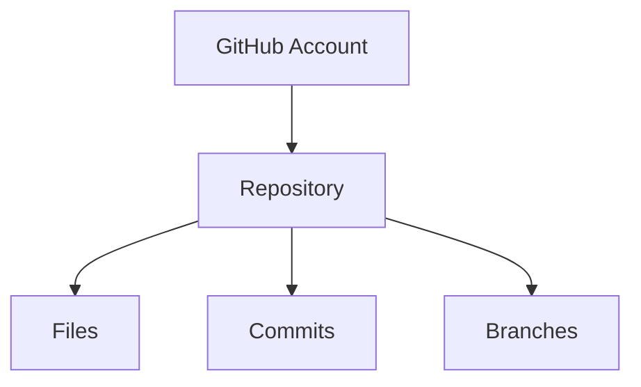

# 📦 Create a GitHub Repository

---

## 🎯 Why This Matters

A repository (repo) is where your code lives on GitHub.

Without a repo:
- you cannot push code
- you cannot collaborate
- you cannot share projects

---

## 🧠 Core Idea

> Repository = project container on GitHub

---

## 📊 Visual

```text
GitHub Account
   └── Repository (your project)
````

---

## 📊 Visual (Mermaid)



---

## 🧩 Steps to Create Repository

---

### 1. Go to GitHub

👉 [https://github.com](https://github.com)

---

### 2. Click "New Repository"

---

### 3. Fill Details

* Repository name
* Description (optional)
* Public / Private

---

### 4. Optional Settings

* ✔ Add README
* ✔ Add .gitignore
* ✔ Add license

---

### 5. Click "Create Repository"

---

## 📊 What You Get

```text id="gh203"
https://github.com/username/repo-name
```

---

## 📊 Visual Structure

```text
repo-name/
 ├── README.md
 ├── .gitignore
 └── project files
```

---

## 🏗 Internal Architecture

---

### GitHub Stores

* commits
* branches
* files
* pull requests

---

### Remote URL

```bash id="gh204"
https://github.com/username/repo.git
```

---

## 🔬 What Happens Internally

When repo is created:

* GitHub initializes a repository
* creates default branch (`main`)
* sets up remote endpoint

---

## 🧩 Real Use Cases

---

### 🔹 New project

---

### 🔹 Portfolio repo

---

### 🔹 Team project

---

### 🔹 Open source project

---

## ⚠️ Common Mistakes

---

### ❌ Wrong visibility (public/private)

---

### ❌ Forgetting README

---

### ❌ Bad naming

Avoid:

```text id="gh205"
test123
repo1
```

Use:

```text id="gh206"
todo-app
portfolio-website
api-server
```

---

## 🧠 Best Practices

* use meaningful names
* add README
* add .gitignore
* keep repo organized

---

## 🧠 Interview-Level Explanation

**Q: What is a repository in GitHub?**

Answer:

> A repository is a storage location on GitHub that contains project files, commit history, branches, and collaboration tools.

---

## 🧠 Memory Trick

> Repo = project container

---

## ✅ Quick Recap

* repo stores project
* created on GitHub
* has URL
* used for collaboration

---

## ➡️ Next Step

👉 `03-clone-repo.md`
