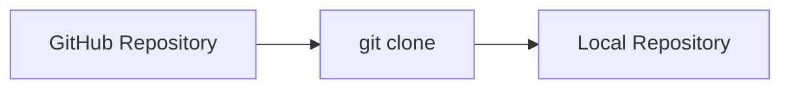
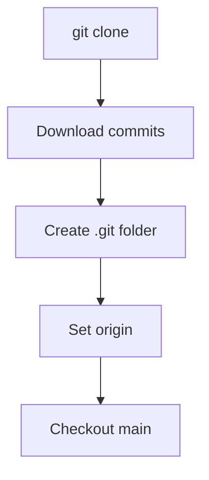

# 📥 Clone Repository

---

## 🎯 Why This Matters

Cloning lets you:

- copy a GitHub repo to your local machine
- start working immediately
- contribute to projects

---

## 🧠 Core Idea

> Clone = download repo + Git history

---

## 📊 Visual

```text
GitHub Repo → Local Machine
````

---

## 📊 Visual (Mermaid)



---

## 🛠 Command

```bash id="gh303"
git clone <repo-url>
```

---

## 🧪 Example

```bash id="gh304"
git clone https://github.com/user/project.git
```

---

## 📊 What Gets Created

```text
project/
 ├── .git/
 ├── files
 └── history
```

---

## 🏗 Internal Architecture

---

### After Clone

```text id="gh305"
Local Repo
 ├── .git/
 ├── working files
```

---

### Remote Automatically Set

```bash id="gh306"
origin → GitHub repo
```

---

## 🔬 What Happens Internally

Clone performs:

1. downloads repository data
2. copies commit history
3. sets remote origin
4. checks out default branch

---

## 📊 Internal Flow



---

## 🧩 Real Use Cases

---

### 🔹 Start working on project

---

### 🔹 Contribute to open source

---

### 🔹 Get team repository

---

## ⚠️ Common Mistakes

---

### ❌ Cloning wrong repo

---

### ❌ Not checking branch

---

### ❌ Modifying directly without branch

---

## 🧠 Best Practices

* always clone first
* create feature branch after cloning
* verify remote URL

---

## 🧠 Interview-Level Explanation

**Q: What does git clone do?**

Answer:

> Git clone creates a local copy of a remote repository, including its commit history, branches, and sets up a remote connection called origin.

---

## 🧠 Memory Trick

> Clone = full copy + connection

---

## ✅ Quick Recap

* copies repo locally
* includes history
* sets remote automatically
* ready to use

---

## ➡️ Next Step

👉 `04-add-remote.md`
