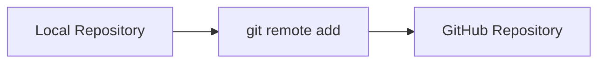
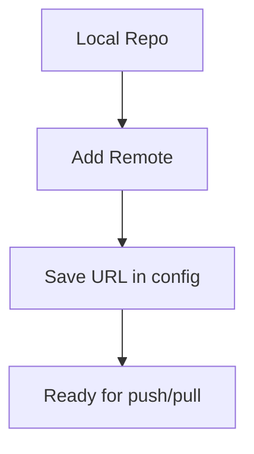

# 🔗 Add Remote Repository

---

## 🎯 Why This Matters

If you already have a local Git project, you need to:

> connect it to GitHub

This is done using **remote**

---

## 🧠 Core Idea

> Remote = link between local repo and GitHub

---

## 📊 Visual

```text
Local Repo → Remote (GitHub)
````

---

## 📊 Visual (Mermaid)



---

## 🛠 Command

```bash id="gh403"
git remote add origin <repo-url>
```

---

## 🧪 Example

```bash id="gh404"
git remote add origin https://github.com/user/project.git
```

---

## 📊 Check Remote

```bash id="gh405"
git remote -v
```

Output:

```text id="gh406"
origin  https://github.com/user/project.git (fetch)
origin  https://github.com/user/project.git (push)
```

---

## 🏗 Internal Architecture

---

### Stored in

```bash id="gh407"
.git/config
```

---

### Example Config

```text id="gh408"
[remote "origin"]
    url = https://github.com/user/project.git
```

---

## 🔬 What Happens Internally

When adding remote:

* Git stores URL in config
* creates alias (`origin`)
* prepares push/pull communication

---

## 📊 Flow



---

## 🧩 Real Use Cases

---

### 🔹 Connect local project to GitHub

---

### 🔹 Push existing project

---

### 🔹 Link multiple remotes

---

## 🛠 Additional Commands

---

### Change remote URL

```bash id="gh410"
git remote set-url origin <new-url>
```

---

### Remove remote

```bash id="gh411"
git remote remove origin
```

---

## ⚠️ Common Mistakes

---

### ❌ Wrong URL

---

### ❌ Forgetting origin name

---

### ❌ Not verifying remote

---

## 🧠 Best Practices

* use `origin` as default name
* verify using `git remote -v`
* keep remote URLs correct

---

## 🧠 Interview-Level Explanation

**Q: What is git remote add?**

Answer:

> It connects a local repository to a remote repository by storing the remote URL in the Git configuration, allowing push and pull operations.

---

## 🧠 Memory Trick

> Remote = connection link

---

## ✅ Quick Recap

* connects local to GitHub
* stored in `.git/config`
* required for push/pull

---

## ➡️ Next Step

👉 `05-push-code.md`
