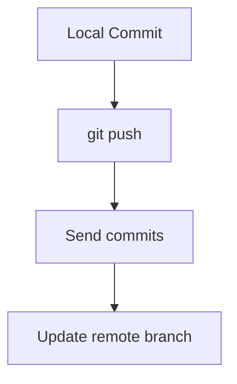

# 🚀 Push (Send Code to GitHub)

---

## 🎯 Why This Matters

Push is how your local work reaches GitHub.

Without push:
- your code stays local
- team cannot see your work
- no backup exists

---

## 🧠 Core Idea

> Push = send commits from local → remote

---

## 📊 Visual

```text
Local Repo  ──push──▶  GitHub Repo
````

---

## 📊 Visual (Mermaid)


---

## 🛠 Main Command

```bash
git push origin main
```

---

## 🧪 First Push (Important)

```bash id="rmt503"
git push -u origin main
```

👉 sets upstream tracking

---

## 📊 What Happens

Before push:

```text id="rmt504"
Local:   A --- B --- C
Remote:  A --- B
```

After push:

```text id="rmt505"
Local:   A --- B --- C
Remote:  A --- B --- C
```

---

## 🏗 Internal Architecture

---

### Local Branch

```text id="rmt506"
main → C
```

---

### Remote Branch

```text id="rmt507"
origin/main → B
```

---

### After Push

```text id="rmt508"
origin/main → C
```

---

## 🔬 What Happens Internally

When you run:

```bash id="rmt509"
git push origin main
```

Git:

1. finds new commits
2. sends commit objects
3. updates remote branch pointer

---

## 📊 Push Flow



---

## 🧩 Command Variants

---

### Push specific branch

```bash id="rmt511"
git push origin feature
```

---

### Push all branches

```bash id="rmt512"
git push --all
```

---

### Force push (dangerous)

```bash id="rmt513"
git push --force
```

---

### Safe force push

```bash id="rmt514"
git push --force-with-lease
```

---

## ⚠️ Common Mistakes

---

### ❌ Forgetting to pull first

👉 leads to rejection

---

### ❌ Force push on shared branch

👉 breaks team history

---

### ❌ Wrong branch push

---

## 🧠 Best Practices

* pull before push
* use `--force-with-lease` instead of `--force`
* verify branch before pushing
* commit properly before pushing

---

## 🧠 Interview-Level Explanation

**Q: What does git push do?**

Answer:

> Git push sends local commits to a remote repository and updates the remote branch pointer to match the local branch.

---

## 🧠 Memory Trick

> Push = upload commits

---

## ✅ Quick Recap

* sends commits to remote
* updates remote branch
* requires remote connection
* first push sets upstream

---

## ➡️ Next Step

👉 `06-pull.md`
