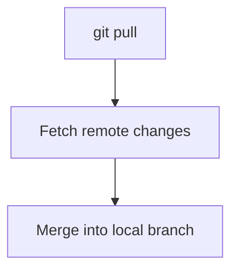

# 📥 Pull (Fetch + Merge)

---

## 🎯 Why This Matters

Pull keeps your local repo updated with remote changes.

Without pull:
- your code becomes outdated
- conflicts increase
- collaboration breaks

---

## 🧠 Core Idea

> Pull = fetch + merge

---

## 📊 Visual

```text
GitHub Repo ──pull──▶ Local Repo
````

---

## 📊 Visual (Mermaid)


---

## 🛠 Main Command

```bash
git pull
```

---

## 🧪 With branch

```bash id="rmt603"
git pull origin main
```

---

## 📊 What Happens

Before pull:

```text id="rmt604"
Local:   A --- B
Remote:  A --- B --- C
```

After pull:

```text id="rmt605"
Local:   A --- B --- C
```

---

## 🏗 Internal Architecture

---

### Step 1: Fetch

```text id="rmt606"
origin/main updated
```

---

### Step 2: Merge

```text id="rmt607"
merge origin/main into local main
```

---

## 🔬 What Happens Internally

```bash id="rmt608"
git pull
```

Git performs:

1. `git fetch`
2. `git merge`

---

## 📊 Pull Flow



---

## 🧩 Command Variants

---

### Pull with rebase

```bash id="rmt610"
git pull --rebase
```

---

### Pull specific branch

```bash id="rmt611"
git pull origin feature
```

---

## ⚠️ Common Mistakes

---

### ❌ Not pulling before pushing

---

### ❌ Unexpected merge commits

---

### ❌ Ignoring conflicts

---

## 🧠 Best Practices

* pull frequently
* use `--rebase` for cleaner history
* resolve conflicts carefully
* review changes before merge

---

## 🧠 Interview-Level Explanation

**Q: What does git pull do?**

Answer:

> Git pull fetches changes from a remote repository and merges them into the current local branch.

---

## 🧠 Memory Trick

> Pull = fetch + merge

---

## ✅ Quick Recap

* updates local repo
* combines remote changes
* may create merge commit
* can cause conflicts

---

## ➡️ Next Step

👉 `07-fetch.md`
