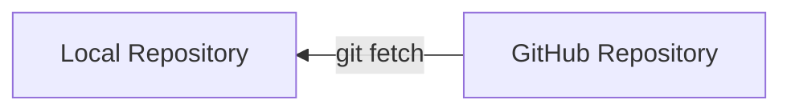
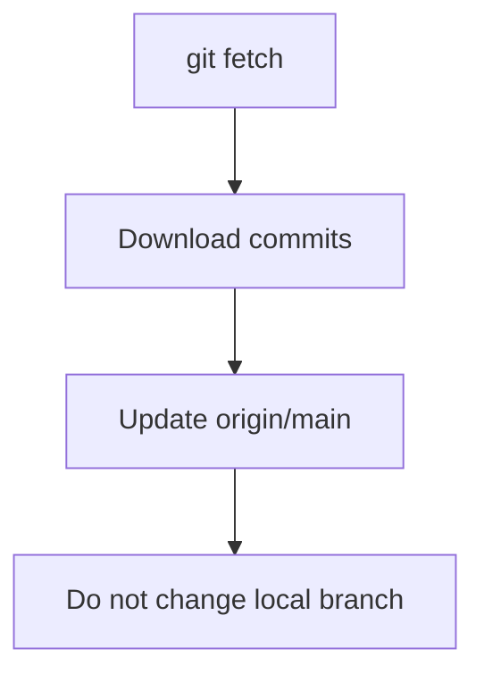

# 📡 Fetch (Download Without Changing Code)

---

## 🎯 Why This Matters

Fetch lets you:

- see remote changes
- inspect before merging
- stay safe

---

## 🧠 Core Idea

> Fetch = download changes without applying them

---

## 📊 Visual

```text
GitHub Repo ──fetch──▶ Local (no merge)
````

---

## 📊 Visual (Mermaid)



---

## 🛠 Main Command

```bash
git fetch
```

---

## 📊 What Happens

Before fetch:

```text id="rmt703"
Local:        A --- B
origin/main:  A --- B --- C
```

After fetch:

```text id="rmt704"
Local:        A --- B
origin/main:  A --- B --- C
```

👉 local code unchanged

---

## 🏗 Internal Architecture

---

### Remote Tracking Branch

```text id="rmt705"
origin/main updated
```

---

### Local Branch

```text id="rmt706"
main unchanged
```

---

## 🔬 What Happens Internally

```bash id="rmt707"
git fetch
```

Git:

1. downloads new commits
2. updates remote tracking branches
3. does NOT merge

---

## 📊 Fetch Flow



---

## 🧩 After Fetch (Next Step)

To apply changes:

```bash id="rmt709"
git merge origin/main
```

OR

```bash id="rmt710"
git rebase origin/main
```

---

## ⚠️ Fetch vs Pull

| Feature          | Fetch | Pull |
| ---------------- | ----- | ---- |
| Download changes | ✔     | ✔    |
| Merge changes    | ❌     | ✔    |
| Safe             | ✔     | ⚠️   |

---

## 🧩 Real Use Cases

---

### 🔹 Inspect changes before merging

---

### 🔹 Avoid unwanted merge commits

---

### 🔹 Safe team workflow

---

## ⚠️ Common Mistakes

---

### ❌ Assuming fetch updates code

---

### ❌ Forgetting to merge after fetch

---

### ❌ Ignoring fetched changes

---

## 🧠 Best Practices

* use fetch before merge
* inspect changes carefully
* prefer fetch in team environments

---

## 🧠 Interview-Level Explanation

**Q: What does git fetch do?**

Answer:

> Git fetch downloads changes from a remote repository and updates remote-tracking branches without modifying the working directory.

---

## 🧠 Memory Trick

> Fetch = download only

---

## ✅ Quick Recap

* downloads changes
* does NOT modify code
* updates remote tracking branch
* safe operation

---

## ➡️ Next Step

👉 `08-fork-and-pr.md`
