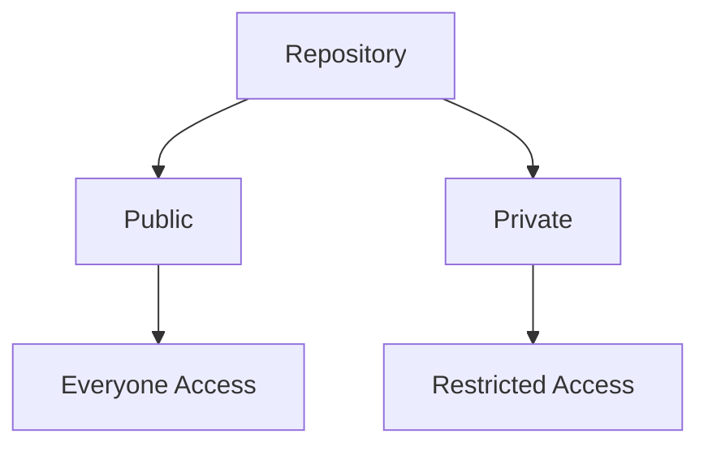

# 🔐 Private vs Public Repository

---

## 🎯 Why This Matters

Choosing the right visibility affects:

- security
- collaboration
- open-source contributions
- company policies

---

## 🧠 Core Idea

| Type | Visibility |
|------|------------|
| Public | anyone can see |
| Private | restricted access |

---

## 📊 Visual

```text
Public Repo → visible to everyone
Private Repo → visible to selected users
````

---

## 📊 Visual (Mermaid)



---

## 🧠 Public Repository

---

### Features

* visible to everyone
* searchable
* open-source friendly

---

### Use Cases

* portfolio projects
* open-source contributions
* learning projects

---

## 🧠 Private Repository

---

### Features

* limited access
* secure
* requires permission

---

### Use Cases

* company projects
* personal work
* confidential code

---

## 🏗 Internal Behavior

---

### Public Repo

```text id="rmt903"
accessible by anyone via URL
```

---

### Private Repo

```text id="rmt904"
requires authentication
```

---

## 🔬 What Happens Internally

* GitHub controls access via permissions
* private repos require login/token
* public repos accessible via HTTPS

---

## 🧩 Real Use Cases

---

### 🔹 Public

* GitHub portfolio
* open-source libraries

---

### 🔹 Private

* startup code
* enterprise apps
* sensitive data

---

## ⚠️ Common Mistakes

---

### ❌ Making sensitive repo public

---

### ❌ Keeping portfolio private

---

### ❌ Sharing credentials

---

## 🧠 Best Practices

* use public for learning/projects
* use private for secure code
* review visibility before pushing
* avoid secrets in public repos

---

## 🧠 Interview-Level Explanation

**Q: Difference between public and private repo?**

Answer:

> A public repository is visible to everyone, while a private repository is restricted to specific users. Public repos are used for open-source, while private repos are used for secure or proprietary code.

---

## 🧠 Memory Trick

> Public = open
> Private = restricted

---

## ✅ Quick Recap

* public = visible to all
* private = restricted access
* choose based on use case

---

## ➡️ Next Step

👉 `practice-lab.md`

