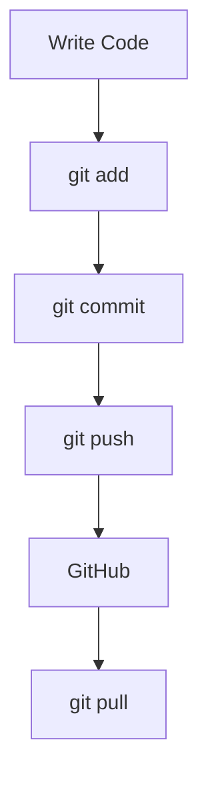

# 🌐 Remote Git & GitHub

---

## 🎯 Goal of This Section

By the end of this module, you will:

- understand what a remote repository is
- connect local Git to GitHub
- push and pull code
- collaborate with others
- understand GitHub workflows (PRs, forks)

---

## 🧠 Core Idea

> Local Git = your machine  
> Remote Git (GitHub) = shared server

---

## 📊 Basic Concept

```text
[ Your Computer ]  ←→  [ GitHub Server ]
     (local repo)        (remote repo)
````

---

## 📊 Visual (Mermaid)


---

## 🧠 Why Remote Exists

Without remote:

* your code stays on your machine
* no collaboration
* no backup

With remote:

* share code
* collaborate with team
* backup safely
* deploy projects

---

## 📊 Typical Workflow

```text
1. Write code locally
2. Commit changes
3. Push to GitHub
4. Others pull changes
```

---

## 📊 Visual Workflow



---

## 🏗 Internal Architecture

---

### Local Repository

```bash id="rmt04"
.git/
```

Stores:

* commits
* branches
* history

---

### Remote Reference

```bash id="rmt05"
origin → GitHub URL
```

Stored in:

```bash id="rmt06"
.git/config
```

---

### Remote Tracking Branch

```text id="rmt07"
origin/main
```

Represents:

> last known state of remote

---

## 🔬 What Happens Internally

---

### Push

```bash id="rmt08"
git push origin main
```

* sends commits to remote
* updates GitHub

---

### Pull

```bash id="rmt09"
git pull
```

* fetch + merge
* updates local repo

---

## 🧩 Real Use Cases

---

### 🔹 Backup code

---

### 🔹 Work in team

---

### 🔹 Open source contribution

---

### 🔹 Deploy apps

---

## 🛠 Common Commands

```bash id="rmt10"
git remote add origin <url>
git push -u origin main
git pull
git fetch
git clone <url>
```

---

## ⚠️ Common Mistakes

---

### ❌ Not setting remote

---

### ❌ Confusing fetch vs pull

---

### ❌ Force pushing incorrectly

---

### ❌ Not pulling before pushing

---

## 🧠 Best Practices

* pull before push
* use meaningful commit messages
* avoid force push on shared branches
* verify remote URL

---

## 🧠 Interview-Level Explanation

**Q: What is a remote repository in Git?**

Answer:

> A remote repository is a version of your project hosted on a server like GitHub, which allows collaboration and backup. It is connected to your local repository using a URL and managed through commands like push and pull.

---

## 🧠 Memory Trick

> Remote = shared Git

---

## 📚 Topics in This Module

1. Create GitHub account
2. Create repository
3. Connect local repo
4. Push & pull
5. Clone repo
6. Fork & PR

---

## 🚀 Next Step

👉 Start with: `01-create-github-account.md`
