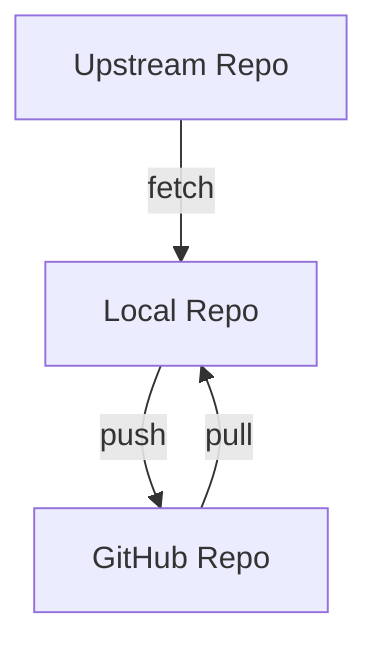

# 🧪 Practice Lab — Remote & GitHub Mastery

---

## 🎯 Objective

By completing this lab, you will:

- create GitHub repo
- clone repository
- add remote
- push & pull code
- understand origin/upstream
- work with visibility settings

---

## 📊 Target Flow

```text
Local → Push → GitHub
GitHub → Pull → Local
Upstream → Sync → Local
````

---

## 🛠 Task 1 — Create Repo

* go to GitHub
* create repository

---

## 🧩 Task 2 — Clone Repo

```bash id="rmt1002"
git clone <repo-url>
```

---

## 🧩 Task 3 — Add Remote (if needed)

```bash id="rmt1003"
git remote add origin <url>
```

---

## 🧩 Task 4 — Push Code

```bash id="rmt1004"
git push -u origin main
```

---

## 🧩 Task 5 — Make Changes

```bash id="rmt1005"
echo "update" >> app.txt
git add .
git commit -m "update"
git push
```

---

## 🧩 Task 6 — Pull Changes

```bash id="rmt1006"
git pull
```

---

## 🧩 Task 7 — Add Upstream

```bash id="rmt1007"
git remote add upstream <original-url>
git fetch upstream
```

---

## 🧩 Task 8 — Sync Upstream

```bash id="rmt1008"
git merge upstream/main
```

---

## 🧩 Task 9 — Change Visibility

* switch public/private in GitHub settings

---

## 📊 Visual Workflow



---

## 🔥 Bonus Challenges

---

### 🔹 Try multiple remotes

---

### 🔹 Push different branches

---

### 🔹 Sync fork manually

---

## ⚠️ Common Mistakes

* wrong remote URL
* forgetting upstream
* pushing to wrong branch
* not pulling before push

---

## 🧠 What You Learned

* remote workflow
* push/pull/fetch
* origin vs upstream
* GitHub usage

---

## 🧠 Memory Trick

> Remote = share + sync

---

## 🚀 Next Step

👉 Move to: `06-Collaboration/README.md`
