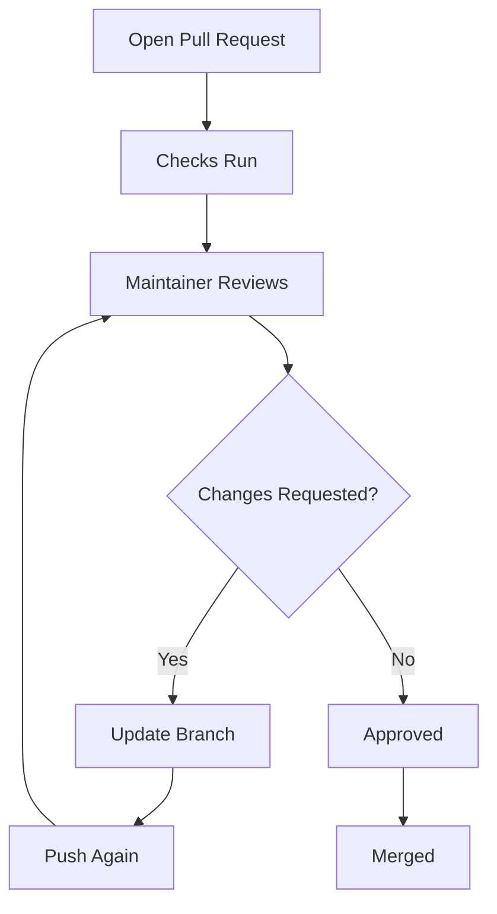

# 🍴 Fork Workflow Mastery

<p align="center">
  
  
  
  
</p>

<p align="center">
  <b>Learn how to contribute to repositories when you do not have direct write access.</b>
</p>

---

## 📌 What Is the Fork Workflow?

Fork workflow is a collaboration model where you:

1. create your own copy of someone else's repository
2. work in your own fork
3. push your changes there
4. open a Pull Request back to the original repository

This is the standard workflow for:

- open-source contribution
- external contributors
- public collaboration on GitHub

---

## 🧠 Why Fork Workflow Exists

In open-source, maintainers cannot give write access to everyone.

That would be unsafe.

So GitHub uses a safer model:

- contributor gets a personal copy
- contributor works independently
- maintainer reviews before merge

This keeps the original repository protected.

---

## 🗺️ The Big Picture

```text
┌──────────────────────┐
│ Original Repository  │
│   owner/project      │
└──────────┬───────────┘
           │ Fork
           ▼
┌──────────────────────┐
│ Your Fork            │
│ yourname/project     │
└──────────┬───────────┘
           │ Clone
           ▼
┌──────────────────────┐
│ Local Repository     │
│ on your machine      │
└──────────┬───────────┘
           │ Branch
           ▼
┌──────────────────────┐
│ feature/my-change    │
└──────────┬───────────┘
           │ Push
           ▼
┌──────────────────────┐
│ Your Fork on GitHub  │
└──────────┬───────────┘
           │ Pull Request
           ▼
┌──────────────────────┐
│ Original Repository  │
│ reviewed & merged    │
└──────────────────────┘
````

---

## 🔄 Full Workflow Diagram

```mermaid
flowchart LR
    A[Original Repository] --> B[Fork on Your Account]
    B --> C[Clone Fork Locally]
    C --> D[Create Feature Branch]
    D --> E[Make Changes]
    E --> F[Commit Changes]
    F --> G[Push to Your Fork]
    G --> H[Open Pull Request]
    H --> I[Maintainer Review]
    I --> J[Merge to Original Repo]
```



---

## 🧱 Step 1 — Fork the Repository

On GitHub, click the **Fork** button.

### What GitHub does internally

When you fork a repo, GitHub creates a server-side copy under your account.

```text
Original:  github.com/original-owner/project
Fork:      github.com/your-username/project
```

### Important understanding

A fork is:

* not just a download
* not just a local copy
* not a branch

A fork is a **new repository under your account**, connected conceptually to the original.

---

## 🖥️ GitHub UI Mock

```text
┌──────────────────────────────────────────────────────────────┐
│ original-owner/project                                      │
│ [ Star ] [ Watch ] [ Fork ]                                 │
└──────────────────────────────────────────────────────────────┘

After clicking Fork:

┌──────────────────────────────────────────────────────────────┐
│ your-username/project                                       │
│ Forked from original-owner/project                          │
└──────────────────────────────────────────────────────────────┘
```

---

## 🧱 Step 2 — Clone Your Fork

```bash
git clone https://github.com/your-username/project.git
cd project
```

Now the repository exists on your machine.

### Internal remote mapping

Right after cloning your fork:

```bash
git remote -v
```

You will usually see:

```text
origin  https://github.com/your-username/project.git (fetch)
origin  https://github.com/your-username/project.git (push)
```

### Key idea

`origin` points to **your fork**, not the original repository.

---

## 🧱 Step 3 — Add the Upstream Remote

This is one of the most important parts of fork workflow.

```bash
git remote add upstream https://github.com/original-owner/project.git
```

Now check remotes:

```bash
git remote -v
```

Expected:

```text
origin    https://github.com/your-username/project.git (fetch)
origin    https://github.com/your-username/project.git (push)
upstream  https://github.com/original-owner/project.git (fetch)
upstream  https://github.com/original-owner/project.git (push)
```

---

## 🧠 origin vs upstream

```text
origin   = your fork
upstream = original repository
```

### Why this matters

You push your work to `origin`, but you sync changes from `upstream`.

That is the heart of fork workflow.

---

## 🧱 Step 4 — Create a Feature Branch

Never work directly on `main`.

```bash
git checkout -b feature/add-login-validation
```

### Why use a branch?

Because it isolates your work.

```text
main
 └── feature/add-login-validation
```

### Internal Git behavior

Git does not copy the whole repository.

It simply creates a new pointer to the current commit.

```text
A --- B --- C  main
              \
               D  feature/add-login-validation
```

Branches are lightweight references.

---

## 🧱 Step 5 — Make Changes

Now edit files however needed.

Example:

* fix typo
* add feature
* update docs
* improve tests
* refactor code

Then stage and commit:

```bash
git add .
git commit -m "Add login validation examples"
```

---

## 🧠 What a commit really is

A commit stores:

* snapshot of tracked changes
* parent commit reference
* author info
* timestamp
* message
* SHA hash

```text
Commit = project snapshot + metadata + history link
```

This is why Git can reconstruct project history so efficiently.

---

## 🧱 Step 6 — Push to Your Fork

```bash
git push origin feature/add-login-validation
```

### What happens now?

Your branch is uploaded to **your fork on GitHub**.

```text
Local branch
    │
    ▼
origin/feature/add-login-validation
```

You still have not changed the original repository.

That only happens after a Pull Request is reviewed and merged.

---

## 🧱 Step 7 — Open a Pull Request

After pushing, GitHub usually shows a button like:

```text
Compare & pull request
```

### PR direction in fork workflow

```text
Base repository:     original-owner/project
Base branch:         main

Head repository:     your-username/project
Compare branch:      feature/add-login-validation
```

---

## 🖥️ Pull Request UI Mock

```text
┌──────────────────────────────────────────────────────────────┐
│ Open a pull request                                         │
├──────────────────────────────────────────────────────────────┤
│ base repository: original-owner/project                     │
│ base:            main                                       │
│                                                            │
│ head repository: your-username/project                      │
│ compare:         feature/add-login-validation               │
├──────────────────────────────────────────────────────────────┤
│ Title: Add login validation examples                        │
│                                                            │
│ Description:                                                │
│ - added validation section                                  │
│ - improved examples                                         │
│ - updated docs                                              │
└──────────────────────────────────────────────────────────────┘
```

---

## ⚙️ What GitHub does internally for a PR

When you open a PR, GitHub calculates:

* common ancestor commit
* difference between base and compare branch
* changed files
* line-by-line diffs
* merge possibility
* check status

### Simplified comparison

```text
Original main:         A --- B --- C
Your feature branch:             \
                                  D --- E
```

GitHub compares `C` vs `E` using the merge base.

---

## 🧪 PR Review Lifecycle



---

## 🔄 Updating the PR After Review

If the maintainer asks for changes:

1. edit code locally
2. commit again
3. push again to the same branch

```bash
git add .
git commit -m "Address PR review feedback"
git push origin feature/add-login-validation
```

GitHub automatically updates the same PR.

That is a powerful concept:
**a PR tracks a branch, not just one commit.**

---

## 🔁 Keeping Your Fork Updated

The original repository may continue changing while you work.

To sync your local `main` with the original:

```bash
git checkout main
git fetch upstream
git merge upstream/main
git push origin main
```

### Visual

```text
upstream/main   ---> newer state
local main      ---> old state
origin/main     ---> old state

After sync:
local main      ---> updated
origin/main     ---> updated
```

---

## 🧠 Why syncing matters

If your fork becomes outdated:

* merge conflicts increase
* PRs become harder to review
* tests may fail
* maintainers may ask you to rebase or update

---

## 🚨 Common Mistakes in Fork Workflow

### 1. Working directly on `main`

This makes future work messy and risky.

### 2. Forgetting to add `upstream`

Then you cannot sync properly with the original repo.

### 3. Creating huge PRs

Massive PRs are difficult to review.

### 4. Ignoring contribution guidelines

Many projects require issue references, templates, lint rules, or test updates.

### 5. Not updating before opening PR

Your branch may already be behind the original repo.

---

## ✅ Best Practices

* create one branch per task
* keep changes focused
* write clean commit messages
* read the repository’s `CONTRIBUTING.md`
* sync frequently from upstream
* explain your PR clearly
* be respectful in review discussions

---

## 🌍 Real-World Open Source Scenario

Imagine you want to contribute a typo fix or feature to an open-source project.

### Workflow

```text
1. Fork repository
2. Clone your fork
3. Add upstream
4. Create feature branch
5. Make changes
6. Commit
7. Push to origin
8. Open Pull Request
9. Respond to review
10. Get merged
```

### This is exactly how thousands of contributors work on GitHub every day.

---

## 🧬 Internal Architecture View

Here is the full structure in one place:

```text
                    GITHUB SERVER SIDE

     ┌────────────────────────┐
     │ Original Repo          │
     │ original-owner/project │
     └──────────┬─────────────┘
                │ fork
                ▼
     ┌────────────────────────┐
     │ Your Fork              │
     │ your-username/project  │
     └──────────┬─────────────┘
                │ clone
                ▼

                    YOUR MACHINE

     ┌────────────────────────┐
     │ Local Repository       │
     │ remote origin   -> fork│
     │ remote upstream -> orig│
     └──────────┬─────────────┘
                │
                ▼
     ┌────────────────────────┐
     │ Feature Branch         │
     │ feature/my-change      │
     └──────────┬─────────────┘
                │ push
                ▼

                    GITHUB AGAIN

     ┌────────────────────────┐
     │ origin/feature branch  │
     └──────────┬─────────────┘
                │ PR
                ▼
     ┌────────────────────────┐
     │ Merge into upstream    │
     └────────────────────────┘
```

---

## 🎤 Interview Questions

### What is the difference between fork and clone?

A fork is a new repository on GitHub under your account.
A clone is a local copy on your machine.

### Why do we add `upstream`?

So we can fetch and sync changes from the original repository.

### Can you push directly to the original repo in fork workflow?

Usually no, unless you have permission.

### Why is fork workflow common in open source?

Because it allows safe contribution without giving direct write access.

### What happens if you push more commits after opening a PR?

The PR updates automatically because it tracks the branch.

---

## 🧪 Practice Lab

Try this complete exercise:

```bash
# 1. Clone your fork
git clone https://github.com/your-username/project.git
cd project

# 2. Add original repo
git remote add upstream https://github.com/original-owner/project.git

# 3. Create feature branch
git checkout -b docs/improve-readme

# 4. Make changes
# edit files...

# 5. Commit
git add .
git commit -m "Improve README examples"

# 6. Push
git push origin docs/improve-readme
```

Then open a Pull Request from your fork to the original repo.

---

## 🎯 Final Takeaway

Fork workflow is the foundation of open-source contribution.

It teaches you how to:

* work without direct access
* keep repositories safe
* collaborate cleanly
* understand GitHub’s review model
* contribute like a real developer

Once you truly understand fork workflow, GitHub starts making much more sense.

---

## 👉 Next Step

➡️ [`02-pull-request.md`](./02-pull-request.md)
