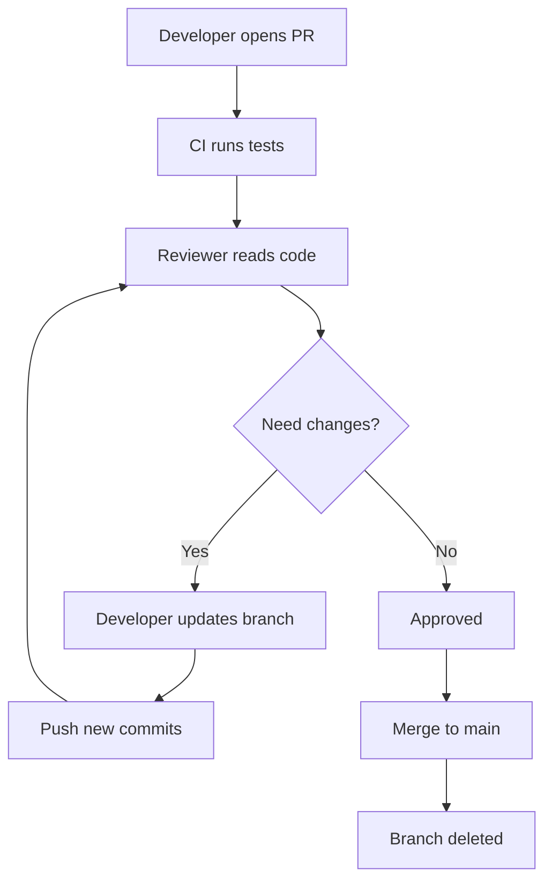

# 🔀 Pull Request Mastery

<p align="center">
  
  
  
  
</p>

<p align="center">
  <b>Understand Pull Requests deeply — from creation to review to merge, with real-world team flow.</b>
</p>

---

## 📌 What Is a Pull Request?

A **Pull Request (PR)** is a structured request to merge changes from one branch into another branch.

Most commonly:

- from `feature/login` → `main`
- from `bugfix/navbar` → `main`
- from fork branch → original repository branch

A Pull Request is not just a merge button.

It is a **collaboration space** where teams:

- inspect changes
- discuss design decisions
- review code quality
- run automated checks
- approve or request fixes
- merge safely

---

## 🧠 Why Pull Requests Matter

Without Pull Requests, developers may:

- push unstable code directly to `main`
- skip review
- introduce bugs faster
- lose visibility into what changed
- create chaotic project history

With Pull Requests, teams gain:

- safer merges
- code review discipline
- CI/CD validation
- discussion history
- better documentation of changes
- cleaner release flow

---

## 🗺️ Big Picture

```mermaid
flowchart LR
    A[Create Branch] --> B[Make Changes]
    B --> C[Commit]
    C --> D[Push Branch]
    D --> E[Open Pull Request]
    E --> F[Automated Checks]
    F --> G[Code Review]
    G --> H[Update If Needed]
    H --> I[Approve]
    I --> J[Merge]
````

---

## 🧱 Pull Request Core Idea

A Pull Request compares two branches:

```text
Base branch    = where changes should go
Compare branch = where your changes currently are
```

Example:

```text
Base:    main
Compare: feature/add-login
```

GitHub calculates the difference and shows what would be merged.

---

## 🖥️ GitHub UI Mock

```text
┌──────────────────────────────────────────────────────────────┐
│ Open a pull request                                         │
├──────────────────────────────────────────────────────────────┤
│ base:    main                                               │
│ compare: feature/add-login                                  │
├──────────────────────────────────────────────────────────────┤
│ Title: feat: add login validation                           │
│                                                            │
│ Description:                                                │
│ - added client-side validation                              │
│ - improved error messages                                   │
│ - added tests                                               │
├──────────────────────────────────────────────────────────────┤
│ Commits: 4                                                  │
│ Files changed: 7                                            │
│ Checks: ✅ Passed                                            │
└──────────────────────────────────────────────────────────────┘
```

---

## ⚙️ What Happens Internally When You Open a PR

When you open a Pull Request, GitHub does several things internally.

### 1. Finds the merge base

GitHub identifies the common ancestor between the two branches.

```text
A --- B --- C  main
           \
            D --- E  feature/add-login
```

Here:

* `C` is where branch diverged from main
* `E` is the latest feature branch commit

GitHub uses the branch history to compute the diff.

---

### 2. Computes the diff

GitHub compares:

```text
base branch latest commit
vs
compare branch latest commit
```

It shows:

* added lines
* deleted lines
* modified files
* renamed files
* comments attached to exact lines

---

### 3. Checks mergeability

GitHub tries to determine:

* can this branch merge cleanly?
* are there conflicts?
* are required checks passing?
* are branch protection rules satisfied?

---

### 4. Creates a review space

A PR becomes a discussion thread around the proposed change.

It includes:

* title
* description
* commits
* file-by-file diffs
* comments
* review approvals
* status checks
* merge button (if allowed)

---

## 🧬 PR Architecture View

```text
                    PULL REQUEST ARCHITECTURE

     Base Branch                                 Compare Branch
        main                                  feature/add-login
          │                                          │
          │                                          │
          └────────────── GitHub compares ───────────┘
                                 │
                                 ▼
                     ┌─────────────────────────┐
                     │ Pull Request            │
                     │ - diff                  │
                     │ - conversation          │
                     │ - checks                │
                     │ - review status         │
                     └─────────────────────────┘
                                 │
                                 ▼
                           Merge Decision
```

---

## 🧱 Step-by-Step PR Workflow

### Step 1 — Create a feature branch

```bash
git checkout -b feature/add-login
```

### Step 2 — Make your changes

Edit files, add tests, improve docs, or fix a bug.

### Step 3 — Commit changes

```bash
git add .
git commit -m "Add login validation"
```

### Step 4 — Push branch

```bash
git push origin feature/add-login
```

### Step 5 — Open Pull Request

On GitHub, compare your branch against the target branch.

### Step 6 — Review and fix feedback

Push more commits if needed.

### Step 7 — Merge

Once approved and checks pass, merge into the base branch.

---

## 🧠 A PR Tracks a Branch, Not a Single Commit

This is one of the most important ideas.

When you open a PR, GitHub links the PR to the branch.

So if you push more commits later:

```bash
git add .
git commit -m "Fix review feedback"
git push origin feature/add-login
```

the same PR updates automatically.

That means a Pull Request is a **live view of a branch’s proposed changes**.

---

## 🧪 Real-World PR Lifecycle



---

## ✍️ Writing a Good Pull Request

A strong PR should answer 3 questions clearly:

### 1. What changed?

Example:

* added validation
* updated API error handling
* improved docs

### 2. Why was it changed?

Example:

* login accepted empty email before
* tests were missing
* onboarding docs were unclear

### 3. How should reviewers check it?

Example:

* review validation rules in `auth.js`
* test login form manually
* confirm added test cases pass

---

## ✅ Good PR Title Examples

```text
feat: add login validation
fix: resolve navbar overflow on mobile
docs: improve setup instructions
refactor: simplify auth middleware
test: add coverage for password reset flow
```

### Bad titles

```text
changes
update
fix stuff
new work
final code
```

Good titles help maintainers understand the change quickly.

---

## ✅ Good PR Description Template

```text
## Summary
Adds login validation and improves error messages.

## Changes
- added email format validation
- added empty password check
- updated frontend messages
- added tests

## Why
Users could submit invalid form data before.

## How to Review
- inspect validation logic in auth/login.js
- run tests
- try invalid login inputs manually
```

---

## 🔍 PR Tabs Explained

Most PRs contain these tabs:

### 1. Conversation

Discussion, summary, comments, approvals, checks.

### 2. Commits

Shows each commit in the branch.

### 3. Checks

Builds, tests, linting, deployments, CI status.

### 4. Files changed

Line-by-line diff review.

---

## 🖥️ Files Changed UI Mock

```text
┌──────────────────────────────────────────────────────────────┐
│ Files changed                                                │
├──────────────────────────────────────────────────────────────┤
│ auth/login.js                                                │
│ + 24 additions                                               │
│ -  3 deletions                                               │
│                                                              │
│ tests/login.test.js                                          │
│ + 18 additions                                               │
│                                                              │
│ docs/auth.md                                                 │
│ +  8 additions                                               │
└──────────────────────────────────────────────────────────────┘
```

---

## ⚠️ Merge Conflicts in Pull Requests

A PR may show conflict if the base branch changed in overlapping areas.

### Example

```text
main branch:
    return "Login successful";

feature branch:
    return "User logged in successfully";
```

If another commit changed the same lines in `main`, Git may not merge automatically.

### Conflict signal

```text
This branch has conflicts that must be resolved
```

### Fix flow

```bash
git checkout feature/add-login
git fetch origin
git merge origin/main
# resolve conflicts manually
git add .
git commit
git push origin feature/add-login
```

GitHub updates the PR after the push.

---

## 🔀 Merge Strategies

GitHub usually supports multiple merge strategies.

---

### 1. Merge Commit

Creates a new merge commit.

```text
A --- B --- C -------- M   main
           \          /
            D --- E --     feature
```

✅ Preserves full history
❌ Can make history noisier

---

### 2. Squash and Merge

Combines all branch commits into one commit.

```text
A --- B --- C --- S   main
```

Where `S` contains all feature branch changes.

✅ Clean history
✅ Great for small PRs
❌ Individual branch commits are not preserved in main history

---

### 3. Rebase and Merge

Replays feature commits on top of latest base branch.

```text
A --- B --- C --- D' --- E'   main
```

✅ Linear history
❌ Can be confusing for beginners

---

## 🧠 Which Merge Strategy Should You Use?

General rule:

* **merge commit** → when preserving branch history matters
* **squash merge** → when you want clean and simple history
* **rebase merge** → when team prefers linear history

Many teams prefer **squash merge** for feature PRs.

---

## 🚨 Common Pull Request Mistakes

### 1. Huge PRs

PR with 50 files and 2000 lines is hard to review.

### 2. Weak title and description

Reviewers should not guess your intent.

### 3. No tests

If logic changed, tests should often change too.

### 4. Mixing unrelated changes

One PR should solve one clear problem.

### 5. Ignoring CI failures

A red PR should not usually be merged.

### 6. Taking review personally

Review comments are about code quality, not ego.

---

## ✅ Pull Request Best Practices

* keep PRs small
* explain the reason, not just the change
* include screenshots for UI changes
* mention related issues
* run tests before opening PR
* re-read your own diff first
* respond to all review comments clearly

---

## 🌍 Real-World Team Scenario

Imagine a team building an e-commerce product.

One developer works on coupon validation.

### PR flow:

```text
1. Create branch: feature/coupon-validation
2. Implement logic
3. Add tests
4. Push branch
5. Open PR
6. CI runs
7. Reviewer asks for edge-case handling
8. Developer updates branch
9. Reviewer approves
10. PR merged
```

This prevents unstable discount logic from entering production without review.

---

## 🎤 Interview Questions

### What is a Pull Request?

A Pull Request is a request to merge changes from one branch into another, with review, checks, and discussion.

### Why use Pull Requests?

They improve safety, review quality, traceability, and collaboration.

### What happens when you push more commits to an open PR?

The PR updates automatically because it tracks the branch.

### What is the base branch?

The target branch where changes will be merged.

### What is the compare branch?

The source branch containing proposed changes.

### Why are small PRs preferred?

They are faster to review, easier to understand, and lower risk.

### What is the purpose of CI checks in a PR?

To automatically validate build, tests, linting, and integration rules before merge.

---

## 🧪 Practice Lab

Create your own Pull Request flow:

```bash
# create branch
git checkout -b feature/profile-page

# make changes
# edit files...

# commit
git add .
git commit -m "Add profile page layout"

# push
git push origin feature/profile-page
```

Then on GitHub:

1. open Pull Request
2. write title and description
3. inspect Files changed
4. imagine reviewer comments
5. push one more improvement commit

---

## 🎯 Final Takeaway

A Pull Request is much more than a merge request.

It is:

* a change proposal
* a review workspace
* a discussion thread
* a quality gate
* a collaboration record

Master Pull Requests, and you learn how real software teams protect code quality while moving fast.

---

## 👉 Next Step

➡️ [`03-code-review.md`](./03-code-review.md)

