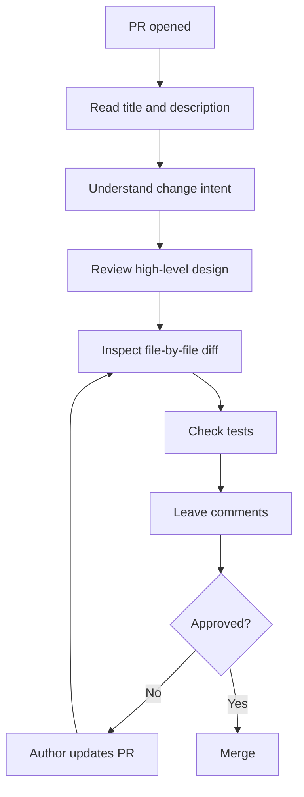

```markdown
# 🧑‍💻 Code Review Mastery

<p align="center">
  
  
  
  
</p>

<p align="center">
  <b>Learn how real engineers review code — not just for syntax, but for correctness, clarity, safety, and maintainability.</b>
</p>

---

## 📌 What Is Code Review?

Code review is the process of examining code changes before they are merged.

It usually happens through a Pull Request, where one or more reviewers inspect:

- correctness
- readability
- architecture
- performance
- security
- tests
- maintainability

Code review is one of the most important engineering habits in modern software teams.

---

## 🧠 Why Code Review Matters

Without review:

- bugs enter production faster
- bad design spreads through the codebase
- security issues are missed
- teams lose shared understanding
- junior developers get less guidance

With review:

- quality improves
- bugs are caught earlier
- code becomes easier to maintain
- knowledge spreads across the team
- standards stay consistent

Code review is not only about finding mistakes.

It is also about **teaching, alignment, and protecting the codebase**.

---

## 🗺️ Code Review Big Picture

```mermaid
flowchart LR
    A[Developer opens PR] --> B[Reviewer reads summary]
    B --> C[Reviewer checks code]
    C --> D[Reviewer leaves comments]
    D --> E[Author updates code]
    E --> F[Reviewer re-checks]
    F --> G[Approve]
    G --> H[Merge]
````

---

## 🧱 What Reviewers Actually Check

A good reviewer does not only ask:

> “Does this code run?”

They ask deeper questions:

### Correctness

* Does it do the right thing?
* Does it handle edge cases?
* Could it break existing behavior?

### Readability

* Is the code easy to understand?
* Are names clear?
* Is the logic too complex?

### Maintainability

* Will this be easy to modify later?
* Is the solution unnecessarily clever?
* Is duplication introduced?

### Safety

* Could this create a bug, security issue, or data problem?
* Are validations present?
* Is error handling good enough?

### Testing

* Are tests included where needed?
* Do tests actually cover important behavior?

---

## 🧠 The Real Goal of Code Review

The goal is **not** to prove the author wrong.

The goal is to improve:

* the code
* the design
* the reliability
* the team’s understanding

A healthy review culture says:

> “We review code to help the codebase win.”

Not:

> “We review code to attack the developer.”

---

## 🧬 Code Review Architecture

```text
                 CODE REVIEW SYSTEM

 Author writes code
        │
        ▼
  Pull Request opened
        │
        ▼
 Reviewer inspects:
   - diff
   - tests
   - logic
   - architecture
   - edge cases
        │
        ▼
 Feedback given
        │
        ▼
 Author updates code
        │
        ▼
 Approve / Request changes
        │
        ▼
 Merge
```

---

## 🖥️ GitHub Review UI Mock

```text
┌──────────────────────────────────────────────────────────────┐
│ Pull Request #58                                             │
│ feat: add coupon validation                                  │
├──────────────────────────────────────────────────────────────┤
│ Reviewer comments:                                           │
│                                                              │
│ Line 42: What happens if coupon is expired?                  │
│ Line 67: Could we rename this variable for clarity?          │
│ Line 91: Please add test coverage for empty input.           │
│                                                              │
│ Review status: Changes requested                             │
└──────────────────────────────────────────────────────────────┘
```

---

## 🔍 Layers of Review

Not all review comments are equally important.

A strong reviewer thinks in layers.

---

### Layer 1 — Correctness

This is the most important.

Questions:

* Is the logic right?
* Are edge cases handled?
* Are assumptions valid?

Example:

```js
if (age > 18) {
  allowSignup();
}
```

Review thought:

* Should 18 be allowed too?
* Is this supposed to be `>= 18`?

That is a correctness issue.

---

### Layer 2 — Safety

Questions:

* Could this crash?
* What if input is null?
* What if API call fails?
* Is user input sanitized?

Example:

```js
const name = user.profile.name.toUpperCase();
```

Review thought:

* What if `user.profile` is missing?

That is a safety issue.

---

### Layer 3 — Maintainability

Questions:

* Is this too complex?
* Can this be simplified?
* Is code duplicated?

Example:

```js
if (role === "admin") { ... }
if (role === "editor") { ... }
if (role === "manager") { ... }
```

Review thought:

* Can this be expressed more cleanly with shared logic?

That is a maintainability issue.

---

### Layer 4 — Style / Polish

Questions:

* Is naming clear?
* Is formatting consistent?
* Can comments be improved?

These matter, but they usually come after correctness and safety.

---

## 🧪 Real Review Flow



---

## 🧠 How Senior Engineers Review Code

Senior reviewers usually review in this order:

### 1. Understand the goal first

They read:

* PR title
* PR description
* linked issue
* related context

Because reviewing code without knowing intent leads to shallow comments.

---

### 2. Review architecture before line-by-line detail

They ask:

* is the overall approach sound?
* is the change in the right place?
* does this fit project design?

This is more valuable than only nitpicking variable names.

---

### 3. Check risky areas carefully

They pay extra attention to:

* auth
* payments
* database changes
* concurrency
* destructive operations
* migrations
* security-sensitive code

---

### 4. Look at tests

They ask:

* are tests present?
* do they test useful behavior?
* do they cover edge cases?

---

### 5. Leave clear, actionable feedback

Bad review:

> This is wrong.

Good review:

> This may fail when `user` is null. Could we guard against missing profile data here?

---

## ✍️ Good Review Comments vs Bad Review Comments

### ❌ Bad comment

```text
Bad code.
```

This is vague and unhelpful.

### ✅ Good comment

```text
This may break when the API returns an empty array.
Could we add a guard here and include a test for that case?
```

This is:

* specific
* constructive
* actionable

---

## 🧠 Types of Review Comments

### 1. Blocking comment

Must be fixed before merge.

Example:

* security issue
* broken logic
* failing test
* unsafe migration

### 2. Non-blocking suggestion

Helpful improvement, but not necessarily merge-blocking.

Example:

* rename variable
* simplify method
* improve wording

### 3. Question

Reviewer seeks clarification.

Example:

* Why is this check needed here?
* Should this path also handle archived users?

### 4. Praise

Important for healthy team culture.

Example:

* Nice simplification here.
* Good test coverage for the edge cases.

---

## 🖥️ GitHub Suggestion UI Mock

```text
┌──────────────────────────────────────────────────────────────┐
│ Reviewer comment                                             │
├──────────────────────────────────────────────────────────────┤
│ Could we rename `d` to `discountAmount` for clarity?         │
│                                                              │
│ Suggested change:                                            │
│ - const d = getDiscount()                                    │
│ + const discountAmount = getDiscount()                       │
└──────────────────────────────────────────────────────────────┘
```

---

## ⚙️ Internal Behavior of Review in GitHub

When a reviewer comments on a Pull Request, GitHub stores review data tied to:

* PR id
* commit range
* file path
* line number or code block
* review status

That is why comments can appear:

* inline on exact lines
* as general conversation comments
* as review summaries

Review states usually include:

* Comment
* Approve
* Request changes

---

## ✅ What Authors Should Do During Review

When receiving comments, a strong author should:

* read carefully
* avoid defensive reactions
* fix valid issues
* ask questions if unclear
* reply clearly to each thread
* push focused updates

Good author behavior speeds up merge and builds trust.

---

## 🚨 Common Author Mistakes

### 1. Taking review personally

Review is about the code, not your worth.

### 2. Replying emotionally

Stay calm and professional.

### 3. Marking comments resolved without explanation

Explain what changed.

### 4. Ignoring test requests

Uncovered logic often causes production bugs.

### 5. Pushing unrelated changes during review

This confuses the reviewer.

---

## 🚨 Common Reviewer Mistakes

### 1. Nitpicking everything

Too much low-value feedback slows the team.

### 2. Ignoring design issues

Catching architecture mistakes early is valuable.

### 3. Being vague

Comments should be specific.

### 4. Being rude or sarcastic

This damages review culture.

### 5. Reviewing without understanding the problem

Always understand the purpose first.

---

## ✅ Code Review Best Practices

### For reviewers

* understand the goal first
* prioritize correctness over style
* be clear and respectful
* separate blockers from suggestions
* praise good improvements too

### For authors

* keep PRs small
* write clear descriptions
* respond professionally
* add tests
* clean up obvious issues before requesting review

---

## 🌍 Real-World Scenario

A developer adds a checkout discount feature.

During review, the reviewer notices:

* coupon expiration is not checked
* negative discount values are allowed
* test coverage is missing for invalid inputs

Without review, this could lead to revenue loss in production.

With review:

* logic is corrected
* invalid coupons are blocked
* tests are added
* feature becomes safer before release

That is the real value of code review.

---

## 🧠 Review Checklist

A practical reviewer can use this checklist:

```text
[ ] Do I understand what this PR is trying to do?
[ ] Is the overall design reasonable?
[ ] Is the logic correct?
[ ] Are edge cases handled?
[ ] Is there risk to security/data/performance?
[ ] Are tests included?
[ ] Are names and structure understandable?
[ ] Can this be merged safely?
```

---

## 🎤 Interview Questions

### What is the purpose of code review?

To improve correctness, maintainability, safety, and team knowledge before merge.

### What should reviewers prioritize?

Correctness, safety, architecture, and tests before style nitpicks.

### Why are small PRs easier to review?

Because they reduce cognitive load and make issues easier to detect.

### What is the difference between approve and request changes?

Approve means acceptable to merge. Request changes means important issues must be addressed first.

### Why is code review good for teams, not just code?

It spreads knowledge, improves standards, and helps mentoring.

### How should developers respond to review feedback?

Professionally, clearly, and without taking it personally.

---

## 🧪 Practice Lab

Review this imaginary code:

```js
function applyDiscount(price, discount) {
  return price - discount;
}
```

Ask review questions:

* What if `discount` is negative?
* What if discount > price?
* Should discount be percentage or fixed amount?
* Are tests present?
* Is validation needed?

Now rewrite it more safely and document the assumptions.

---

## 🎯 Final Takeaway

Code review is one of the most powerful habits in software engineering.

It is not only about finding mistakes.

It is about:

* protecting quality
* reducing risk
* sharing knowledge
* improving design
* building strong engineering culture

When done well, code review makes both the codebase and the team stronger.

---

## 👉 Next Step

➡️ [`04-resolve-pr-comments.md`](./04-resolve-pr-comments.md)
