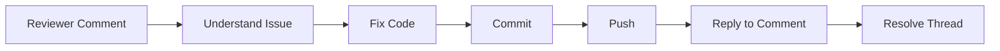

````markdown
# 💬 Resolving Pull Request Comments

<p align="center">
  
  
  
  
</p>

<p align="center">
  <b>Learn how to handle review feedback like a professional — update code, communicate clearly, and get PRs merged faster.</b>
</p>

---

## 📌 What Does "Resolving PR Comments" Mean?

After you open a Pull Request, reviewers will:

- leave comments
- ask questions
- request changes
- suggest improvements

Your job is to:

- understand feedback
- update your code
- respond clearly
- push changes
- move the PR toward approval

---

## 🧠 Why This Step Is Critical

Most beginners think:

> “I opened a PR, I’m done.”

Reality:

> The real work starts **after review begins**.

If you handle comments well:
- your PR gets merged faster ✅
- reviewers trust you more ✅
- your code quality improves ✅

If you handle them poorly:
- PR gets stuck ❌
- frustration increases ❌
- reputation suffers ❌

---

## 🗺️ PR Feedback Loop

```mermaid
flowchart TD
    A[Open PR] --> B[Reviewer Comments]
    B --> C[Author Reads Feedback]
    C --> D[Update Code]
    D --> E[Commit Changes]
    E --> F[Push Updates]
    F --> G[Respond to Comments]
    G --> H{Approved?}
    H -->|No| B
    H -->|Yes| I[Merge]
````

---

## 🧱 Types of PR Comments

Understanding comment types helps you respond correctly.

---

### 1. 🔴 Blocking Comments (Must Fix)

These prevent merge.

Examples:

* broken logic
* security issue
* failing test
* missing validation

```text
" This will crash if user is null "
" This allows invalid input "
" Tests are failing "
```

👉 Action: MUST fix before merge

---

### 2. 🟡 Suggestions (Optional but Recommended)

Examples:

* rename variable
* simplify logic
* improve readability

```text
" Can we rename this variable for clarity? "
```

👉 Action: Usually accept unless strong reason not to

---

### 3. 🔵 Questions (Clarification)

Examples:

* Why is this needed?
* What happens in edge case?

```text
" Why are we checking this condition here? "
```

👉 Action: Explain clearly or improve code

---

### 4. 🟢 Praise

Examples:

```text
" Nice improvement here "
" Good test coverage "
```

👉 Action: Acknowledge (optional but good practice)

---

## 🖥️ GitHub Comment UI Mock

```text
┌──────────────────────────────────────────────────────────────┐
│ Line 42:                                                    │
│ Reviewer: What happens if user is null?                     │
│                                                            │
│ Author: Good catch — adding null check.                    │
│                                                            │
│ [ Commit pushed ]                                          │
│                                                            │
│ ✔ Conversation resolved                                     │
└──────────────────────────────────────────────────────────────┘
```

---

## 🧱 Step-by-Step: How to Resolve Comments

---

### Step 1 — Read Carefully

Do NOT rush.

Bad approach:

```text
" ok "
```

Good approach:

* understand intent
* identify issue type
* check code context

---

### Step 2 — Decide Action

For each comment:

| Type       | Action            |
| ---------- | ----------------- |
| Blocking   | Fix immediately   |
| Suggestion | Usually apply     |
| Question   | Answer or improve |
| Praise     | Acknowledge       |

---

### Step 3 — Update Code Locally

```bash
# make changes
git add .
git commit -m "Fix null check in login validation"
```

---

### Step 4 — Push Changes

```bash
git push origin feature/your-branch
```

### 🧠 Important Concept

> A PR is linked to a branch
> NOT a single commit

So pushing updates automatically updates the PR.

---

### Step 5 — Respond to Comments

Do NOT just push code silently.

Always respond.

---

## ✍️ Good vs Bad Responses

---

### ❌ Bad Response

```text
fixed
```

---

### ✅ Good Response

```text
Good catch — added a null check to prevent runtime error.
Also updated tests to cover this case.
```

---

### ❌ Defensive Response

```text
This works fine already.
```

---

### ✅ Professional Response

```text
I see your point. I initially assumed input would always exist,
but adding a guard makes it safer. Updated 👍
```

---

## 🧠 Golden Rule

> Always explain WHAT you changed and WHY

---

## 🔄 Full Resolution Flow



---

## 🧬 Internal Git + GitHub Behavior

When you push after review:

```text
Your branch:
   old commits → new commits added

GitHub PR:
   automatically updates diff
   keeps all comments
   tracks resolved threads
```

GitHub does NOT create a new PR.

It updates the existing one.

---

## 🧠 "Resolve Conversation" Feature

After fixing:

```text
✔ Resolve conversation
```

### What it means:

* issue addressed
* reviewer can verify fix
* thread collapsed

---

### ⚠️ When NOT to resolve

Do NOT resolve if:

* you didn’t fix it yet
* you don’t understand it
* discussion is ongoing

---

## 🔁 Multiple Iterations (Real World)

Most PRs are NOT approved in one go.

```text
PR → review → fixes → review → fixes → approve
```

That is normal.

---

## 🧪 Real-World Scenario

You submit a PR for login validation.

Reviewer comments:

```text
1. What if email is empty?
2. Missing test case
3. Rename variable `d`
```

### Your response:

```text
- Added empty email validation
- Added test case for invalid input
- Renamed `d` → `discountAmount`
```

Push changes → PR updates → reviewer approves.

---

## 🧠 Advanced Tip: Squash Fixes

Instead of messy commits like:

```text
fix
fix again
final fix
last fix
```

Use:

```bash
git rebase -i HEAD~4
```

Then squash commits into clean history.

---

## 🚨 Common Mistakes

---

### ❌ Ignoring comments

PR stays blocked.

---

### ❌ Resolving without fixing

Breaks trust.

---

### ❌ Emotional replies

Damages collaboration.

---

### ❌ Silent updates

Reviewer doesn’t know what changed.

---

### ❌ Huge fix commits

Hard to review again.

---

## ✅ Best Practices

* reply to every comment
* be respectful and clear
* explain reasoning
* keep commits focused
* push small updates
* ask if unclear
* don’t rush approval

---

## 🧠 Communication Matters

Code review is not just technical.

It is also communication.

Bad communication slows teams.

Good communication builds trust and speed.

---

## 🎤 Interview Questions

### What should you do after receiving PR comments?

Understand, update code, commit, push, and respond clearly.

---

### What happens when you push new commits to a PR?

The PR updates automatically.

---

### What is “Resolve conversation”?

Marks a discussion thread as addressed.

---

### Should you always accept suggestions?

Usually yes, unless you have a valid reason not to.

---

### Why is responding to comments important?

It shows understanding and helps reviewers verify changes.

---

## 🧪 Practice Lab

Simulate a PR review:

### Given comment:

```text
"This may fail if API returns null"
```

### Your steps:

1. Add null check
2. Add test case
3. Commit change
4. Push
5. Reply:

```text
Added null guard and test case for API failure scenario.
```

---

## 🎯 Final Takeaway

Resolving PR comments is where:

* code becomes production-ready
* collaboration becomes real
* trust between developers is built

Master this and you move from:

> "I can write code"

to

> "I can work effectively in a professional team"

---

## 👉 Next Step

➡️ `05-sync-fork.md`
