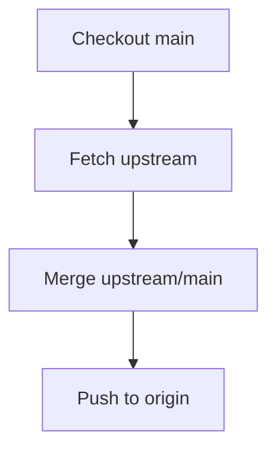

````markdown
# 🔄 Sync Fork (Keep Your Fork Updated)

<p align="center">
  
  
  
  
</p>

<p align="center">
  <b>Learn how to keep your fork in sync with the original repository — a must-have skill for open-source and team collaboration.</b>
</p>

---

## 📌 What Does "Sync Fork" Mean?

When you fork a repository, your fork becomes **independent**.

But the original repository keeps evolving:

- new commits
- bug fixes
- new features
- refactors

👉 Syncing your fork means:

> Updating your fork to match the latest state of the original repository (upstream).

---

## 🧠 Why Syncing Is Important

If you don’t sync:

- your fork becomes outdated ❌
- merge conflicts increase ❌
- PRs become harder to review ❌
- CI may fail ❌

If you sync regularly:

- clean history ✅
- fewer conflicts ✅
- smoother PR approval ✅
- easier collaboration ✅

---

## 🗺️ Big Picture

```mermaid
flowchart LR
    A[Original Repo (upstream)] --> B[Fetch Changes]
    B --> C[Update Local Main]
    C --> D[Push to Your Fork]
````

---

## 🧱 Repository Relationships

```text
                 GITHUB SERVER

     ┌──────────────────────────────┐
     │ Original Repo (upstream)     │
     │ original-owner/project       │
     └─────────────┬────────────────┘
                   │ fork
                   ▼
     ┌──────────────────────────────┐
     │ Your Fork (origin)           │
     │ your-username/project        │
     └─────────────┬────────────────┘
                   │ clone
                   ▼

                 YOUR MACHINE

     ┌──────────────────────────────┐
     │ Local Repository             │
     │ origin   → your fork         │
     │ upstream → original repo     │
     └──────────────────────────────┘
```

---

## 🧠 origin vs upstream (Quick Recap)

```text
origin   = your fork
upstream = original repository
```

---

## 🔄 Full Sync Workflow



---

## 🧱 Step-by-Step Sync Process

---

### Step 1 — Switch to main branch

```bash
git checkout main
```

---

### Step 2 — Fetch latest changes from upstream

```bash
git fetch upstream
```

### 🧠 What this does

```text
Downloads commits from upstream
Does NOT modify your files yet
```

---

### Step 3 — Merge upstream into your local main

```bash
git merge upstream/main
```

### 🧠 Internal Behavior

```text
Your local main:
    A --- B --- C

Upstream main:
    A --- B --- C --- D --- E

After merge:
    A --- B --- C --- D --- E
```

---

### Step 4 — Push updated main to your fork

```bash
git push origin main
```

Now your fork is fully updated.

---

## 🔁 Visual Flow

```text
upstream/main  ---> latest commits
       │
       ▼
local main  ---> updated
       │
       ▼
origin/main ---> updated fork
```

---

## 🧪 Real-World Scenario

You fork a popular repo.

After 3 days:

* original repo has 10 new commits
* your fork is outdated

If you open a PR now:

❌ conflicts likely
❌ reviewer asks: "please sync your branch"

---

### Correct flow:

```text
1. Sync fork
2. Update your branch
3. Resolve conflicts early
4. Then open PR
```

---

## 🧠 Sync Before vs After PR

### Best Practice:

👉 Always sync BEFORE starting new work

```text
sync → create branch → work → PR
```

---

### Also needed:

👉 Sync BEFORE merging PR if requested

---

## ⚠️ Merge Conflicts During Sync

Sometimes:

```bash
git merge upstream/main
```

may cause conflicts.

---

### Conflict Example

```text
<<<<<<< HEAD
console.log("Hello World")
=======
console.log("Hello GitHub")
>>>>>>> upstream/main
```

---

### Resolution Steps

```bash
# 1. Fix file manually
# 2. Remove conflict markers

git add .
git commit
```

---

## 🧠 Why Conflicts Happen

Conflicts occur when:

* same file changed
* same lines modified
* Git cannot auto-merge

---

## 🔄 Sync Feature Branch (Advanced)

Sometimes your feature branch is outdated.

---

### Option 1: Merge main into branch

```bash
git checkout feature/my-feature
git merge main
```

---

### Option 2: Rebase (cleaner history)

```bash
git checkout feature/my-feature
git rebase main
```

---

## 🧠 Merge vs Rebase (Quick Insight)

| Merge             | Rebase           |
| ----------------- | ---------------- |
| keeps history     | rewrites history |
| safer             | cleaner          |
| adds merge commit | linear history   |

---

## 🖥️ GitHub UI Sync Option

GitHub also provides a UI button:

```text
"Sync fork"
```

### What it does:

* fetches upstream changes
* updates your fork automatically

---

## ⚠️ But Important

Even if you sync via UI:

👉 You should still update your **local repo**

```bash
git pull origin main
```

---

## 🧬 Internal Git Flow

```text
upstream/main → fetch → local repo → merge → origin/main
```

Git operates in layers:

1. fetch → download commits
2. merge → apply commits
3. push → update remote fork

---

## 🚨 Common Mistakes

---

### ❌ Not adding upstream

```bash
git remote add upstream ...
```

Without this, sync is impossible.

---

### ❌ Working on outdated branch

Leads to:

* conflicts
* broken PRs
* rejected merges

---

### ❌ Syncing after large changes

Harder conflict resolution.

---

### ❌ Forgetting to push after sync

Fork remains outdated.

---

## ✅ Best Practices

* sync before starting work
* sync before opening PR
* sync regularly
* resolve conflicts early
* keep branches updated
* use rebase for cleaner history (advanced)

---

## 🧠 Pro Tip

Before starting ANY work:

```bash
git checkout main
git fetch upstream
git merge upstream/main
git push origin main
```

Then:

```bash
git checkout -b feature/new-work
```

---

## 🎤 Interview Questions

### What is upstream?

The original repository you forked from.

---

### Why do we sync fork?

To keep your fork updated with latest changes.

---

### Difference between fetch and merge?

Fetch downloads changes, merge applies them.

---

### What happens if you don’t sync?

More conflicts and outdated PRs.

---

### When should you sync?

Before starting work and before opening PR.

---

## 🧪 Practice Lab

### Task:

```bash
# 1. Go to main
git checkout main

# 2. Fetch upstream
git fetch upstream

# 3. Merge changes
git merge upstream/main

# 4. Push to fork
git push origin main
```

Then:

```bash
# update feature branch
git checkout feature/test
git merge main
```

---

## 🎯 Final Takeaway

Syncing your fork is not optional.

It is a **core habit** for:

* open-source contribution
* professional Git usage
* clean collaboration

Master this, and you eliminate:

* unnecessary conflicts
* broken PRs
* outdated code issues

---

## 👉 Next Step

➡️ `06-team-branch-strategy.md`
