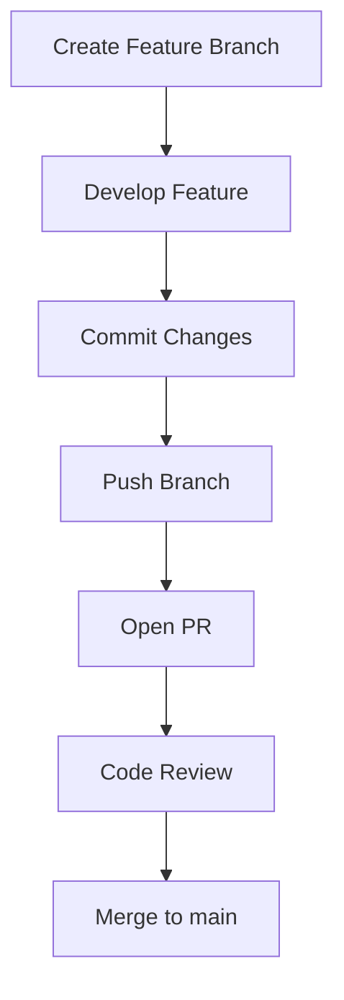
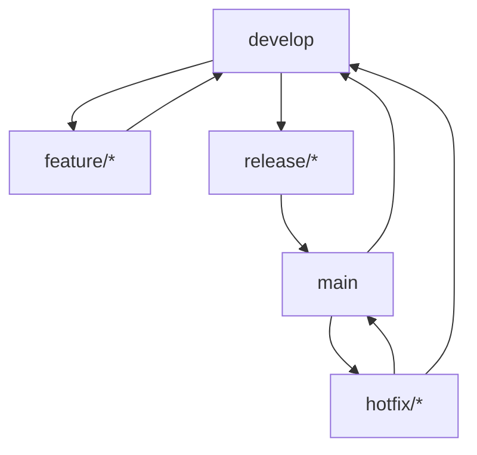
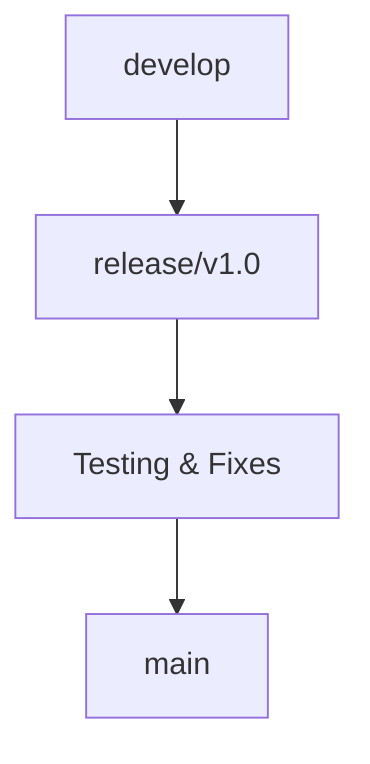

# 🌿 Team Branch Strategy (Professional Workflows)

<p align="center">
  
  
  
  
</p>

<p align="center">
  <b>Learn how professional teams structure branches to manage features, releases, and production safely.</b>
</p>

---

## 📌 What Is a Branch Strategy?

A **branch strategy** defines:

- how branches are created
- how code flows between branches
- when merges happen
- how releases are handled

It is the backbone of **team collaboration in Git**.

---

## 🧠 Why Branch Strategy Matters

Without a strategy:

- chaos in branches ❌
- unstable main branch ❌
- messy history ❌
- difficult releases ❌

With a strategy:

- predictable workflow ✅
- safe releases ✅
- easier collaboration ✅
- scalable development ✅

---

## 🗺️ Big Picture

```mermaid
flowchart LR
    A[Feature Work] --> B[Integration Branch]
    B --> C[Testing]
    C --> D[Release]
    D --> E[Production]
````

---

## 🧱 Core Branch Types

Most strategies use some combination of:

```text id="3ey9k1"
main       → production-ready code
develop    → integration branch (optional)
feature/*  → new features
release/*  → release preparation
hotfix/*   → urgent fixes
```

---

## 🧬 Internal Git Concept

Branches are **pointers to commits**, not copies.

```text id="s3k5b8"
A --- B --- C   main
             \
              D --- E   feature/login
```

This makes branching fast and flexible.

---

# 🏗️ Popular Team Branch Strategies

---

## 1️⃣ Feature Branch Workflow (Most Common)

### 📌 Concept

Every feature is developed in its own branch.

---

### 🌳 Structure

```text id="h3n7r2"
main
 ├── feature/login
 ├── feature/payment
 ├── bugfix/navbar
```

---

### 🔄 Workflow



---

### ✅ Advantages

* isolates work
* safe for teams
* supports PR review
* easy rollback

---

### ❌ Limitations

* no dedicated release flow
* may become messy at scale

---

### 🧪 Real Use Case

* startups
* small teams
* SaaS products

---

## 2️⃣ GitFlow Strategy (Enterprise Classic)

---

### 📌 Concept

A structured workflow with multiple long-lived branches.

---

### 🌳 Structure

```text id="7v78kn"
main      → production
develop   → integration
feature/* → new features
release/* → pre-release
hotfix/*  → urgent fixes
```

---

### 🗺️ Full Flow



---

### 🧠 Branch Roles

| Branch    | Purpose                 |
| --------- | ----------------------- |
| main      | production-ready        |
| develop   | active development      |
| feature/* | new work                |
| release/* | testing & stabilization |
| hotfix/*  | urgent fixes            |

---

### 🧪 Example Flow

```text id="9i3bkc"
feature/login → develop → release/v1.2 → main
```

---

### ✅ Advantages

* clear structure
* controlled releases
* good for large teams

---

### ❌ Disadvantages

* complex
* overhead for small teams
* slower workflow

---

### 🧪 Real Use Case

* enterprises
* large backend systems
* long release cycles

---

## 3️⃣ Trunk-Based Development (Modern Approach)

---

### 📌 Concept

Everyone works on small branches and merges quickly into `main`.

---

### 🌳 Structure

```text id="m4k8jp"
main
 ├── small feature branches (short-lived)
 └── frequent merges
```

---

### 🔄 Workflow


---

### 🧠 Key Idea

> Keep branches short-lived and merge fast.

---

### ✅ Advantages

* fast development
* fewer merge conflicts
* continuous integration friendly

---

### ❌ Disadvantages

* requires strong discipline
* needs good test automation

---

### 🧪 Real Use Case

* modern DevOps teams
* CI/CD pipelines
* companies like Google

---

## 4️⃣ Release Branch Strategy

---

### 📌 Concept

Separate branch for release stabilization.

---

### 🌳 Structure

```text id="d9sn0s"
main
 ├── develop
 └── release/v1.0
```

---

### 🔄 Flow



---

### 🧠 Why Needed?

Allows:

* bug fixing without blocking new features
* stable release preparation

---

## ⚔️ Strategy Comparison

```text id="7f2j0o"
Feature Branch   → simple, flexible
GitFlow          → structured, complex
Trunk-Based      → fast, modern
Release Branch   → controlled releases
```

---

## 🧠 Choosing the Right Strategy

---

### Small Team / Startup

👉 Feature Branch or Trunk-Based

---

### Medium Team

👉 Feature Branch + Release Branch

---

### Large Enterprise

👉 GitFlow or Hybrid Model

---

### CI/CD Driven Teams

👉 Trunk-Based Development

---

## 🖥️ GitHub Workflow Mapping

```text id="kfd3ay"
feature branch → PR → review → merge → deploy
```

GitHub integrates naturally with all strategies.

---

## 🔬 Internal Merge Flow

```text id="90pq3r"
Feature Branch
     │
     ▼
Pull Request
     │
     ▼
Merge into main
     │
     ▼
New commit added to history
```

---

## 🚨 Common Mistakes

---

### ❌ Long-lived feature branches

Cause:

* huge conflicts
* difficult merges

---

### ❌ Direct commits to main

Breaks:

* stability
* review process

---

### ❌ No branch naming convention

Bad:

```text id="3h9qaf"
branch1
test
new
```

Good:

```text id="mp6b3g"
feature/login
bugfix/navbar
hotfix/payment-error
```

---

### ❌ Mixing features in one branch

Hard to review and rollback.

---

## ✅ Best Practices

* keep branches small
* merge frequently
* use meaningful names
* always use PRs
* protect main branch
* automate testing
* delete merged branches

---

## 🧠 Naming Conventions

```text id="dh1r3g"
feature/<feature-name>
bugfix/<issue-name>
hotfix/<critical-fix>
release/<version>
```

---

## 🧪 Real-World Scenario

### E-commerce Team

```text id="0xq9p2"
feature/cart → PR → main
feature/payment → PR → main
hotfix/payment-bug → immediate merge
release/v2.0 → final testing → deploy
```

---

## 🧠 Branch Protection Rules (GitHub)

Teams often enforce:

* PR required before merge
* code review required
* CI must pass
* no force push
* restricted direct commits

---

## 🎤 Interview Questions

### What is a branch strategy?

A structured approach to managing branches and code flow in a team.

---

### What is GitFlow?

A branching model with main, develop, feature, release, and hotfix branches.

---

### What is trunk-based development?

A strategy where developers merge small changes frequently into main.

---

### Why avoid long-lived branches?

They cause merge conflicts and slow integration.

---

### Which strategy is best?

Depends on team size, release cycle, and CI/CD maturity.

---

## 🧪 Practice Lab

### Task:

```text id="r3y5gn"
1. Create feature branch
2. Simulate PR flow
3. Merge into main
4. Create hotfix branch
5. Merge fix quickly
```

---

## 🎯 Final Takeaway

Branch strategy is not just about Git.

It is about:

* team coordination
* release safety
* code quality
* development speed

Master this and you understand how real companies build software.

---

## 👉 Next Step

➡️ `07-open-source-contribution.md`
