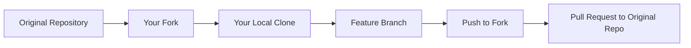
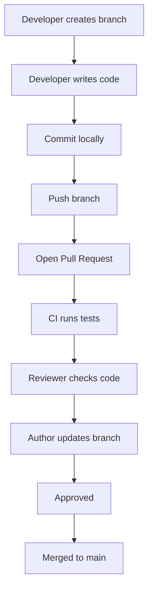

````markdown
# 🤝 Git Collaboration Mastery

<p align="center">
  
  
  
  
</p>

<p align="center">
  <b>Learn how real developers collaborate using Git & GitHub — safely, clearly, and professionally.</b>
</p>

---

## 📚 Module Overview

Collaboration is where Git becomes truly powerful.

You are no longer just saving versions of code.  
You are now working with:

- teammates
- reviewers
- maintainers
- release processes
- pull requests
- branch rules
- contribution flows

This module teaches how collaboration works from **small teams to open-source projects**.

---

## 🎯 Learning Goals

By the end of this section, you will understand how to:

- fork repositories and contribute safely
- create clean pull requests
- review code professionally
- respond to review comments
- sync your fork with the original repository
- use team branch strategies
- contribute to open-source projects with confidence

---

## 🧠 Why Collaboration Matters

Without a collaboration workflow, teams face:

- overwritten work
- merge conflicts everywhere
- unstable main branches
- unclear ownership
- slow reviews
- release mistakes

With a good workflow, teams get:

- safer changes
- cleaner history
- faster debugging
- predictable releases
- easier teamwork

---

## 🗺️ Collaboration Big Picture

```mermaid
flowchart LR
    A[Get Repository] --> B[Create Branch]
    B --> C[Write Code]
    C --> D[Commit Changes]
    D --> E[Push to Remote]
    E --> F[Open Pull Request]
    F --> G[Code Review]
    G --> H[Improve / Fix]
    H --> I[Merge]
````

---

## 🏗️ Core Collaboration Models

### 1. Centralized Workflow

Used mostly by very small teams.

```text
             CENTRALIZED MODEL

        ┌──────────────────────┐
        │     main branch      │
        └──────────────────────┘
           ↑      ↑       ↑
           │      │       │
        Dev A   Dev B   Dev C
```

### ✅ Pros

* simple to understand
* fast for tiny teams

### ❌ Cons

* dangerous if people commit directly to `main`
* unstable history
* high conflict risk

---

### 2. Feature Branch Workflow

This is the most common professional model.

```text
                FEATURE BRANCH MODEL

main
 ├── feature/login
 ├── feature/payment
 ├── bugfix/navbar
 └── docs/api-guide
```

Each piece of work happens in an isolated branch.

### ✅ Why it works

* protects `main`
* enables code review
* makes rollback easier
* keeps changes focused

---

### 3. Fork & Pull Workflow

This is the standard open-source workflow.



### ✅ Why it matters

* you do not need direct write access
* maintainers stay in control
* contributors can work safely

---

## ⚙️ What Git and GitHub Do Internally

Understanding collaboration deeply means understanding the machinery behind it.

---

### When you clone

```text
Remote Repository
      │
      ▼
Local Repository
  ├── working directory
  ├── staging area
  └── commit history
```

Git copies repository data to your machine and links the remote.

---

### When you create a branch

Git does **not** copy the whole project again.

It simply creates a lightweight pointer to a commit.

```text
main ────── C1 ── C2 ── C3
                         ↑
                      branch pointer
```

This is why branches are fast and cheap.

---

### When you open a Pull Request

GitHub compares:

* **base branch** → where changes should go
* **compare branch** → where your changes live

```text
Base:    main
Compare: feature/login
```

GitHub computes the diff between them and shows:

* changed files
* added/removed lines
* comments
* checks/status

---

### When merging happens

Git may do one of these:

* **fast-forward merge**
* **merge commit**
* **squash merge**
* **rebase merge**

#### 3-way merge concept

```text
          A  ← common ancestor
         / \
        /   \
       B     C
        \   /
         \ /
          M  ← merge commit
```

Git finds the shared ancestor and combines both histories.

---

## 🧪 Real Team Workflow



---

## 🖥️ GitHub UI Mock Flow

```text
┌──────────────────────────────────────────────────────────────┐
│ Pull Request #42                                             │
│ feat: add login validation                                   │
├──────────────────────────────────────────────────────────────┤
│ Base: main        ← merge into                               │
│ Compare: feature/login-validation                            │
├──────────────────────────────────────────────────────────────┤
│ Files changed: 6                                             │
│ Commits: 4                                                   │
│ Checks: ✅ Passed                                             │
│ Reviewers: @maintainer @teammate                             │
├──────────────────────────────────────────────────────────────┤
│ Conversation                                                 │
│ - reviewer asks for naming fix                               │
│ - reviewer asks for test coverage                            │
│ - author pushes updates                                      │
└──────────────────────────────────────────────────────────────┘
```

---

## 📂 Files in This Module

| File                             | What You Learn                             |
| -------------------------------- | ------------------------------------------ |
| `01-fork-workflow.md`            | How open-source contribution works         |
| `02-pull-request.md`             | PR creation, lifecycle, and best practices |
| `03-code-review.md`              | Review like a professional engineer        |
| `04-resolve-pr-comments.md`      | Handle feedback and update PRs             |
| `05-sync-fork.md`                | Keep your fork aligned with upstream       |
| `06-team-branch-strategy.md`     | Team-friendly branching strategies         |
| `07-open-source-contribution.md` | Full real-world contribution flow          |
| `practice-lab.md`                | Hands-on collaboration exercises           |

---

## 🚨 Common Collaboration Mistakes

### Mistake 1: Working directly on `main`

This makes history messy and risks unstable code.

### Mistake 2: Huge pull requests

Large PRs are hard to review and easy to reject.

### Mistake 3: Not syncing before work

Outdated branches cause painful merge conflicts.

### Mistake 4: Poor commit messages

This makes code history hard to understand later.

### Mistake 5: Treating review comments personally

Code review is about improving code, not attacking people.

---

## 💡 Pro Collaboration Rules

* create a new branch for each task
* keep PRs small and focused
* write clear commit messages
* update your branch regularly
* explain your PR properly
* review before merging
* never rush a merge into production branches

---

## 🎤 Interview-Level Understanding

### What is a Pull Request?

A Pull Request is a structured request to merge changes from one branch into another, usually with review and automated checks.

### Why use branches for collaboration?

Branches isolate work so multiple developers can work without disturbing stable code.

### Why do merge conflicts happen?

They happen when Git cannot automatically combine overlapping changes.

### Why is code review important?

It improves correctness, readability, maintainability, and team knowledge sharing.

---

## 🧪 Practice Mindset

As you go through this module, think like this:

> “How would this work in a real team with deadlines, reviews, CI, and production safety?”

That mindset separates beginner Git usage from professional Git collaboration.

---

## 🚀 Final Takeaway

Git collaboration is not just about commands.

It is about:

* isolation of work
* safe integration
* communication
* review discipline
* understanding how Git and GitHub behave under the hood

Once you master this module, you move from **“I know Git commands”** to **“I can work effectively with real teams.”**

---

## 👉 Start Here

➡️ [`01-fork-workflow.md`](./01-fork-workflow.md)

