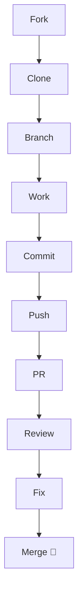

# 🧪 Collaboration Practice Lab (Hands-On)

<p align="center">
  
  
  
  
</p>

<p align="center">
  <b>Practice real GitHub collaboration workflows step-by-step — just like professional developers.</b>
</p>

---

## 🎯 Lab Objective

By completing this lab, you will:

- fork a repository
- sync with upstream
- create feature branches
- open Pull Requests
- handle code review
- resolve conflicts
- follow team workflows

👉 This simulates **real-world Git collaboration**

---

## 🧠 Lab Structure

```mermaid
flowchart TD
    A[Setup Repo] --> B[Fork]
    B --> C[Clone]
    C --> D[Branch]
    D --> E[Make Changes]
    E --> F[Commit]
    F --> G[Push]
    G --> H[Pull Request]
    H --> I[Code Review]
    I --> J[Fix Issues]
    J --> K[Merge]
````

---

# 🧪 LAB 1 — Fork & Setup

---

## Task

1. Go to any GitHub repository
2. Click **Fork**
3. Clone your fork

---

### Commands

```bash
git clone https://github.com/your-username/repo.git
cd repo
```

---

## Add upstream

```bash
git remote add upstream https://github.com/original-owner/repo.git
```

---

## Verify

```bash
git remote -v
```

Expected:

```text
origin   → your fork
upstream → original repo
```

---

# 🧪 LAB 2 — Feature Development

---

## Task

Create a feature branch and make a change.

---

### Commands

```bash
git checkout -b feature/lab-change
```

---

## Make change

Example:

* edit README
* add comment
* modify small code

---

## Commit

```bash
git add .
git commit -m "Add lab change"
```

---

## Push

```bash
git push origin feature/lab-change
```

---

# 🧪 LAB 3 — Pull Request

---

## Task

Create a Pull Request on GitHub.

---

### Steps

1. Go to your fork
2. Click **Compare & Pull Request**
3. Fill details

---

### PR Template

```text
Title: Add lab change

Description:
- updated README
- added practice content

Why:
For learning Git workflow
```

---

## Expected Outcome

```text
PR created successfully
```

---

# 🧪 LAB 4 — Simulate Code Review

---

## Task

Pretend reviewer gave feedback:

```text
1. Rename variable
2. Add comment
3. Improve message
```

---

## Fix changes

```bash
# edit files
git add .
git commit -m "Improve code based on review"
git push origin feature/lab-change
```

---

## Respond (simulate)

```text
"Updated code based on feedback. Added comments and improved naming."
```

---

# 🧪 LAB 5 — Sync Fork

---

## Task

Update your fork with latest upstream changes.

---

### Commands

```bash
git checkout main
git fetch upstream
git merge upstream/main
git push origin main
```

---

## Expected

```text
Your fork is now updated
```

---

# 🧪 LAB 6 — Merge Conflict Simulation

---

## Task

Create a conflict manually.

---

### Step 1

Edit same line in two branches.

---

### Step 2

Merge branches

```bash
git merge main
```

---

### Conflict Example

```text
<<<<<<< HEAD
Hello World
=======
Hello GitHub
>>>>>>> main
```

---

## Resolve

```bash
# edit file manually
git add .
git commit
```

---

## Outcome

```text
Conflict resolved successfully
```

---

# 🧪 LAB 7 — Team Workflow Simulation

---

## Scenario

You are working in a team.

---

## Flow

```text
feature/login
feature/payment
feature/cart
```

---

## Task

1. Create multiple branches
2. Simulate PR flow
3. Merge into main

---

### Commands

```bash
git checkout -b feature/login
git checkout -b feature/payment
git checkout -b feature/cart
```

---

# 🧪 LAB 8 — Open Source Contribution Simulation

---

## Task

Simulate real contribution:

```text
1. Fork repo
2. Fix issue
3. Create PR
4. Address feedback
```

---

## Bonus

Write:

```text
"I would like to work on this issue"
```

---

# 🧪 LAB 9 — Branch Strategy Practice

---

## Task

Create structured branches:

```text
feature/*
bugfix/*
hotfix/*
release/*
```

---

### Commands

```bash
git checkout -b feature/ui
git checkout -b bugfix/navbar
git checkout -b hotfix/payment
git checkout -b release/v1.0
```

---

# 🧪 LAB 10 — Full Workflow Challenge (🔥 Final)

---

## Scenario

You are contributing to an open-source project.

---

## Task

Complete full flow:

```text
1. Fork repo
2. Clone
3. Add upstream
4. Sync fork
5. Create branch
6. Make change
7. Commit
8. Push
9. Open PR
10. Fix review
11. Merge
```

---

## Visual



---

# 🧠 Self-Evaluation Checklist

```text
[ ] Can I fork a repo?
[ ] Can I create a PR?
[ ] Can I resolve conflicts?
[ ] Can I sync fork?
[ ] Can I handle review comments?
[ ] Can I follow team workflow?
```

---

# 🎯 Final Outcome

After completing this lab, you can:

* contribute to open-source 🌍
* work in real teams 👨‍💻
* handle Git workflows confidently 🔥
* pass Git/GitHub interviews 💼

---

# 🚀 Pro Challenge (Optional)

Try contributing to:

* documentation fix
* small bug fix
* UI improvement

👉 Real contribution = real learning
