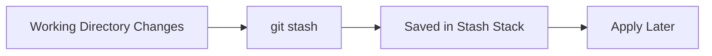

# 📦 Git Stash (Save Work Temporarily)

<p align="center">
  
  
  
  
</p>

<p align="center">
  <b>Save your work temporarily without committing — switch tasks instantly.</b>
</p>

---

## 📌 What Is Git Stash?

`git stash` lets you:

> Save uncommitted changes temporarily and clean your working directory.

---

## 🧠 Why Use Stash?

Scenario:

```text
You are working on Feature A
→ Suddenly urgent bug appears
→ You need to switch branch
````

Without stash:
❌ messy commits
❌ lost changes

With stash:
✅ safe temporary storage
✅ clean working directory

---

## 🗺️ Big Picture



---

## 🧱 Basic Commands

---

### Save changes

```bash
git stash
```

---

### View stashes

```bash
git stash list
```

Example:

```text
stash@{0}: WIP on main
stash@{1}: WIP on feature
```

---

### Apply stash

```bash
git stash apply
```

---

### Apply and remove

```bash
git stash pop
```

---

### Delete stash

```bash
git stash drop stash@{0}
```

---

## 🧠 Internal Behavior

When you run:

```bash
git stash
```

Git:

```text
1. saves changes as a commit (hidden)
2. stores in stash stack
3. resets working directory
```

---

## 🧬 Internal Structure

```text
stash = commit object (not branch)

refs/stash → points to latest stash
```

---

## 🔄 Stash Flow

```text
Working Directory
     ↓ stash
Stash Stack
     ↓ apply/pop
Working Directory
```

---

## 🧪 Real-World Scenario

```text
1. Working on login feature
2. Urgent bug arrives
3. git stash
4. switch branch
5. fix bug
6. return to feature
7. git stash pop
```

---

## 🧱 Advanced Usage

---

### Stash with message

```bash
git stash push -m "login feature work"
```

---

### Stash specific files

```bash
git stash push file1.js
```

---

### Include untracked files

```bash
git stash -u
```

---

### Apply specific stash

```bash
git stash apply stash@{1}
```

---

## 🧠 Multiple Stashes

```text
Stack behavior (LIFO)

stash@{0} → latest
stash@{1} → older
```

---

## ⚠️ Stash Conflicts

Sometimes:

```bash
git stash pop
```

can cause conflicts.

---

### Fix

```bash
# resolve conflicts
git add .
git commit
```

---

## 🧠 Stash vs Commit

| Stash          | Commit          |
| -------------- | --------------- |
| temporary      | permanent       |
| not in history | part of history |
| quick save     | structured save |

---

## 🚨 Common Mistakes

---

### ❌ Forgetting stash exists

Use:

```bash
git stash list
```

---

### ❌ Using stash for long-term storage

Not recommended.

---

### ❌ Losing track of stashes

Always add messages.

---

## ✅ Best Practices

* use stash for short-term work
* name your stashes
* clean old stashes
* don’t rely on stash for important work

---

## 🎤 Interview Questions

### What is git stash?

Temporary storage for uncommitted changes.

---

### Where are stashes stored?

In a special ref called `refs/stash`.

---

### Difference between stash apply and pop?

Apply keeps stash, pop removes it.

---

### Can stash handle untracked files?

Yes, with `-u`.

---

## 🧪 Practice Lab

```bash
# create changes
echo "test" >> file.txt

# stash
git stash

# switch branch
git checkout main

# come back
git checkout -

# apply stash
git stash pop
```

---

## 🎯 Final Takeaway

Git stash is a **productivity superpower**.

Use it when:

* switching tasks
* handling interruptions
* keeping work safe without committing

---

## 👉 Next Step

➡️ `02-git-cherry-pick.md`
