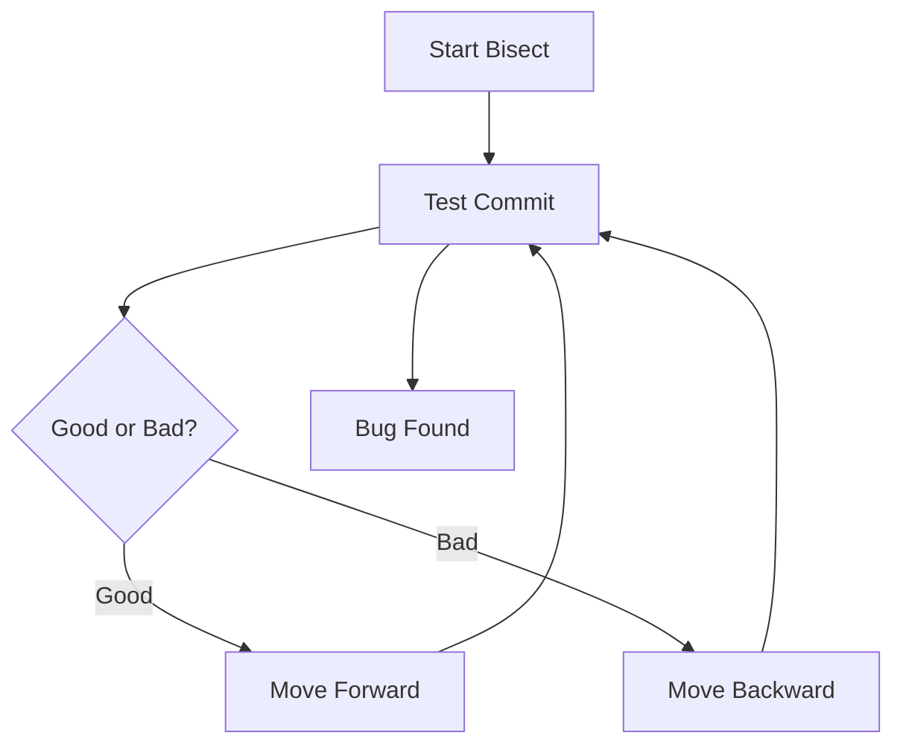

# 🔍 Git Bisect (Find Bugs in History)

<p align="center">
  
  
  
  
</p>

<p align="center">
  <b>Quickly find the commit that introduced a bug using binary search.</b>
</p>

---

## 📌 What Is Git Bisect?

`git bisect` helps you:

> Identify the exact commit that introduced a bug.

---

## 🧠 Why Use Bisect?

Without bisect:

- manually checking commits ❌
- time-consuming ❌

With bisect:

- binary search 🔍
- fast debugging ⚡

---

## 🗺️ Big Picture

```mermaid
flowchart LR
    A[Old Good Commit] --> B[Mid Commit]
    B --> C[New Bad Commit]
````

---

## 🧬 Binary Search Concept

```text id="b8q2tm"
Total commits: 100

Without bisect → check 100 commits ❌
With bisect → check ~7 commits ✅
```

---

## 🧱 Basic Workflow



---

## 🧱 Step-by-Step

---

### Step 1 — Start bisect

```bash id="3q2t4k"
git bisect start
```

---

### Step 2 — Mark bad commit

```bash id="n9m2s7"
git bisect bad
```

(Current commit has bug)

---

### Step 3 — Mark good commit

```bash id="q5r1xa"
git bisect good <commit-hash>
```

(Older commit without bug)

---

### Step 4 — Test commits

Git automatically checks out middle commit.

---

### Step 5 — Mark result

```bash id="y3h7lo"
git bisect good
```

OR

```bash id="m1w6pz"
git bisect bad
```

---

### Step 6 — Repeat

Git continues narrowing down.

---

### Step 7 — Result

```text id="0k9xcz"
Commit XYZ introduced the bug
```

---

### Step 8 — Exit

```bash id="j9n2df"
git bisect reset
```

---

## 🧪 Real-World Scenario

```text id="g5d9w1"
1. App worked last week
2. Now broken
3. Unknown commit caused issue
4. Use git bisect
5. Find exact commit quickly
```

---

## 🧠 Internal Behavior

```text id="v9f2rk"
Git performs binary search
Each step halves search space
```

---

## 🔄 Visual Flow

```text id="6t2bwp"
[Good] ---- mid ---- [Bad]
          ↓
      test mid
```

---

## ⚙️ Automating Bisect (Advanced)

```bash id="p3c1az"
git bisect run test-script.sh
```

Git will:

* run script automatically
* decide good/bad
* find bug faster

---

## 🚨 Common Mistakes

* marking wrong commit
* not testing properly
* forgetting to reset

---

## ✅ Best Practices

* identify correct good commit
* test carefully
* use automation when possible

---

## 🎤 Interview Questions

### What is git bisect?

Tool to find bug-causing commit using binary search.

---

### Why is it efficient?

Reduces search from linear to logarithmic.

---

### When to use?

When bug origin is unknown.

---

## 🧪 Practice Lab

```bash id="7g2n1p"
git bisect start
git bisect bad
git bisect good <old-commit>

# test each step
git bisect good
git bisect bad

git bisect reset
```

---

## 🎯 Final Takeaway

Git bisect is a **debugging superpower**.

Use it when:

* bug source unknown
* large history
* need fast isolation

---

## 👉 Next Step

➡️ `05-git-tag.md`
