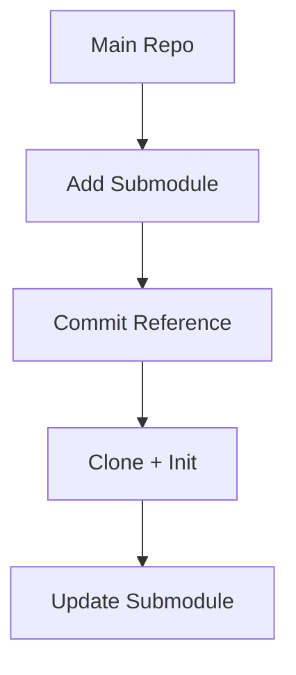

# 🧩 Git Submodules (Nested Repositories)

<p align="center">
  
  
  
  
</p>

<p align="center">
  <b>Manage one Git repository inside another — useful for large systems and shared dependencies.</b>
</p>

---

## 📌 What Is a Git Submodule?

A submodule is:

> A Git repository embedded inside another Git repository.

---

## 🧠 Why Use Submodules?

Use submodules when:

- you want to reuse another repo
- you want separate version control
- you want to include external dependencies

---

## 🗺️ Big Picture

```mermaid
flowchart LR
    A[Main Repo] --> B[Submodule Repo]
````

---

## 🧬 Concept Visualization

```text id="7y2v9k"
Main Project
 ├── src/
 ├── docs/
 └── external-lib/  ← submodule (separate repo)
```

---

## 🧠 Key Idea

Submodule is NOT copied code.

It is:

```text id="g6w4r2"
Pointer to a specific commit of another repo
```

---

## 🧱 Add Submodule

```bash id="o3n6pj"
git submodule add <repo-url> <path>
```

---

### Example

```bash id="8t1d4m"
git submodule add https://github.com/lib/project.git external-lib
```

---

## 🧠 What Happens Internally

```text id="v1m9tz"
1. creates folder
2. links external repo
3. stores reference in .gitmodules
```

---

## 📂 .gitmodules File

```text id="p2k4rx"
[submodule "external-lib"]
    path = external-lib
    url = https://github.com/lib/project.git
```

---

## 🧱 Clone Repo with Submodules

```bash id="u4z1hk"
git clone --recurse-submodules <repo>
```

---

## 🔄 Initialize Submodules

```bash id="y3f7nm"
git submodule update --init
```

---

## 🔁 Update Submodules

```bash id="m7q9lp"
git submodule update --remote
```

---

## 🧠 Internal Structure

```text id="j5k2nx"
Main repo commit
   ↓
Points to submodule commit
```

---

## 🧪 Real-World Scenario

```text id="w2m8qz"
Main app
 ├── frontend (repo)
 ├── backend (repo)
 └── shared-lib (submodule)
```

---

## 🔄 Submodule Workflow



---

## ⚠️ Important Behavior

---

### Submodule is locked to commit

```text id="x4n2pg"
Does NOT auto-update
```

---

### You must manually update

---

## 🚨 Common Mistakes

---

### ❌ Forgetting to init submodules

Leads to empty folders.

---

### ❌ Not committing submodule changes

Main repo only tracks pointer.

---

### ❌ Confusing submodule with folder

It is a separate repo.

---

## ✅ Best Practices

* use for shared libraries
* keep submodules updated
* document setup steps
* avoid overuse

---

## 🧠 Submodule vs Subtree

| Submodule     | Subtree      |
| ------------- | ------------ |
| separate repo | merged repo  |
| lightweight   | integrated   |
| manual update | easier usage |

---

## 🎤 Interview Questions

### What is a submodule?

A repo inside another repo.

---

### Does submodule copy code?

No, it references a commit.

---

### Where is config stored?

.gitmodules file.

---

### Why use submodules?

To manage dependencies.

---

## 🧪 Practice Lab

```bash id="c2m6px"
git submodule add <repo-url>
git submodule update --init
git submodule update --remote
```

---

## 🎯 Final Takeaway

Submodules help you:

* manage large systems
* reuse repositories
* maintain separation

---

## 👉 Next Step

➡️ `practice-lab.md`
