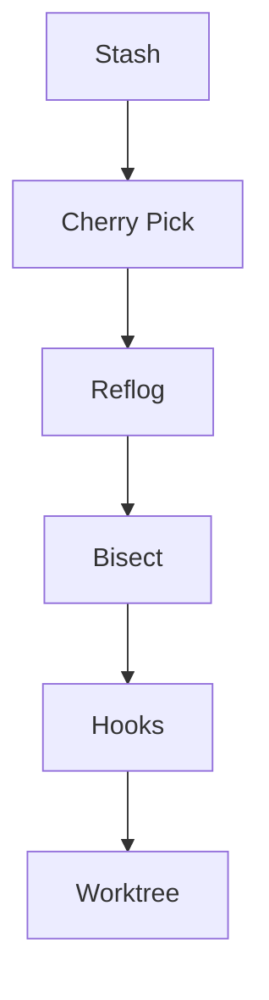

Great—now we step into the **deep technical layer of Git**. This module will elevate your repo from “practical user” to **power user / expert**.

---

# 📄 `07-Advanced-Git/README.md`

````markdown
# ⚙️ Advanced Git Mastery

<p align="center">
  
  
  
  
</p>

<p align="center">
  <b>Master powerful Git tools used by senior engineers to debug, recover, and optimize workflows.</b>
</p>

---

## 📌 What Is Advanced Git?

This section focuses on:

- powerful commands rarely taught deeply
- internal Git mechanisms
- debugging and recovery techniques
- productivity tools used by professionals

---

## 🧠 Why Learn Advanced Git?

Basic Git helps you **work**.

Advanced Git helps you:

- fix mistakes safely 🔧
- debug history 🔍
- recover lost work ♻️
- optimize workflow ⚡
- understand internals 🧬

---

## 🗺️ Big Picture

```mermaid
flowchart LR
    A[Work Changes] --> B[Stash / Commit]
    B --> C[History Manipulation]
    C --> D[Debugging Tools]
    D --> E[Recovery]
````

---

## 🧱 Topics Covered

| File                    | Concept                |
| ----------------------- | ---------------------- |
| `01-git-stash.md`       | Save temporary work    |
| `02-git-cherry-pick.md` | Apply specific commits |
| `03-git-reflog.md`      | Recover lost commits   |
| `04-git-bisect.md`      | Debug bugs in history  |
| `05-git-tag.md`         | Version tagging        |
| `06-git-hooks.md`       | Automation             |
| `07-git-worktree.md`    | Multiple working dirs  |
| `08-submodules.md`      | Nested repositories    |
| `practice-lab.md`       | Advanced exercises     |

---

## 🧬 Internal Git View

Git stores everything as:

```text
objects/
 ├── blobs   (files)
 ├── trees   (folders)
 └── commits (snapshots)
```

---

## 🔥 What Makes This Section Different

You will learn:

* **how Git works internally**
* **how to recover mistakes**
* **how to manipulate history safely**
* **how professionals debug issues**

---

## 🚀 Real-World Use Cases

* "I lost my commit" → reflog
* "I need this one commit only" → cherry-pick
* "I want to switch work temporarily" → stash
* "Where did bug start?" → bisect
* "I want automation" → hooks

---

## 🎯 Learning Path



---

## 🧠 Interview Value

Advanced Git questions often include:

* What is reflog?
* Difference between merge and cherry-pick?
* How do you recover lost commits?
* What is stash used for?
* How does Git store data?

---

## 🎯 Final Goal

After this module, you will:

* debug Git issues confidently
* recover any lost work
* optimize your workflow
* understand Git beyond commands

---

## 👉 Start Here

➡️ `01-git-stash.md`
