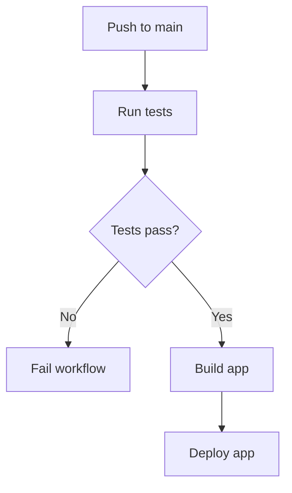

# ⚙️ GitHub Actions Mastery (CI/CD, Automation, Workflows)

<p align="center">
  
  
  
  
</p>

<p align="center">
  <b>Learn how GitHub Actions automates testing, building, linting, and deployment in real-world software teams.</b>
</p>

---

## 📌 What Is GitHub Actions?

GitHub Actions is GitHub’s built-in automation system.

It lets you run workflows automatically when events happen in your repository, such as:

- push
- pull request
- issue creation
- release publishing
- manual trigger

In simple words:

> GitHub Actions = "When something happens in GitHub, automatically run tasks."

---

## 🧠 Why GitHub Actions Matters

Without automation:

- developers run tests manually ❌
- broken code gets merged ❌
- deployments are inconsistent ❌
- releases take longer ❌

With GitHub Actions:

- tests run automatically ✅
- lint checks run on every PR ✅
- builds are validated before merge ✅
- deployment can be automated ✅
- team workflow becomes faster and safer ✅

---

## 🗺️ Big Picture

```mermaid
flowchart LR
    A[Developer Pushes Code] --> B[GitHub Event Triggered]
    B --> C[Workflow Starts]
    C --> D[Jobs Run]
    D --> E[Steps Execute]
    E --> F[Tests / Build / Deploy]
    F --> G[Status Reported to PR]
````

---

## ⚡ CI and CD Explained

Before learning Actions deeply, understand these two terms.

### CI = Continuous Integration

CI means:

> Automatically test and validate code whenever changes are added.

Common CI tasks:

* install dependencies
* lint code
* run tests
* build project

---

### CD = Continuous Delivery / Deployment

CD means:

> Automatically prepare or ship code after it passes validation.

Common CD tasks:

* package build
* create Docker image
* upload artifacts
* deploy to server / cloud

---

## 🧱 Core GitHub Actions Concepts

GitHub Actions is built from a few main concepts.

---

### 1. Workflow

A workflow is the automation file itself.

It is written in YAML and stored in:

```text
.github/workflows/
```

Example:

```text
.github/workflows/test.yml
```

---

### 2. Event

An event is what triggers the workflow.

Examples:

* `push`
* `pull_request`
* `workflow_dispatch`
* `release`

---

### 3. Job

A workflow contains one or more jobs.

A job is a unit of work that runs on a runner.

Examples:

* test job
* lint job
* build job
* deploy job

---

### 4. Runner

A runner is the machine that executes the job.

Examples:

* Ubuntu runner
* Windows runner
* macOS runner
* self-hosted runner

---

### 5. Step

A job contains steps.

A step can:

* run a shell command
* use a reusable GitHub Action
* install dependencies
* execute a script

---

### 6. Action

An action is a reusable automation unit.

Examples:

* checkout repository
* setup Node.js
* cache dependencies
* upload artifacts

---

## 🧬 Internal Architecture

```text
Repository Event
      │
      ▼
Workflow Triggered
      │
      ▼
Job(s) Created
      │
      ▼
Runner Assigned
      │
      ▼
Step 1 → Step 2 → Step 3
      │
      ▼
Status Returned to GitHub
```

---

## 🧪 Real-World Example

Imagine this team workflow:

```text
Developer opens Pull Request
        ↓
GitHub Actions runs:
- install dependencies
- lint code
- run tests
- build app
        ↓
If all checks pass:
PR is review-ready
```

That is CI in action.

---

## 📂 Workflow File Location

GitHub only recognizes workflow files inside:

```text
.github/workflows/
```

Example project structure:

```text
my-project/
 ├── src/
 ├── package.json
 └── .github/
      └── workflows/
           ├── ci.yml
           └── deploy.yml
```

---

## 🧠 First Simple Workflow

Here is a minimal workflow:

```yaml
name: Hello Workflow

on: [push]

jobs:
  say-hello:
    runs-on: ubuntu-latest
    steps:
      - name: Print message
        run: echo "Hello from GitHub Actions"
```

---

## 🔍 YAML Breakdown Line by Line

Let’s understand it deeply.

### `name`

```yaml
name: Hello Workflow
```

This is the workflow name shown in GitHub UI.

---

### `on`

```yaml
on: [push]
```

This means:

> Run the workflow whenever code is pushed.

---

### `jobs`

```yaml
jobs:
```

This begins the jobs section.

A workflow can have one or many jobs.

---

### Job name

```yaml
say-hello:
```

This is the internal job id.

---

### `runs-on`

```yaml
runs-on: ubuntu-latest
```

This selects the machine environment used for the job.

---

### `steps`

```yaml
steps:
```

A list of commands / actions inside the job.

---

### `run`

```yaml
run: echo "Hello from GitHub Actions"
```

Executes a shell command.

---

## 🖥️ GitHub UI Mock

```text
┌──────────────────────────────────────────────────────────────┐
│ Actions                                                     │
├──────────────────────────────────────────────────────────────┤
│ Workflow: Hello Workflow                                    │
│ Event: push                                                 │
│ Status: ✅ Success                                           │
├──────────────────────────────────────────────────────────────┤
│ Job: say-hello                                              │
│  └── Step: Print message                                    │
└──────────────────────────────────────────────────────────────┘
```

---

## 🧱 Real CI Workflow for Node.js

This is a practical example most learners need.

```yaml
name: Node.js CI

on:
  push:
    branches: [main]
  pull_request:
    branches: [main]

jobs:
  test:
    runs-on: ubuntu-latest

    steps:
      - name: Checkout repository
        uses: actions/checkout@v4

      - name: Setup Node.js
        uses: actions/setup-node@v4
        with:
          node-version: 20

      - name: Install dependencies
        run: npm ci

      - name: Run lint
        run: npm run lint

      - name: Run tests
        run: npm test

      - name: Build project
        run: npm run build
```

---

## 🔍 Deep YAML Explanation

### Trigger section

```yaml
on:
  push:
    branches: [main]
  pull_request:
    branches: [main]
```

This means:

* run workflow on pushes to `main`
* also run workflow when PR targets `main`

This is common because teams want:

* validation on direct pushes
* validation before merging PRs

---

### `uses`

```yaml
uses: actions/checkout@v4
```

This means:

> Use a reusable GitHub Action maintained by GitHub.

`checkout` pulls repository code into the runner.

Without checkout, the runner would not have your project files.

---

### `with`

```yaml
with:
  node-version: 20
```

This passes configuration input to the action.

Here it tells setup-node to install Node.js 20.

---

### `npm ci`

```yaml
run: npm ci
```

This installs dependencies in a clean, reproducible way.

It is preferred in CI over `npm install`.

---

## 🧬 Internal CI Flow

```text
Push / PR Event
      │
      ▼
Runner starts
      │
      ▼
Checkout code
      │
      ▼
Install runtime
      │
      ▼
Install dependencies
      │
      ▼
Lint
      │
      ▼
Test
      │
      ▼
Build
      │
      ▼
Success / Failure sent to GitHub
```

---

## 🧠 Why Steps Are Ordered This Way

The order matters a lot.

### 1. Checkout first

Need project files.

### 2. Setup environment

Need correct Node / Python / Java version.

### 3. Install dependencies

Needed before lint/test/build.

### 4. Lint before build sometimes

Catches simple errors quickly.

### 5. Test before deployment

Avoid shipping broken code.

---

## 🔀 Multiple Jobs Example

A workflow can run multiple jobs.

```yaml
name: Multi Job Example

on: [push]

jobs:
  lint:
    runs-on: ubuntu-latest
    steps:
      - uses: actions/checkout@v4
      - run: npm ci
      - run: npm run lint

  test:
    runs-on: ubuntu-latest
    steps:
      - uses: actions/checkout@v4
      - run: npm ci
      - run: npm test
```

---

## 🧠 Job Behavior

By default, jobs run in parallel when possible.

That means:

* faster execution
* independent validation

But you can also make jobs depend on each other.

---

## 🔗 Job Dependencies with `needs`

```yaml
name: Build After Test

on: [push]

jobs:
  test:
    runs-on: ubuntu-latest
    steps:
      - run: echo "Running tests"

  build:
    needs: test
    runs-on: ubuntu-latest
    steps:
      - run: echo "Building after test passes"
```

### Meaning:

* `build` waits for `test`
* if `test` fails, `build` does not run

---

## 🧪 Real CI/CD Pipeline Example



---

## 🚀 Deployment Example

A simplified deployment workflow:

```yaml
name: Deploy App

on:
  push:
    branches: [main]

jobs:
  deploy:
    runs-on: ubuntu-latest

    steps:
      - name: Checkout code
        uses: actions/checkout@v4

      - name: Deploy application
        run: echo "Deploying app..."
```

In real projects, this step might:

* deploy to Vercel
* deploy to AWS
* deploy to Render
* deploy Docker container
* upload static site

---

## 🔐 Secrets in GitHub Actions

Never hardcode passwords, tokens, or API keys in workflow files.

Use GitHub Secrets.

Example:

```yaml
env:
  API_KEY: ${{ secrets.API_KEY }}
```

This injects a secret stored in repository settings.

---

## 🧠 Why Secrets Matter

Without secrets:

* credentials leak into code ❌
* workflows become unsafe ❌

With secrets:

* secure environment variables ✅
* hidden in logs (usually) ✅
* safer automation ✅

---

## 🧪 Example Using Secrets

```yaml
name: Deploy With Secret

on:
  push:
    branches: [main]

jobs:
  deploy:
    runs-on: ubuntu-latest
    steps:
      - name: Deploy
        run: echo "Using secret token"
        env:
          DEPLOY_TOKEN: ${{ secrets.DEPLOY_TOKEN }}
```

---

## 📦 Artifacts

Artifacts are files produced by a workflow that you want to store.

Examples:

* build output
* test reports
* coverage reports
* packaged binaries

Example:

```yaml
- name: Upload build files
  uses: actions/upload-artifact@v4
  with:
    name: build-output
    path: dist/
```

---

## 🧠 Artifact Flow

```text
Workflow Runs
     │
     ▼
Build generates files
     │
     ▼
Artifact uploaded
     │
     ▼
Download later from GitHub UI
```

---

## ⚡ Matrix Builds

Matrix strategy lets you test across multiple environments.

Example:

```yaml
name: Matrix Test

on: [push]

jobs:
  test:
    runs-on: ubuntu-latest
    strategy:
      matrix:
        node-version: [18, 20]

    steps:
      - uses: actions/checkout@v4
      - uses: actions/setup-node@v4
        with:
          node-version: ${{ matrix.node-version }}
      - run: npm ci
      - run: npm test
```

---

## 🧠 Why Matrix Builds Are Powerful

They allow you to test:

* multiple Node versions
* multiple OS environments
* multiple toolchain versions

This is very useful for libraries and cross-platform apps.

---

## 🖥️ Matrix Visualization

```text
Single Workflow
    │
    ├── Job 1 → Node 18
    └── Job 2 → Node 20
```

---

## 🧭 Common GitHub Actions Events

### `push`

Run when code is pushed.

### `pull_request`

Run when PR is opened, synchronized, or updated.

### `workflow_dispatch`

Run manually from GitHub UI.

Example:

```yaml
on:
  workflow_dispatch:
```

### `release`

Run when release is published.

### `schedule`

Run on a cron schedule.

Example:

```yaml
on:
  schedule:
    - cron: '0 0 * * *'
```

---

## 🧠 Manual and Scheduled Workflows

These are useful for:

* nightly tests
* backup jobs
* dependency checks
* manual deployments

---

## 🧪 Full Professional CI Example

```yaml
name: Full CI Pipeline

on:
  push:
    branches: [main, develop]
  pull_request:
    branches: [main]

jobs:
  lint:
    runs-on: ubuntu-latest
    steps:
      - name: Checkout code
        uses: actions/checkout@v4
      - name: Setup Node
        uses: actions/setup-node@v4
        with:
          node-version: 20
      - name: Install dependencies
        run: npm ci
      - name: Lint
        run: npm run lint

  test:
    runs-on: ubuntu-latest
    needs: lint
    steps:
      - name: Checkout code
        uses: actions/checkout@v4
      - name: Setup Node
        uses: actions/setup-node@v4
        with:
          node-version: 20
      - name: Install dependencies
        run: npm ci
      - name: Run tests
        run: npm test

  build:
    runs-on: ubuntu-latest
    needs: test
    steps:
      - name: Checkout code
        uses: actions/checkout@v4
      - name: Setup Node
        uses: actions/setup-node@v4
        with:
          node-version: 20
      - name: Install dependencies
        run: npm ci
      - name: Build
        run: npm run build
```

---

## 🔍 Professional Pipeline Explained

### `lint`

Checks code quality first.

### `test`

Runs only if lint succeeds.

### `build`

Runs only if test succeeds.

This creates a quality gate:

```text
lint → test → build
```

If any stage fails, later stages stop.

---

## 🧪 Real Team Workflow Example

```text
Developer opens PR
      ↓
GitHub Actions runs CI
      ↓
Lint passes
Tests pass
Build passes
      ↓
PR gets green checks
      ↓
Reviewer approves
      ↓
Merge allowed
```

This is exactly how many professional teams work.

---

## 🚨 Common Workflow Failures

### 1. Missing checkout step

Runner has no code.

### 2. Wrong runtime version

App may fail due to environment mismatch.

### 3. Wrong dependency command

CI behavior becomes inconsistent.

### 4. Hardcoded secrets

Major security risk.

### 5. Slow workflows

Hurts team productivity.

### 6. Overly complex single workflow

Hard to debug and maintain.

---

## ✅ Best Practices

* keep workflows focused
* fail fast with lint/test early
* use secrets for credentials
* use reusable actions when possible
* cache dependencies where helpful
* separate CI and deployment when needed
* protect `main` branch with required checks

---

## 🧠 GitHub Actions vs Local Scripts

| Local Script              | GitHub Actions                |
| ------------------------- | ----------------------------- |
| runs on your machine      | runs in GitHub infrastructure |
| manual                    | automatic                     |
| not enforced for everyone | enforced consistently         |
| good for development      | good for team workflows       |

---

## 🌍 Real-World Use Cases

GitHub Actions can automate:

* Node.js CI
* Python test pipelines
* Docker builds
* static site deployment
* release packaging
* issue labeling
* scheduled cleanup jobs
* dependency updates

---

## 🧬 Advanced Architecture View

```text
GitHub Event
   │
   ▼
Workflow YAML
   │
   ▼
Runner Environment
   │
   ├── checkout action
   ├── setup action
   ├── shell commands
   ├── test/build/deploy
   └── artifact upload
   │
   ▼
Result back to GitHub UI / PR checks
```

---

## 🎤 Interview Questions

### What is GitHub Actions?

A GitHub automation platform used to run workflows for CI/CD and other repository events.

### What is a workflow?

A YAML-defined automation process stored in `.github/workflows/`.

### What is a job?

A set of steps that runs on a runner.

### What is a runner?

The machine that executes workflow jobs.

### What is the difference between CI and CD?

CI validates code continuously, while CD delivers or deploys validated code.

### Why use `actions/checkout`?

Because the runner needs the repository code before it can test or build it.

### Why use secrets?

To securely store tokens, passwords, and sensitive configuration.

### What does `needs` do?

It creates dependencies between jobs.

### What is a matrix build?

A way to run the same job across multiple environments or versions.

---

## 🧪 Practice Lab

### Lab 1 — Hello Workflow

Create:

```yaml
name: Hello Workflow

on: [push]

jobs:
  hello:
    runs-on: ubuntu-latest
    steps:
      - run: echo "Hello GitHub Actions"
```

---

### Lab 2 — CI Workflow

Build a workflow that:

* runs on push
* checks out code
* installs Node
* runs `npm ci`
* runs `npm test`

---

### Lab 3 — Multi Job Pipeline

Create jobs:

* lint
* test
* build

Make:

* `test` depend on `lint`
* `build` depend on `test`

---

### Lab 4 — Manual Workflow

Create a workflow using:

```yaml
on:
  workflow_dispatch:
```

Trigger it manually from GitHub UI.

---

### Lab 5 — Matrix Build

Test your project on:

* Node 18
* Node 20

---

## 🎯 Final Takeaway

GitHub Actions is one of the most powerful features in GitHub.

It transforms GitHub from a code hosting platform into a real automation engine.

Once you master it, you can:

* enforce quality automatically
* speed up reviews
* reduce human error
* automate releases and deployments
* work like modern engineering teams

---

## 👉 Next Step

➡️ `02-project-boards.md`

