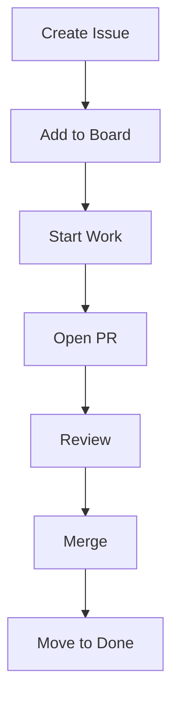

# 📋 GitHub Project Boards (Planning & Workflow Management)

<p align="center">
  
  
  
  
</p>

<p align="center">
  <b>Plan, track, and manage development work using GitHub’s built-in project boards.</b>
</p>

---

## 📌 What Are GitHub Project Boards?

GitHub Project Boards are:

> Visual task management tools built into GitHub.

They help teams organize work using:
- issues
- pull requests
- notes/tasks

---

## 🧠 Why Project Boards Matter

Without project tracking:

- tasks get lost ❌
- no visibility ❌
- team confusion ❌

With project boards:

- clear workflow ✅
- task ownership ✅
- progress tracking ✅
- team alignment ✅

---

## 🗺️ Big Picture

```mermaid
flowchart LR
    A[Ideas / Issues] --> B[To Do]
    B --> C[In Progress]
    C --> D[Review]
    D --> E[Done]
````

---

## 🧱 Board Types

---

### 1. 🧩 Classic Kanban Board

```text id="kbn1"
To Do → In Progress → Done
```

---

### 2. 📊 Table / Spreadsheet View

```text id="tbl1"
Task | Status | Assignee | Priority
```

---

### 3. 📅 Timeline View (Roadmap)

```text id="tln1"
Task A → Task B → Task C
```

---

## 🧬 Core Components

---

### 🔹 Issues

Each task is usually an issue.

Example:

```text id="iss1"
#42 Fix login bug
#43 Add payment feature
```

---

### 🔹 Pull Requests

PRs are linked to tasks.

```text id="pr1"
PR #12 → resolves Issue #42
```

---

### 🔹 Cards

Each item on board = card

---

### 🔹 Columns / Status

Typical columns:

```text id="cols1"
To Do
In Progress
Review
Done
```

---

## 🖥️ Board UI Mock

```text id="uimock1"
┌──────────────┬──────────────┬──────────────┬──────────────┐
│ To Do        │ In Progress  │ Review       │ Done         │
├──────────────┼──────────────┼──────────────┼──────────────┤
│ #42 Fix bug  │ #43 Feature  │ PR #12       │ #40 Complete │
│ #44 UI fix   │              │              │              │
└──────────────┴──────────────┴──────────────┴──────────────┘
```

---

## 🧱 Creating a Project Board

---

### Step 1 — Go to GitHub Projects

```text id="step1"
Click "Projects" tab
```

---

### Step 2 — Create New Project

Choose:

* Board (Kanban)
* Table
* Roadmap

---

### Step 3 — Add Columns

```text id="step3"
To Do → In Progress → Review → Done
```

---

### Step 4 — Add Issues

Link existing issues or create new ones.

---

## 🔄 Workflow Integration



---

## 🧠 Automation in Boards

GitHub can automate movement:

---

### Example Rules

* Issue created → move to "To Do"
* PR opened → move to "In Progress"
* PR merged → move to "Done"

---

## ⚙️ Example Automation Flow

```text id="auto1"
Issue created → To Do
PR opened → In Progress
PR merged → Done
```

---

## 🧪 Real-World Scenario

```text id="real1"
Sprint Planning:
- Add 10 tasks to To Do

During work:
- Developers move tasks to In Progress

During review:
- Move to Review

After merge:
- Move to Done
```

---

## 🧠 Labels + Projects

Combine labels for better tracking:

```text id="lbl1"
bug
feature
high-priority
frontend
backend
```

---

## 🧠 Assignment

Each issue can be assigned:

```text id="asg1"
Assignee → responsible developer
```

---

## 🧬 Full System View

```text id="arch1"
Issue → Board → PR → Review → Merge → Done
```

---

## 📊 Advanced Features

---

### 🔹 Filters

```text id="flt1"
status:open label:bug
```

---

### 🔹 Custom Fields

* priority
* sprint
* story points

---

### 🔹 Views

* board view
* table view
* timeline view

---

## 🚨 Common Mistakes

---

### ❌ Not updating board

Board becomes useless.

---

### ❌ Too many columns

Confusing workflow.

---

### ❌ No ownership

Tasks stay incomplete.

---

### ❌ Mixing unrelated work

Hard to track progress.

---

## ✅ Best Practices

* keep columns simple
* update status regularly
* link PRs to issues
* assign owners
* use labels
* automate movements

---

## 🧠 Pro Tips

* keep board clean
* review board daily
* use milestones for releases
* close issues after merge

---

## 🎤 Interview Questions

### What are GitHub Project Boards?

Tools to manage and track development tasks visually.

---

### What is Kanban board?

A workflow system using columns like To Do → Done.

---

### How do boards integrate with PRs?

PRs can be linked to issues and move cards automatically.

---

### Why use project boards?

To organize work and track progress.

---

## 🧪 Practice Lab

---

### Task 1

Create a project board with:

```text id="lab1"
To Do
In Progress
Review
Done
```

---

### Task 2

Create issues:

```text id="lab2"
#1 Add login
#2 Fix bug
#3 Improve UI
```

---

### Task 3

Move tasks through workflow.

---

### Task 4

Link PR to issue:

```text id="lab4"
"Fixes #1"
```

---

## 🎯 Final Takeaway

GitHub Project Boards turn GitHub into:

```text id="take1"
Code + Tasks + Workflow
```

They help teams:

* stay organized
* move faster
* collaborate better

---

## 👉 Next Step

➡️ `03-issues-milestones.md`