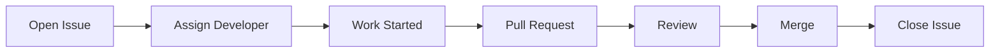
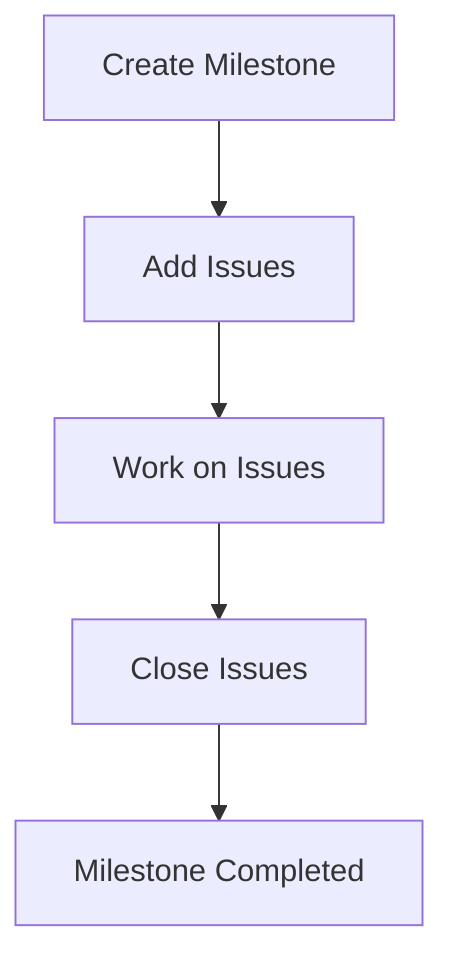

# 🐞 GitHub Issues & Milestones (Tracking Work & Releases)

<p align="center">
  
  
  
  
</p>

<p align="center">
  <b>Track bugs, features, and releases using Issues and Milestones — the backbone of project management on GitHub.</b>
</p>

---

## 📌 What Are GitHub Issues?

GitHub Issues are:

> Tasks, bugs, feature requests, or discussions tracked inside a repository.

---

### 🔹 Examples of Issues

```text id="iss-ex1"
#42 Fix login bug
#43 Add payment integration
#44 Improve UI responsiveness
````

---

## 🧠 Why Issues Matter

Without issues:

* tasks are unclear ❌
* bugs are not tracked ❌
* no history of decisions ❌

With issues:

* clear task tracking ✅
* structured communication ✅
* better collaboration ✅
* visible progress ✅

---

## 🗺️ Issue Lifecycle



---

## 🧱 Issue Components

---

### 🔹 Title

Short summary of the task.

```text id="title1"
Fix login validation bug
```

---

### 🔹 Description

Detailed explanation.

```text id="desc1"
Login fails when email is empty. Expected validation message.
```

---

### 🔹 Labels

Used to categorize issues.

```text id="labels1"
bug
feature
enhancement
urgent
frontend
backend
```

---

### 🔹 Assignees

Who is responsible.

```text id="asg1"
Assigned to: developer1
```

---

### 🔹 Comments

Discussion between team members.

---

### 🔹 Status

```text id="status1"
Open → In Progress → Closed
```

---

## 🖥️ Issue UI Mock

```text id="ui1"
┌──────────────────────────────────────────────┐
│ #42 Fix login bug                           │
├──────────────────────────────────────────────┤
│ Labels: bug, high-priority                  │
│ Assignee: dev1                              │
├──────────────────────────────────────────────┤
│ Description:                                │
│ Login fails when input is empty             │
├──────────────────────────────────────────────┤
│ Comments:                                   │
│ - dev1: working on it                       │
│ - reviewer: please add test                 │
└──────────────────────────────────────────────┘
```

---

## 🔗 Linking Issues with PRs

You can link PRs to issues:

```text id="link1"
Fixes #42
Closes #43
Resolves #44
```

---

### 🧠 What Happens

```text id="link2"
PR merged → Issue auto closed
```

---

## 🧪 Real-World Workflow

```text id="wf1"
1. Create issue
2. Assign developer
3. Create branch
4. Open PR
5. Merge PR
6. Issue closes automatically
```

---

# 📦 What Are Milestones?

Milestones group issues into a release or goal.

---

## 🧠 Definition

> A milestone is a collection of issues tied to a specific goal or version.

---

## 🗺️ Milestone Example

```text id="ms1"
Milestone: v1.0 Release

Issues:
- #42 Fix login bug
- #43 Add payment
- #44 Improve UI
```

---

## 🧬 Milestone Progress

```text id="ms2"
Completed: 2 / 3 issues
Progress: 66%
```

---

## 🧠 Why Use Milestones?

* plan releases
* group related tasks
* track progress
* align team goals

---

## 🔄 Milestone Workflow



---

## 🧱 Creating Milestone

---

### Step 1

Go to:

```text id="step1"
Issues → Milestones → New Milestone
```

---

### Step 2

Add:

```text id="step2"
Title: v1.0
Description: First stable release
Due date: optional
```

---

### Step 3

Assign issues to milestone.

---

## 🖥️ Milestone UI Mock

```text id="ui2"
┌──────────────────────────────────────────────┐
│ Milestone: v1.0                             │
├──────────────────────────────────────────────┤
│ Progress: 70%                               │
│ Issues:                                     │
│ ✔ #42 Fix bug                               │
│ ✔ #43 Add feature                           │
│ ⏳ #44 UI improvement                        │
└──────────────────────────────────────────────┘
```

---

## 🧠 Issues vs Milestones

| Issues      | Milestones     |
| ----------- | -------------- |
| single task | group of tasks |
| short-term  | long-term goal |
| detailed    | high-level     |

---

## 🧪 Real-World Scenario

```text id="real1"
Sprint 1:
- 10 issues created

Milestone: Sprint 1
- All issues assigned

Goal:
Complete milestone → release
```

---

## 🧠 Labels + Milestones Combo

```text id="combo1"
Milestone: v2.0
Labels:
- bug
- feature
- urgent
```

Helps:

* filtering
* prioritization
* organization

---

## ⚠️ Common Mistakes

---

### ❌ Not using issues

Work becomes unstructured.

---

### ❌ Not linking PRs

Hard to track changes.

---

### ❌ Too many labels

Creates confusion.

---

### ❌ Not updating status

Board becomes outdated.

---

## ✅ Best Practices

* write clear issue titles
* provide detailed description
* assign owners
* use labels wisely
* link PRs to issues
* close issues properly
* use milestones for releases

---

## 🧠 Pro Tips

* use templates for issues
* use milestones for sprint planning
* review issues regularly
* combine with project boards

---

## 🎤 Interview Questions

### What are GitHub Issues?

Tasks or bugs tracked in a repository.

---

### What are Milestones?

Groups of issues tied to a goal or release.

---

### How do you link PR to issue?

Using keywords like `Fixes #42`.

---

### Why use milestones?

To track progress toward releases.

---

### Difference between issues and project boards?

Issues track tasks, boards organize them visually.

---

## 🧪 Practice Lab

---

### Task 1 — Create Issues

```text id="lab1"
#1 Add login
#2 Fix navbar
#3 Improve UI
```

---

### Task 2 — Add Labels

```text id="lab2"
bug, feature, enhancement
```

---

### Task 3 — Create Milestone

```text id="lab3"
Milestone: v1.0
```

---

### Task 4 — Assign Issues to Milestone

---

### Task 5 — Link PR

```text id="lab5"
Fixes #1
```

---

## 🎯 Final Takeaway

Issues + Milestones provide:

```text id="take1"
Tasks + Planning + Progress Tracking
```

They are essential for:

* team collaboration
* structured development
* release management

---

## 👉 Next Step

➡️ `04-releases.md`
