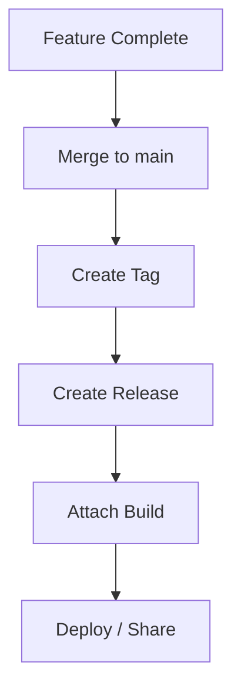
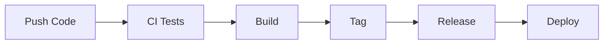

# 📦 GitHub Releases (Versioning & Distribution)

<p align="center">
  
  
  
  
</p>

<p align="center">
  <b>Package, version, and distribute your software using GitHub Releases — the bridge between code and users.</b>
</p>

---

## 📌 What Is a GitHub Release?

A GitHub Release is:

> A packaged version of your project tied to a Git tag, with notes and downloadable assets.

---

## 🧠 Why Releases Matter

Without releases:

- no clear versions ❌
- hard to distribute builds ❌
- users don’t know what changed ❌

With releases:

- versioned builds ✅
- changelog for users ✅
- downloadable artifacts ✅
- easy rollback to previous versions ✅

---

## 🗺️ Big Picture

```mermaid
flowchart LR
    A[Code Ready] --> B[Tag Created]
    B --> C[GitHub Release]
    C --> D[Attach Assets]
    D --> E[Users Download]
````

---

## 🧬 Relationship: Commits → Tags → Releases

```text id="rel-arch"
A --- B --- C --- D
            ↑
          v1.0 (tag)
            ↑
      GitHub Release
```

---

## 🧱 Core Components of a Release

---

### 🔹 Tag

* points to a specific commit
* defines version (e.g., `v1.0.0`)

---

### 🔹 Release Title

```text id="rel-title"
v1.0.0 — Initial Release
```

---

### 🔹 Release Notes

```text id="rel-notes"
- Added login feature
- Fixed navbar bug
- Improved performance
```

---

### 🔹 Assets

Files users can download:

```text id="rel-assets"
app.zip
build.tar.gz
installer.exe
```

---

## 🖥️ GitHub Release UI Mock

```text id="ui-rel"
┌──────────────────────────────────────────────┐
│ Release: v1.0.0                              │
├──────────────────────────────────────────────┤
│ Tag: v1.0.0                                  │
│ Date: 2026-04-19                             │
├──────────────────────────────────────────────┤
│ Notes:                                       │
│ - Added login                                │
│ - Fixed bugs                                 │
├──────────────────────────────────────────────┤
│ Assets:                                      │
│ [Download app.zip]                           │
│ [Download build.tar.gz]                      │
└──────────────────────────────────────────────┘
```

---

## 🧱 Creating a Release (Step-by-Step)

---

### Step 1 — Create Tag

```bash id="rel-tag"
git tag -a v1.0.0 -m "Initial release"
git push origin v1.0.0
```

---

### Step 2 — Go to GitHub

```text id="rel-step2"
Repository → Releases → "Create a new release"
```

---

### Step 3 — Select Tag

```text id="rel-step3"
Choose tag: v1.0.0
```

---

### Step 4 — Add Details

```text id="rel-step4"
Title: v1.0.0
Notes: list of changes
```

---

### Step 5 — Publish

```text id="rel-step5"
Click "Publish release"
```

---

## 🔄 Release Workflow (Real Teams)



---

## 🧪 Real-World Scenario

```text id="rel-real"
1. Features completed
2. Bugs fixed
3. Code merged to main
4. Tag created: v2.0.0
5. Release published
6. Users download update
```

---

## 🧠 Semantic Versioning (VERY IMPORTANT)

---

### Format

```text id="semver"
MAJOR.MINOR.PATCH
```

---

### Example

```text id="semver-ex"
v1.0.0 → first release
v1.1.0 → new feature
v1.1.1 → bug fix
v2.0.0 → breaking change
```

---

### Rules

| Type  | Meaning          |
| ----- | ---------------- |
| MAJOR | breaking changes |
| MINOR | new features     |
| PATCH | bug fixes        |

---

## 🧠 Why SemVer Matters

* clear upgrade expectations
* compatibility tracking
* professional standard

---

## 📦 Attaching Assets

You can upload:

* compiled binaries
* zipped builds
* installers
* documentation PDFs

---

### Example

```text id="assets-ex"
dist/app.zip
dist/build.tar.gz
```

---

## ⚙️ Automating Releases (GitHub Actions)

You can auto-create releases using workflows.

---

### Example

```yaml
name: Create Release

on:
  push:
    tags:
      - 'v*'

jobs:
  release:
    runs-on: ubuntu-latest
    steps:
      - name: Create Release
        uses: softprops/action-gh-release@v1
```

---

## 🧠 What This Does

```text id="auto-rel"
Push tag → workflow runs → release created automatically
```

---

## 🔄 CI/CD + Releases



---

## 🧠 Draft vs Published Release

| Type      | Purpose                   |
| --------- | ------------------------- |
| Draft     | prepare before publishing |
| Published | visible to users          |

---

## 🧠 Pre-release

```text id="pre-rel"
v2.0.0-beta
v2.0.0-rc1
```

Used for testing before final release.

---

## 🚨 Common Mistakes

---

### ❌ Not using tags

Releases become unclear.

---

### ❌ Wrong versioning

Confuses users.

---

### ❌ No release notes

Users don’t know changes.

---

### ❌ Uploading wrong assets

---

## ✅ Best Practices

* use semantic versioning
* always write release notes
* attach correct build files
* tag every release
* automate when possible
* use pre-releases for testing

---

## 🧠 Pro Tips

* generate changelog automatically
* link issues in release notes
* keep releases consistent
* use CI to build assets

---

## 🎤 Interview Questions

### What is a GitHub release?

A packaged version of code tied to a tag.

---

### Difference between tag and release?

Tag marks commit, release adds metadata and assets.

---

### What is semantic versioning?

Versioning system: MAJOR.MINOR.PATCH.

---

### Why use releases?

To distribute and track versions.

---

### Can releases be automated?

Yes, using GitHub Actions.

---

## 🧪 Practice Lab

---

### Task 1 — Create Tag

```bash id="lab-tag"
git tag -a v1.0.0 -m "release"
git push origin v1.0.0
```

---

### Task 2 — Create Release

* Go to GitHub
* Create release from tag

---

### Task 3 — Add Notes

```text id="lab-notes"
- Added feature
- Fixed bug
```

---

### Task 4 — Upload Asset

Upload a `.zip` file.

---

### Task 5 — Try Pre-release

```text id="lab-pre"
v1.1.0-beta
```

---

## 🎯 Final Takeaway

GitHub Releases provide:

```text id="take-rel"
Version + Distribution + Communication
```

They are essential for:

* shipping software
* managing versions
* delivering builds to users

---

## 👉 Next Step

➡️ `05-discussions.md`
