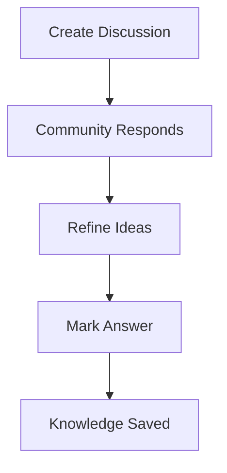

# 💬 GitHub Discussions (Community & Knowledge Sharing)

<p align="center">
  
  
  
  
</p>

<p align="center">
  <b>Build a community around your project using discussions for Q&A, ideas, and long-form conversations.</b>
</p>

---

## 📌 What Are GitHub Discussions?

GitHub Discussions are:

> A forum-style space inside a repository for conversations that are not direct tasks or bugs.

---

## 🧠 Why Discussions Matter

Without discussions:

- cluttered issues ❌
- repeated questions ❌
- no knowledge base ❌

With discussions:

- organized Q&A ✅
- community engagement ✅
- reusable knowledge ✅
- cleaner issue tracking ✅

---

## 🗺️ Big Picture

```mermaid
flowchart LR
    A[User Question] --> B[Discussion Thread]
    B --> C[Community Replies]
    C --> D[Best Answer Selected]
    D --> E[Knowledge Base Created]
````

---

## 🧱 Discussions vs Issues

| Discussions         | Issues           |
| ------------------- | ---------------- |
| conversations       | tasks/bugs       |
| open-ended          | actionable       |
| long-term knowledge | short-term work  |
| community-driven    | developer-driven |

---

## 🧬 Categories in Discussions

Repositories can define categories like:

```text id="cat1"
💡 Ideas
❓ Q&A
📢 Announcements
🙏 Show and Tell
🛠️ Help
```

---

## 🧠 Why Categories Matter

* organizes content
* improves discoverability
* separates types of conversations

---

## 🖥️ Discussion UI Mock

```text id="ui-disc"
┌──────────────────────────────────────────────┐
│ Category: Q&A                                │
├──────────────────────────────────────────────┤
│ Title: How to fix login bug?                 │
├──────────────────────────────────────────────┤
│ User: developer123                           │
│ Description:                                 │
│ Login fails when password is empty           │
├──────────────────────────────────────────────┤
│ Replies:                                     │
│ - devA: add validation                       │
│ - devB: check backend logic                  │
├──────────────────────────────────────────────┤
│ ✅ Answer selected                           │
└──────────────────────────────────────────────┘
```

---

## 🧱 Creating a Discussion

---

### Step 1

```text id="disc-step1"
Go to "Discussions" tab
```

---

### Step 2

```text id="disc-step2"
Click "New Discussion"
```

---

### Step 3

Choose category:

```text id="disc-step3"
Q&A / Ideas / Announcement
```

---

### Step 4

Write:

* title
* description
* context

---

## 🔄 Discussion Lifecycle



---

## 🧠 Q&A Flow (Very Important)

```text id="qa-flow"
Question → Answers → Best Answer → Reference later
```

---

## 🧪 Real-World Scenario

```text id="disc-real"
User: "How to install project?"
Maintainer: "Follow README steps"
Community: adds tips
Answer marked → future users benefit
```

---

## 💡 Idea Discussions

Use discussions for:

```text id="ideas"
- feature proposals
- design discussions
- roadmap planning
```

---

## 📢 Announcements

Use for:

```text id="ann"
- new releases
- breaking changes
- major updates
```

---

## 🧠 Linking Discussions to Development

Sometimes discussions lead to issues:

```text id="link-disc"
Discussion → Idea → Issue → PR → Feature
```

---

## 🔗 Convert Discussion to Issue

GitHub allows:

```text id="convert"
Convert discussion → Issue
```

Useful when:

* idea becomes actionable
* bug is confirmed

---

## 🧠 Best Answer Feature

In Q&A:

```text id="answer"
Mark best answer → highlights solution
```

Benefits:

* faster help for users
* avoids repeated questions

---

## 📚 Discussions as Knowledge Base

Over time:

```text id="kb"
Discussions → searchable knowledge system
```

---

## 🧠 Moderation

Maintainers can:

* pin discussions
* lock threads
* delete spam
* highlight answers

---

## 🚨 Common Mistakes

---

### ❌ Using issues for questions

Leads to clutter.

---

### ❌ No categories

Hard to navigate.

---

### ❌ Ignoring discussions

Community loses interest.

---

### ❌ Not marking answers

Knowledge becomes hidden.

---

## ✅ Best Practices

* use discussions for Q&A
* separate ideas from bugs
* respond actively
* mark best answers
* encourage community participation
* convert to issues when needed

---

## 🧠 Pro Tips

* create clear categories
* pin important discussions
* link discussions in docs
* use discussions for roadmap planning

---

## 🌍 Open Source Impact

Popular projects use discussions to:

* handle thousands of users
* reduce issue noise
* build active communities
* improve onboarding

---

## 🧬 Full GitHub Ecosystem Flow

```text id="ecosystem"
Discussion → Issue → PR → Review → Merge → Release
```

---

## 🎤 Interview Questions

### What are GitHub Discussions?

A forum-style feature for conversations and Q&A.

---

### Difference between issues and discussions?

Issues track tasks, discussions handle conversations.

---

### What is best answer feature?

Marks a solution in Q&A discussions.

---

### When to use discussions?

For ideas, questions, and community interaction.

---

### Can discussions become issues?

Yes, they can be converted.

---

## 🧪 Practice Lab

---

### Task 1 — Create Discussion

```text id="lab1"
Category: Q&A
Title: How to run project?
```

---

### Task 2 — Reply

Simulate answers.

---

### Task 3 — Mark Best Answer

---

### Task 4 — Create Idea Discussion

```text id="lab4"
"Add dark mode feature"
```

---

### Task 5 — Convert to Issue

---

## 🎯 Final Takeaway

GitHub Discussions provide:

```text id="take-disc"
Community + Knowledge + Collaboration
```

They transform a repository into:

* interactive platform
* learning hub
* community ecosystem

---

## 👉 Next Step

➡️ `06-security-alerts.md`
