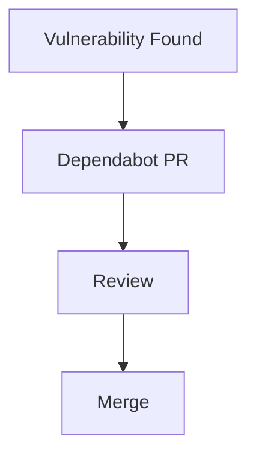
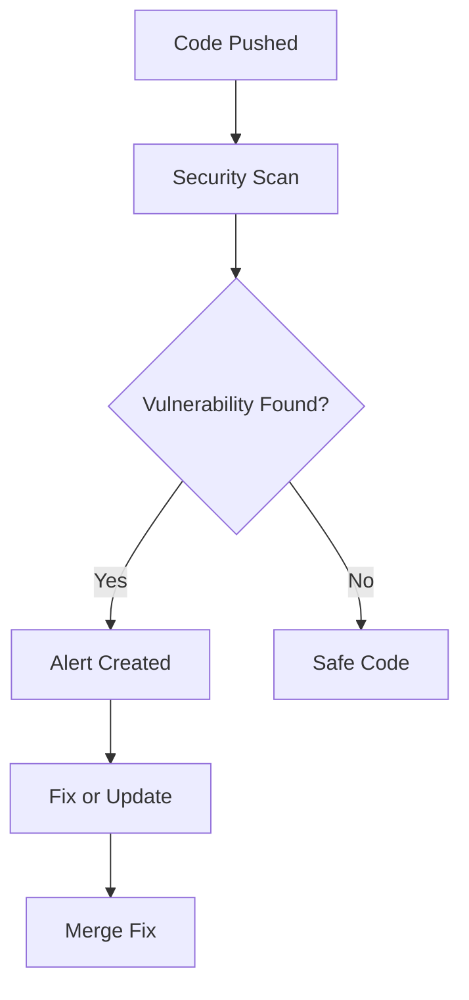

# 🔐 GitHub Security Alerts (Protect Your Code & Dependencies)

<p align="center">
  
  
  
  
</p>

<p align="center">
  <b>Detect, manage, and fix vulnerabilities automatically using GitHub’s built-in security tools.</b>
</p>

---

## 📌 What Are GitHub Security Alerts?

GitHub Security Alerts are:

> Automated notifications about vulnerabilities in your code or dependencies.

---

## 🧠 Why Security Alerts Matter

Without security monitoring:

- vulnerable libraries remain unnoticed ❌
- attackers can exploit code ❌
- data breaches risk increases ❌

With security alerts:

- vulnerabilities detected early ✅
- automated fixes suggested ✅
- safer deployments ✅

---

## 🗺️ Big Picture

```mermaid
flowchart LR
    A[Dependencies / Code] --> B[Security Scan]
    B --> C[Vulnerability Found]
    C --> D[Alert Created]
    D --> E[Fix / Update]
````

---

## 🧱 Types of GitHub Security Features

---

### 1️⃣ Dependabot Alerts

```text id="dep1"
Detects vulnerabilities in dependencies
```

---

### 2️⃣ Dependabot Updates

```text id="dep2"
Automatically creates PRs to update dependencies
```

---

### 3️⃣ Code Scanning

```text id="code1"
Finds security issues in your code
```

---

### 4️⃣ Secret Scanning

```text id="secscan1"
Detects exposed API keys, tokens, passwords
```

---

## 🧬 Security Architecture

```text id="arch-sec"
Code + Dependencies
        │
        ▼
GitHub Security Engine
        │
        ├── Dependency Scan
        ├── Code Scan
        ├── Secret Scan
        ▼
Alerts + Suggestions
```

---

# 🔎 1. Dependabot Alerts

---

## 📌 What It Does

Dependabot scans your dependencies (e.g., npm, pip, Maven).

---

## 🧠 Example

```text id="dep-ex"
Library: lodash
Issue: Known vulnerability
Severity: High
```

---

## 🖥️ UI Mock

```text id="ui-dep"
┌──────────────────────────────────────────────┐
│ Security Alert                              │
├──────────────────────────────────────────────┤
│ Dependency: lodash                          │
│ Severity: HIGH                              │
│ Fix: Upgrade to v4.17.21                    │
│ Status: Open                                │
└──────────────────────────────────────────────┘
```

---

## 🔄 Fixing Alert

```text id="dep-fix"
Click "Update" → PR created → Merge
```

---

# 🔄 2. Dependabot Updates

---

## 📌 What It Does

Automatically creates pull requests:

```text id="dep-update"
Upgrade vulnerable dependencies
```

---

## 🧠 Example Flow



---

## ⚙️ Enable Dependabot

Create file:

```text id="dep-config"
.github/dependabot.yml
```

---

### Example Config

```yaml id="dep-yaml"
version: 2
updates:
  - package-ecosystem: "npm"
    directory: "/"
    schedule:
      interval: "weekly"
```

---

# 🔍 3. Code Scanning

---

## 📌 What It Does

Scans your code for vulnerabilities like:

* SQL injection
* XSS
* insecure patterns

---

## 🧠 Powered by

```text id="codeql"
CodeQL (GitHub's analysis engine)
```

---

## ⚙️ Enable Code Scanning

```yaml id="code-yaml"
name: CodeQL

on: [push]

jobs:
  analyze:
    runs-on: ubuntu-latest
    steps:
      - uses: github/codeql-action/init@v3
      - uses: github/codeql-action/analyze@v3
```

---

## 🖥️ UI Mock

```text id="ui-code"
┌──────────────────────────────────────────────┐
│ Code Scanning Alert                         │
├──────────────────────────────────────────────┤
│ Issue: SQL Injection Risk                   │
│ File: login.js                             │
│ Severity: Critical                          │
└──────────────────────────────────────────────┘
```

---

# 🔑 4. Secret Scanning

---

## 📌 What It Detects

```text id="sec-detect"
API keys
tokens
passwords
private keys
```

---

## 🧠 Example

```text id="sec-ex"
AWS_SECRET=abcd1234
```

GitHub detects → creates alert.

---

## 🚨 Why This Is Critical

Exposed secrets can lead to:

* account takeover
* data leaks
* financial loss

---

## 🧠 What To Do

```text id="sec-fix"
1. Revoke secret
2. Remove from code
3. Use GitHub Secrets instead
```

---

# 🔐 Security Workflow (Real Teams)



---

## 🧠 Severity Levels

| Level    | Meaning             |
| -------- | ------------------- |
| Low      | minor issue         |
| Medium   | moderate risk       |
| High     | serious issue       |
| Critical | urgent fix required |

---

## 🧪 Real-World Scenario

```text id="real-sec"
1. Project uses old library
2. Vulnerability discovered
3. GitHub creates alert
4. Dependabot opens PR
5. Developer merges fix
6. Project becomes secure
```

---

## 🚨 Common Mistakes

---

### ❌ Ignoring alerts

Leads to security risks.

---

### ❌ Not updating dependencies

Old versions are unsafe.

---

### ❌ Hardcoding secrets

Major security flaw.

---

### ❌ Disabling scans

Removes protection.

---

## ✅ Best Practices

* enable Dependabot
* enable code scanning
* review alerts regularly
* update dependencies
* never store secrets in code
* use GitHub Secrets
* automate updates

---

## 🧠 Pro Tips

* schedule weekly updates
* combine with CI workflows
* audit dependencies regularly
* use least-privilege secrets

---

## 🧬 Security + CI Integration

```text id="sec-ci"
CI → Test → Security Scan → Merge
```

---

## 🎤 Interview Questions

### What are GitHub Security Alerts?

Notifications about vulnerabilities in code or dependencies.

---

### What is Dependabot?

Tool that detects and updates vulnerable dependencies.

---

### What is CodeQL?

GitHub’s engine for analyzing code security.

---

### What is secret scanning?

Detecting exposed credentials in code.

---

### Why is security important in CI/CD?

To prevent vulnerabilities from reaching production.

---

## 🧪 Practice Lab

---

### Task 1 — Enable Dependabot

Create:

```yaml id="lab1"
.github/dependabot.yml
```

---

### Task 2 — Trigger Update

Push code → see PR.

---

### Task 3 — Enable CodeQL

Add workflow.

---

### Task 4 — Simulate Secret Leak

```text id="lab4"
Add fake API key → observe detection
```

---

### Task 5 — Fix Vulnerability

Merge Dependabot PR.

---

## 🎯 Final Takeaway

GitHub Security Alerts provide:

```text id="take-sec"
Protection + Automation + Safety
```

They are essential for:

* secure development
* production systems
* protecting users and data

---

## 👉 Next Step

➡️ `07-codeowners.md`
