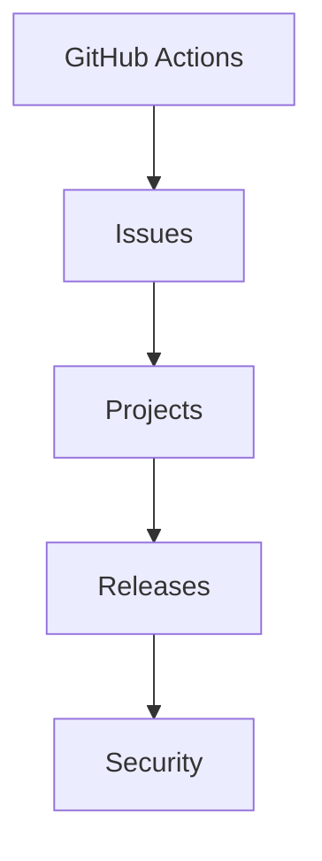

# 🚀 GitHub Pro Level (Automation, Projects, Security)

<p align="center">
  
  
  
  
</p>

<p align="center">
  <b>Master GitHub beyond code — automation, project management, releases, and security used in real-world teams.</b>
</p>

---

## 📌 What Is GitHub Pro Level?

This module focuses on **GitHub as a platform**, not just Git.

You will learn how teams use GitHub for:

- automation (CI/CD)
- issue tracking
- project management
- release management
- security monitoring
- collaboration at scale

---

## 🧠 Why This Matters

Git = version control  
GitHub = **engineering platform**

Without GitHub features:

- manual deployment ❌
- no structured planning ❌
- weak collaboration ❌

With GitHub Pro skills:

- automated pipelines ✅
- organized development ✅
- secure repositories ✅
- scalable teamwork ✅

---

## 🗺️ GitHub Ecosystem Overview

```mermaid
flowchart TD
    A[Code] --> B[Pull Requests]
    B --> C[GitHub Actions]
    C --> D[Build & Test]
    D --> E[Deploy]
    B --> F[Issues]
    F --> G[Project Boards]
    B --> H[Code Review]
    B --> I[Security Alerts]
````

---

## 🧱 Topics Covered

| File                      | Concept                     |
| ------------------------- | --------------------------- |
| `01-github-actions.md`    | CI/CD automation            |
| `02-project-boards.md`    | Task management             |
| `03-issues-milestones.md` | Issue tracking              |
| `04-releases.md`          | Version releases            |
| `05-discussions.md`       | Community interaction       |
| `06-security-alerts.md`   | Security monitoring         |
| `07-codeowners.md`        | Code ownership              |
| `practice-lab.md`         | Real-world GitHub workflows |

---

## ⚙️ Core GitHub Components

---

### 🔀 Pull Requests

* collaboration
* review system
* merge control

---

### 🧪 GitHub Actions

* CI/CD pipelines
* automation workflows
* testing & deployment

---

### 🐞 Issues

* bug tracking
* feature requests
* task management

---

### 📋 Projects

* kanban boards
* sprint planning
* workflow tracking

---

### 📦 Releases

* version management
* deployment packaging

---

### 🔐 Security

* vulnerability scanning
* dependency alerts
* secret detection

---

## 🧠 Real-World Development Flow

```mermaid
flowchart LR
    A[Issue Created] --> B[Branch Created]
    B --> C[Code Written]
    C --> D[Pull Request]
    D --> E[GitHub Actions Run]
    E --> F[Code Review]
    F --> G[Merge]
    G --> H[Release]
```

---

## 🧬 Internal GitHub Workflow

```text id="u3t9rp"
Code → PR → CI → Review → Merge → Release → Deploy
```

---

## 🧪 Example: Professional Workflow

```text id="k7p2vm"
1. Create issue
2. Assign developer
3. Create branch
4. Open PR
5. Run CI tests
6. Review code
7. Merge
8. Deploy
```

---

## 🧠 GitHub vs Git

| Git             | GitHub                    |
| --------------- | ------------------------- |
| version control | collaboration platform    |
| local tool      | cloud-based system        |
| commit history  | CI/CD + issues + security |

---

## 🔥 What Makes This Module Powerful

You will learn:

* how companies automate builds
* how teams manage tasks
* how releases are shipped
* how security is handled
* how large teams collaborate

---

## 🧠 Industry Relevance

These concepts are used in:

* startups
* enterprises
* open-source projects
* DevOps pipelines

---

## 🎤 Interview Value

Common questions:

* What is GitHub Actions?
* How do you automate deployment?
* What are Issues vs Projects?
* What is CI/CD?
* How do you manage releases?

---

## 🎯 Learning Path



---

## 🚀 Final Goal

After this module, you will:

* automate workflows ⚡
* manage projects 📋
* handle releases 📦
* improve collaboration 🤝
* understand GitHub deeply 🧠

---

## 🧠 Real Developer Mindset

> Git stores code
> GitHub manages the entire development lifecycle

---

## 🎯 Final Takeaway

GitHub Pro skills transform you from:

```text
"I can use Git"
```

to

```text
"I can manage real-world software development"
```

---

## 👉 Start Here

➡️ `01-github-actions.md`
