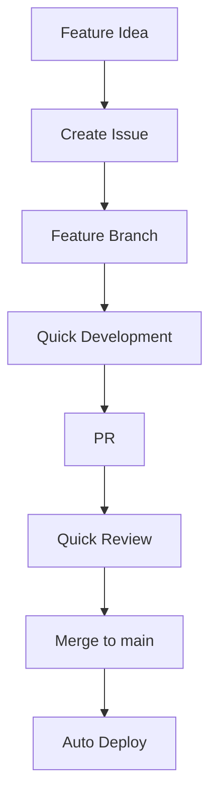
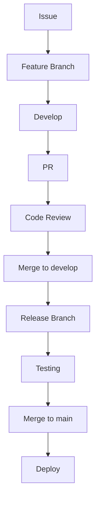
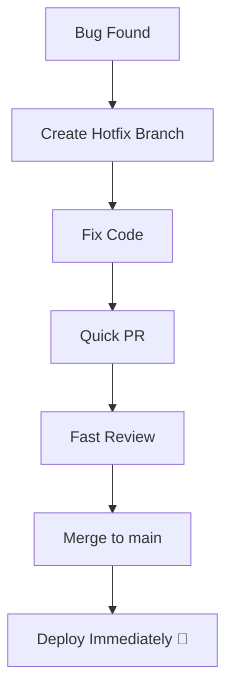
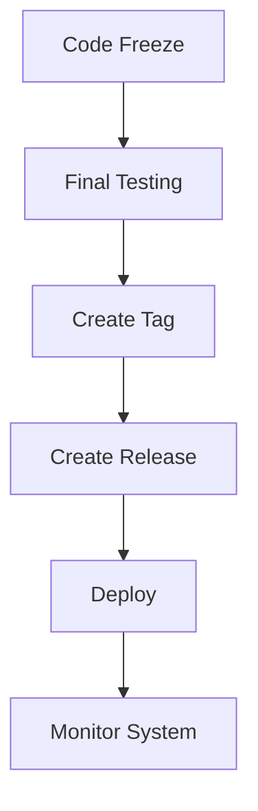
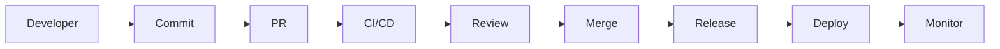

# 🌍 Real-World Git & GitHub Scenarios

<p align="center">
  
  
  
  
</p>

<p align="center">
  <b>Understand how Git and GitHub are used in real companies — from startups to enterprises.</b>
</p>

---

## 📌 What Is This Section?

This module connects:

```text id="rw-connect"
Git Basics + Advanced Git + GitHub Pro
            ↓
      Real Engineering Workflows
````

---

## 🧠 Why This Section Matters

Learning commands is not enough.

You need to understand:

* how teams actually work
* how code flows from idea → production
* how releases happen
* how problems are handled

---

## 🗺️ Big Picture


---

## 🧱 Topics Covered

| File                         | Concept               |
| ---------------------------- | --------------------- |
| `startup-workflow.md`        | fast-moving teams     |
| `enterprise-workflow.md`     | large-scale systems   |
| `monorepo-vs-multirepo.md`   | repo architecture     |
| `trunk-based-development.md` | modern workflow       |
| `gitflow-model.md`           | structured releases   |
| `emergency-hotfix.md`        | critical fixes        |
| `release-day-workflow.md`    | production deployment |

---

## 🧬 Real Development Lifecycle

```text id="lifecycle"
Idea → Issue → Branch → Code → PR → CI → Review → Merge → Release → Deploy
```

---

## 🚀 Scenario 1 — Startup Workflow

Startups focus on:

* speed ⚡
* flexibility 🔄
* quick releases 🚀

---

### Typical Flow



---

### Characteristics

```text id="startup-char"
- trunk-based development
- small PRs
- fast merges
- CI/CD automation
```

---

## 🏢 Scenario 2 — Enterprise Workflow

Enterprises focus on:

* stability 🛡️
* control 🎯
* structured releases 📦

---

### Typical Flow



---

### Characteristics

```text id="enterprise-char"
- GitFlow model
- multiple environments
- strict reviews
- staged releases
```

---

## ⚔️ Trunk-Based vs GitFlow

---

### 🌿 Trunk-Based Development

```text id="trunk"
- main is always active
- small branches
- frequent merges
```

---

### 🌳 GitFlow

```text id="gitflow"
- develop + main
- release branches
- hotfix branches
```

---

### Comparison

| Feature    | Trunk-Based | GitFlow     |
| ---------- | ----------- | ----------- |
| Speed      | fast        | slower      |
| Complexity | simple      | complex     |
| Releases   | continuous  | staged      |
| Best for   | startups    | enterprises |

---

## 🧠 Choosing the Right Workflow

---

### Startup

👉 Trunk-Based

---

### Enterprise

👉 GitFlow / Hybrid

---

### CI/CD Driven Teams

👉 Trunk-Based + Automation

---

## 🧪 Scenario 3 — Emergency Hotfix

---

### Situation

```text id="hotfix1"
Production bug detected
Users affected
Immediate fix required
```

---

### Workflow



---

### Key Points

```text id="hotfix2"
- bypass normal flow
- prioritize speed
- minimal changes
```

---

## 📦 Scenario 4 — Release Day Workflow

---

### Flow



---

### Steps

```text id="release-day"
1. Stop new features
2. Test thoroughly
3. Tag version
4. Publish release
5. Deploy
6. Monitor logs
```

---

## 🧠 Scenario 5 — Monorepo vs Multirepo

---

### Monorepo

```text id="mono"
Single repo for all services
```

---

### Multirepo

```text id="multi"
Separate repo per service
```

---

### Comparison

| Monorepo        | Multirepo          |
| --------------- | ------------------ |
| easier sharing  | better isolation   |
| complex scaling | simpler structure  |
| single CI       | multiple pipelines |

---

## 🧬 Full Production Pipeline



---

## 🧠 Real Problems & Solutions

---

### Problem: Merge Conflicts

```text id="prob1"
Solution: small PRs + frequent sync
```

---

### Problem: Broken Build

```text id="prob2"
Solution: CI checks before merge
```

---

### Problem: Lost Code

```text id="prob3"
Solution: reflog recovery
```

---

### Problem: Wrong Deployment

```text id="prob4"
Solution: tagging + release system
```

---

## 🚨 Common Mistakes

---

### ❌ Large PRs

Hard to review.

---

### ❌ No CI/CD

Leads to unstable code.

---

### ❌ No branching strategy

Creates chaos.

---

### ❌ No release system

Confusing deployments.

---

## ✅ Best Practices

* use small PRs
* automate CI/CD
* follow branch strategy
* use releases
* track issues
* review code properly
* monitor production

---

## 🧠 Pro Insights

* real teams optimize workflow, not just code
* automation is key to scaling
* communication matters as much as code
* Git + GitHub = full engineering system

---

## 🎤 Interview Questions

### What is trunk-based development?

A workflow where developers merge frequently into main.

---

### What is GitFlow?

A structured branching model with develop, release, and hotfix branches.

---

### How do startups manage Git workflows?

Using trunk-based + CI/CD for speed.

---

### How do enterprises manage releases?

Using GitFlow or staged workflows.

---

### What is a hotfix?

An urgent fix applied directly to production.

---

## 🧪 Practice Lab

---

### Scenario 1

```text id="lab1"
Simulate startup workflow
```

---

### Scenario 2

```text id="lab2"
Simulate GitFlow release
```

---

### Scenario 3

```text id="lab3"
Simulate hotfix
```

---

### Scenario 4

```text id="lab4"
Create release with tag
```

---

## 🎯 Final Takeaway

Real-world workflows combine:

```text id="take-final"
Git + GitHub + CI/CD + Team Collaboration
```

Mastering this means:

> You are ready to work in real engineering teams 🚀

---

## 🚀 You Completed Git Mastery

You now understand:

* Git fundamentals
* advanced Git tools
* GitHub ecosystem
* real-world workflows

---

## 🏁 Final Message

> You are no longer just a Git user.
> You are a **Git & GitHub professional** 🔥
