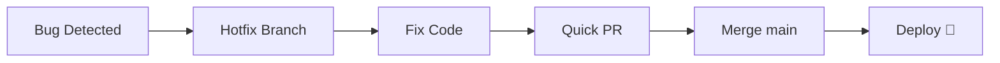
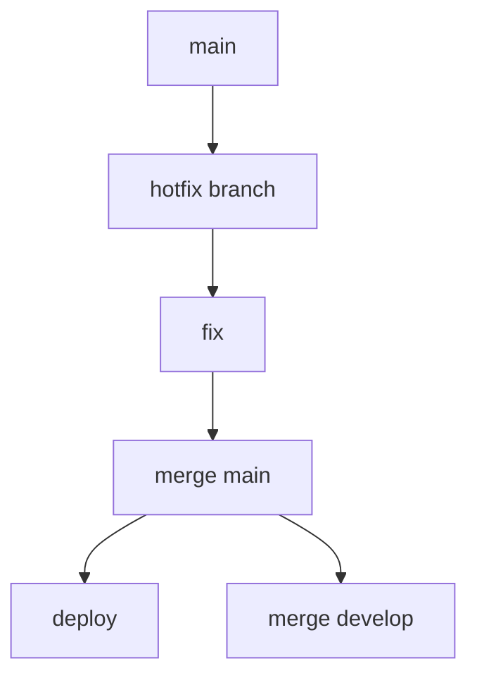

# 🚨 Emergency Hotfix Workflow (Fix Production Issues Fast)

<p align="center">
  
  
  
  
</p>

<p align="center">
  <b>Learn how to respond quickly to production bugs using Git — minimize downtime and restore stability.</b>
</p>

---

## 📌 What Is an Emergency Hotfix?

An emergency hotfix is:

> A fast fix applied directly to production to resolve critical issues.

---

## 🧠 When Is It Needed?

```text id="eh-when"
- production is broken
- users cannot use the system
- security vulnerability detected
- critical bug affecting business
````

---

## 🧠 Key Goal

```text id="eh-goal"
Fix → Deploy → Restore service ASAP
```

---

## 🗺️ Big Picture



---

## 🚨 Real Scenario

```text id="eh-real"
Payment system crashes
Users cannot checkout
Revenue loss happening
```

---

## 🧱 Hotfix Workflow

---

### 1️⃣ Identify Issue

```text id="eh-step1"
Bug found in production
```

---

### 2️⃣ Create Hotfix Branch (from main)

```bash id="eh-step2"
git checkout main
git pull origin main
git checkout -b hotfix/fix-payment-crash
```

---

### 3️⃣ Fix the Bug

```text id="eh-step3"
Minimal, targeted fix only
```

---

### 4️⃣ Commit Changes

```bash id="eh-step4"
git commit -m "Fix payment crash"
```

---

### 5️⃣ Push & Open PR

```bash id="eh-step5"
git push origin hotfix/fix-payment-crash
```

---

### 6️⃣ Fast Review

```text id="eh-step6"
Quick but careful review
```

---

### 7️⃣ Merge to main

```text id="eh-step7"
Merge immediately after approval
```

---

### 8️⃣ Deploy to Production

```text id="eh-step8"
Deploy ASAP 🚀
```

---

### 9️⃣ Sync Back to develop

```bash id="eh-step9"
git checkout develop
git merge hotfix/fix-payment-crash
```

---

## 🔄 Hotfix Flow



---

## 🧠 Why Merge Back to develop?

```text id="eh-why"
Keep future code consistent
```

---

## ⚡ Speed vs Safety

| Factor  | Approach              |
| ------- | --------------------- |
| Speed   | very high             |
| Testing | minimal but essential |
| Scope   | very small            |
| Risk    | controlled            |

---

## 🧠 Key Rule

```text id="eh-rule"
Fix only what is broken — nothing extra
```

---

## 🧪 Real-World Example

```text id="eh-example"
Bug: login crashes when password empty

Fix:
Add validation check

Deploy:
Within 15 minutes
```

---

## 🚨 What NOT to Do

---

### ❌ Add new features

Too risky.

---

### ❌ Large refactor

Slows fix.

---

### ❌ Skip review completely

Dangerous.

---

### ❌ Ignore testing

Can break more things.

---

## ✅ Best Practices

* isolate fix
* keep changes minimal
* test quickly
* deploy immediately
* communicate with team
* document incident

---

## 🧠 Pro Tips

* keep rollback plan ready
* monitor logs after deploy
* use feature flags if possible
* notify stakeholders

---

## 🧬 Internal Flow

```text id="eh-arch"
Bug → Hotfix Branch → Fix → PR → Merge → Deploy → Monitor
```

---

## 📊 After Fix (Post-Mortem)

---

### What to do after incident:

```text id="eh-post"
- analyze root cause
- improve tests
- document issue
- prevent future bugs
```

---

## 🧠 Example Post-Mortem

```text id="eh-post-ex"
Issue: null value crash
Fix: validation added
Prevention: add test cases
```

---

## 🔐 Security Hotfix Scenario

```text id="eh-sec"
Critical vulnerability found
→ patch immediately
→ deploy urgently
```

---

## 🧠 Monitoring After Deployment

```text id="eh-monitor"
- check logs
- monitor errors
- track performance
```

---

## 🚨 Common Mistakes

---

### ❌ Not syncing branches

Leads to future bugs.

---

### ❌ Delayed fix

Increases damage.

---

### ❌ Poor communication

Team confusion.

---

### ❌ No rollback plan

High risk.

---

## 🎤 Interview Questions

### What is a hotfix?

A quick fix applied directly to production.

---

### Why branch from main?

Because main represents production.

---

### Why merge back to develop?

To keep branches consistent.

---

### What is the biggest risk?

Introducing new bugs during fix.

---

### How to minimize risk?

Small changes + quick testing.

---

## 🧪 Practice Lab

---

### Task 1

```text id="lab1"
Simulate production bug
```

---

### Task 2

```bash id="lab2"
Create hotfix branch from main
```

---

### Task 3

```text id="lab3"
Apply small fix
```

---

### Task 4

```text id="lab4"
Merge and deploy
```

---

### Task 5

```text id="lab5"
Merge back to develop
```

---

## 🎯 Final Takeaway

Emergency hotfix is about:

```text id="eh-take"
Speed + Precision + Control
```

---

## 🚀 Key Insight

> Fix fast, but fix carefully.

---

## 👉 Next Step

➡️ `release-day-workflow.md`
