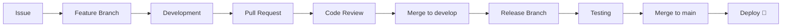
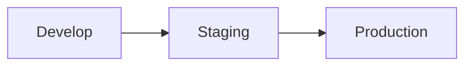
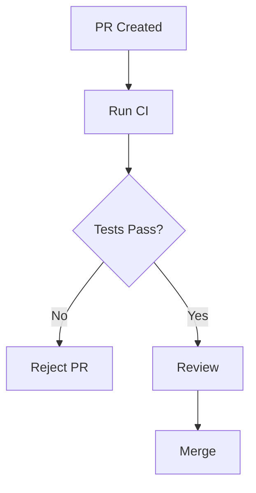
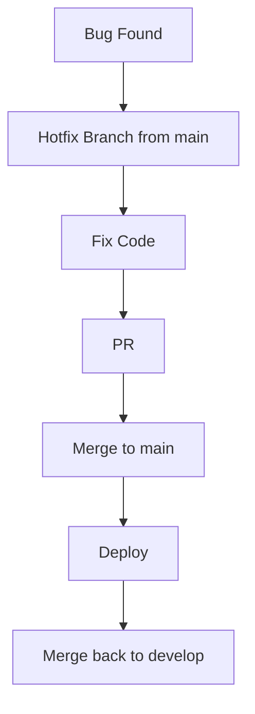

# 🏢 Enterprise Workflow (Stable, Scalable, Controlled Development)

<p align="center">
  
  
  
  
</p>

<p align="center">
  <b>Understand how large companies manage code safely using structured workflows, strict reviews, and controlled releases.</b>
</p>

---

## 📌 What Is an Enterprise Workflow?

An enterprise workflow is designed for:

```text id="ew-goal"
Stability + Scalability + Control
````

Large teams prioritize:

* safe releases 🛡️
* predictable workflows 📊
* strict review systems 🔍
* multi-stage deployment 🚀

---

## 🧠 Key Principles

```text id="ew-principles"
- structured branching
- controlled releases
- strong code reviews
- CI/CD with gates
- multiple environments
```

---

## 🗺️ Big Picture



---

## 🌳 Core Strategy: GitFlow (or Hybrid)

Enterprises commonly use:

```text id="ew-gitflow"
GitFlow or structured branching model
```

---

## 🧬 Branch Structure

```text id="ew-branches"
main      → production
develop   → integration
feature/* → new features
release/* → release prep
hotfix/*  → urgent fixes
```

---

## 🧠 Why This Structure?

```text id="ew-why"
Separate concerns:
- development
- testing
- production
```

---

## 🧱 Workflow Breakdown

---

### 1️⃣ Issue Creation

```text id="ew-step1"
Task created as GitHub Issue
```

---

### 2️⃣ Feature Branch

```bash id="ew-step2"
git checkout -b feature/payment develop
```

---

### 3️⃣ Development

```text id="ew-step3"
Longer development cycles
```

---

### 4️⃣ Pull Request

```text id="ew-step4"
PR opened to develop branch
```

---

### 5️⃣ Code Review (Strict)

```text id="ew-step5"
Multiple reviewers required
```

---

### 6️⃣ Merge to develop

```text id="ew-step6"
Feature integrated
```

---

### 7️⃣ Release Branch

```bash id="ew-step7"
git checkout -b release/v1.2 develop
```

---

### 8️⃣ Testing Phase

```text id="ew-step8"
QA + staging environment testing
```

---

### 9️⃣ Merge to main

```text id="ew-step9"
Release approved → merge to main
```

---

### 🔟 Deployment

```text id="ew-step10"
Deploy to production 🚀
```

---

## 🧪 Real Enterprise Scenario

```text id="ew-real"
1. Multiple features developed
2. Integrated into develop
3. Release branch created
4. QA testing done
5. Bugs fixed in release branch
6. Merged to main
7. Production deployment
```

---

## 🧠 Environments

Enterprise systems use multiple environments:

```text id="ew-env"
- Dev (development)
- Staging (testing)
- Production (live)
```

---

## 🔄 Environment Flow



---

## 🔐 Code Review System

---

### Requirements

```text id="ew-review"
- multiple approvals
- CODEOWNERS enforcement
- CI must pass
- no direct commits to main
```

---

## ⚙️ CI/CD Pipeline



---

## 🧠 Release Strategy

---

### Controlled Releases

```text id="ew-release"
Release happens at scheduled intervals
```

---

### Example

```text id="ew-rel-ex"
v1.0 → January
v1.1 → February
v2.0 → Major release
```

---

## 🚨 Hotfix Workflow

---

### Scenario

```text id="ew-hotfix"
Critical bug in production
```

---

### Flow



---

## 🧠 Why Separate Hotfix?

```text id="ew-hotfix-why"
Avoid waiting for full release cycle
```

---

## ⚔️ Enterprise vs Startup

| Factor    | Startup     | Enterprise |
| --------- | ----------- | ---------- |
| Speed     | very fast   | controlled |
| Branching | trunk-based | GitFlow    |
| Releases  | continuous  | staged     |
| Reviews   | minimal     | strict     |
| Risk      | higher      | minimized  |

---

## 🧠 Scaling Challenges

---

### Problem: Many Developers

```text id="ew-prob1"
Solution: structured branching + reviews
```

---

### Problem: Large Codebase

```text id="ew-prob2"
Solution: modular design + CI
```

---

### Problem: Release Risk

```text id="ew-prob3"
Solution: staging + QA testing
```

---

## 🚨 Common Mistakes

---

### ❌ Skipping review

Leads to bugs.

---

### ❌ Poor branching strategy

Creates chaos.

---

### ❌ No staging environment

Risky deployments.

---

### ❌ Large releases

Hard to debug.

---

## ✅ Best Practices

* enforce code reviews
* use CI/CD gates
* separate environments
* plan releases
* document workflows
* use CODEOWNERS
* keep branches organized

---

## 🧠 Pro Insights

* enterprises optimize for reliability, not speed
* testing is critical before deployment
* communication is key in large teams
* automation reduces human error

---

## 🧬 Full Enterprise Pipeline

```text id="ew-arch"
Issue → Feature → PR → Review → Develop → Release → QA → Main → Deploy
```

---

## 🎤 Interview Questions

### What workflow do enterprises use?

GitFlow or structured branching models.

---

### Why use develop branch?

To integrate features before release.

---

### What is a release branch?

A branch used for testing and preparing a release.

---

### What is staging environment?

A pre-production environment for testing.

---

### Why strict reviews?

To ensure code quality and stability.

---

## 🧪 Practice Lab

---

### Task 1

```text id="lab1"
Create feature branch from develop
```

---

### Task 2

```text id="lab2"
Simulate PR + review
```

---

### Task 3

```text id="lab3"
Create release branch
```

---

### Task 4

```text id="lab4"
Merge to main
```

---

### Task 5

```text id="lab5"
Simulate hotfix
```

---

## 🎯 Final Takeaway

Enterprise workflow is about:

```text id="ew-take"
Control + Stability + Scalability
```

---

## 🚀 Key Insight

> Move carefully, but reliably.

---

## 👉 Next Step

➡️ `monorepo-vs-multirepo.md`
