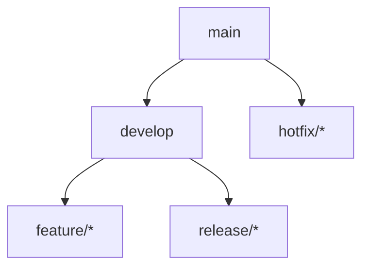
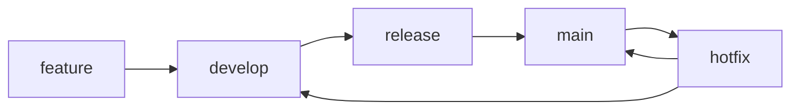
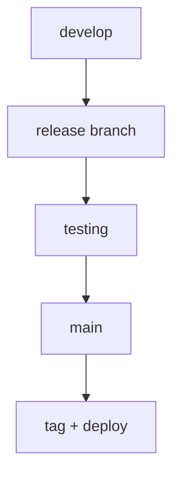
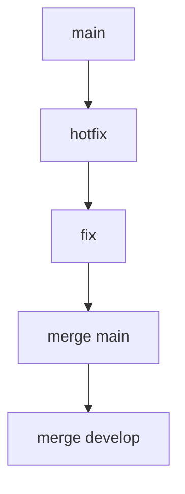
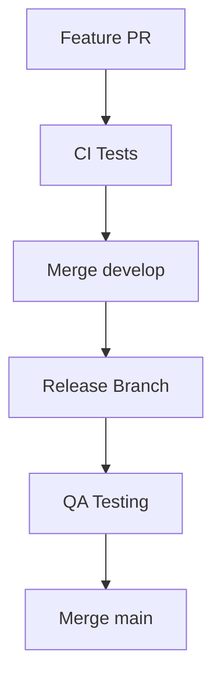

# 🌳 GitFlow Model (Structured Release Workflow)

<p align="center">
  
  
  
  
</p>

<p align="center">
  <b>Manage development and releases using a structured branching strategy — ideal for large teams and controlled deployments.</b>
</p>

---

## 📌 What Is GitFlow?

GitFlow is:

> A branching model that organizes development into multiple structured branches.

---

## 🧠 Core Idea

```text id="gf-core"
Separate development, testing, and production using dedicated branches
````

---

## 🗺️ Big Picture



---

## 🌳 Branch Structure

---

### 🔹 main

```text id="gf-main"
Production-ready code
```

---

### 🔹 develop

```text id="gf-develop"
Integration branch for features
```

---

### 🔹 feature/*

```text id="gf-feature"
New features
```

---

### 🔹 release/*

```text id="gf-release"
Prepare for release
```

---

### 🔹 hotfix/*

```text id="gf-hotfix"
Urgent production fixes
```

---

## 🧬 Branch Relationships



---

## 🧱 Full Workflow

---

### 1️⃣ Feature Development

```bash id="gf-step1"
git checkout -b feature/login develop
```

---

### 2️⃣ Develop Feature

```text id="gf-step2"
Code + commit changes
```

---

### 3️⃣ Merge to develop

```bash id="gf-step3"
git checkout develop
git merge feature/login
```

---

### 4️⃣ Create Release Branch

```bash id="gf-step4"
git checkout -b release/v1.0 develop
```

---

### 5️⃣ Testing Phase

```text id="gf-step5"
QA testing + bug fixes
```

---

### 6️⃣ Merge to main

```bash id="gf-step6"
git checkout main
git merge release/v1.0
```

---

### 7️⃣ Tag Release

```bash id="gf-step7"
git tag v1.0.0
```

---

### 8️⃣ Merge back to develop

```bash id="gf-step8"
git checkout develop
git merge release/v1.0
```

---

## 🚀 Release Flow



---

## 🚨 Hotfix Workflow

---

### Scenario

```text id="gf-hotfix-s"
Critical bug in production
```

---

### Steps

```bash id="gf-hotfix-step"
git checkout -b hotfix/fix-crash main
```

---

### Flow



---

### Why?

```text id="gf-hotfix-why"
Fix production immediately without waiting for next release
```

---

## 🧠 Why GitFlow Works

```text id="gf-why"
Clear separation of stages
Controlled releases
Safe production deployment
```

---

## ⚔️ GitFlow vs Trunk-Based

| Feature    | GitFlow     | Trunk-Based |
| ---------- | ----------- | ----------- |
| Branches   | many        | minimal     |
| Complexity | high        | low         |
| Releases   | staged      | continuous  |
| Speed      | slower      | faster      |
| Best for   | enterprises | startups    |

---

## 🧠 Key Insight

```text id="gf-insight"
GitFlow = control
Trunk-Based = speed
```

---

## 🧪 Real-World Scenario

```text id="gf-real"
1. 5 features developed
2. Merged into develop
3. Release branch created
4. QA testing
5. Bugs fixed
6. Release merged to main
7. Version tagged and deployed
```

---

## ⚙️ CI/CD Integration



---

## 🧠 Environments Mapping

```text id="gf-env"
develop → dev environment
release → staging
main → production
```

---

## 🚨 Common Mistakes

---

### ❌ Too many branches

Hard to manage.

---

### ❌ Long release cycles

Delays deployment.

---

### ❌ Not merging back to develop

Causes inconsistencies.

---

### ❌ Large features

Hard to test.

---

## ✅ Best Practices

* keep features small
* test thoroughly in release branch
* merge fixes back to develop
* tag every release
* use CI/CD pipelines

---

## 🧠 Pro Tips

* automate release builds
* use semantic versioning
* enforce code reviews
* combine with CODEOWNERS

---

## 🧬 Full GitFlow Architecture

```text id="gf-arch"
feature → develop → release → main → deploy
                     ↑
                   hotfix
```

---

## 🌍 When to Use GitFlow

```text id="gf-use"
- large teams
- regulated environments
- scheduled releases
- complex systems
```

---

## 🎤 Interview Questions

### What is GitFlow?

A structured branching model with multiple branches.

---

### What is develop branch?

Main integration branch for features.

---

### What is release branch?

Used to prepare and test a release.

---

### What is hotfix branch?

Used to fix production issues quickly.

---

### Why use GitFlow?

To ensure stability and controlled releases.

---

## 🧪 Practice Lab

---

### Task 1

```text id="lab1"
Create feature branch
```

---

### Task 2

```text id="lab2"
Merge into develop
```

---

### Task 3

```text id="lab3"
Create release branch
```

---

### Task 4

```text id="lab4"
Simulate testing
```

---

### Task 5

```text id="lab5"
Merge to main + tag release
```

---

### Task 6

```text id="lab6"
Simulate hotfix
```

---

## 🎯 Final Takeaway

GitFlow provides:

```text id="gf-take"
Structure + Stability + Control
```

---

## 🚀 Key Insight

> Control complexity with structure.

---

## 👉 Next Step

➡️ `emergency-hotfix.md`
